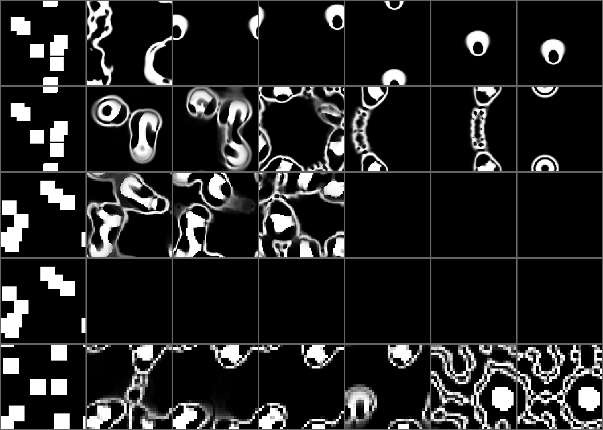

# vmc-pet 設計メモ

このドキュメントは3部に分かれている。

- **第1部 現在の設計**: いまのコードが何をどうしているかのまとめ。仕組みや値を知りたいときはここから読む
- **第2部 判断の記録**: なぜ今の形になったか。計測、試して採らなかった案、踏んだ失敗を、テーマごとにおおむね取り組んだ順で残してある。ソースコードのコメントは `docs/DESIGN.md「節の名前」` の形でここを参照している
- **第3部 未確定と今後**

## コンセプト

デスクトップに常駐するドットマトリックス表示の電子ペット。
CA/Leniaの場を「体」として直接表示し、体の内部状態=表現、という構成にすることで
別途「見た目を作るレイヤー」を実装しなくても、体の状態がそのまま表現になる。

体(body)の定義:「知能の出力で書き換えられる持続的な状態があり、その状態を通してしか
外界とやり取りできない(観測が制約される)」という条件を満たすもの。物理的な実体である
必要はなく、シミュレーション内の状態でも良い。

## アーキテクチャ

```
[外部環境]                     [体(CA/Lenia場)]
ユーザー入力(クリック/ホバー/キー)      |
        |                            v
        +--------> [IF層] ---> 場に局所的な摂動を注入
                                     |
                                     v
                            [場の状態が更新される]
                                     |
                                     v
                    [ドットグリッド描画] (体の状態=表示)
```

- **常駐ウィンドウ**: デスクトップに透過・枠なし・常に最前面で表示する。
- **ドットグリッド描画**: 32x32のグリッド。各セルの値(0〜1)を円の大きさ・透明度に
  マッピングして描画する。
- **体(CA/Lenia場)**: 既存のLenia実装をそのまま流用。場の値がそのまま描画対象になるため、
  Vに相当するエンコーダを別途実装する必要がない。
- **入力IF**: マウスクリック・ホバーを「場の特定座標にエネルギーを注入する」だけに
  限定する。内部のCAロジックを直接いじらせないための境界線。
  Dockerでの体コンテナ/知能コンテナ分離と同じ発想 — 体の境界を明示的に強制する。
- **表現の方向づけ(任意・後回し可)**: 場の外側に少数の状態変数(例: エネルギー量)を
  持たせ、場のパラメータ(拡散率・成長量など)に影響させると、「元気/放置されて弱る」
  といった情緒的な表現が生まれる。

# 第1部 現在の設計

いまのコードが「何を、どう」しているかのまとめ。値や仕組みの**理由**は第2部の各節にあり、「→」の後に節の名前を示す。

## 全体の構成(世界モデルとコントローラ)

```
[外部環境]  クリック・ホバー・タッチ、時刻、(PC のみ)CPU 負荷
     |
     v
[プラットフォーム層 = C]  PC: src/(Wayland) / M5Stack: m5stack-cores3/(esp-hal)
   いつ進めるか・入力デバイス・時計・記憶の置き場所・ピクセル形式への変換
     |  click / hover_at / leave / tick_input / tick_clock / step
     v
[Pet = M]  crates/vmc-pet-body(PC と M5Stack で共有、no_std 対応)
   体(LeniaBody)  <- 慣れで弱めたクリックの摂動、自律コントローラの身じろぎ
   気分(Mood: 世話の予測・期待・がっかり) -> 体のテンポ、色素への刺激
   echo(触れた跡の光)と色素(体の色づき)  … 体の動きには影響しない
     |
     v
[1セルの見え方](appearance.rs、共有) -> 各プラットフォームがドットとして描く
```

→ 「PC/M5Stack どちらでも世界モデルを動かせるようコードを整理する」

## ペットの内部状態と、その見せ方

| 状態 | 持ち主 | 変わり方 | 見た目への現れ方 | → 節 |
|---|---|---|---|---|
| 体(Lenia の場) | `LeniaBody` | Lenia の規則。境界はトーラス | ドットの大きさそのもの | 場の解像度と表示解像度 |
| エネルギー(0〜1) | `LeniaBody` | 触られないと約150秒で尽きる。クリックで +0.15(慣れで弱まる)。停止中は12時間で尽きる速さ。PC は CPU 負荷で速く減る | 成長の強さが 0.85〜1.0 で変わり、弱ると総量と動きが変わる。自律的な身じろぎも控えめになる | 気分状態(エネルギー) |
| 慣れ | `Habituation` | 体の部位ごとに、1回触れると0.2進み、約45秒で抜ける | 同じ部位への刺激が、体にも世話にも効かなくなる | 慣れ(同じ場所への刺激が効かなくなる) |
| 期待(0〜1) | `Mood`(世話の予測) | 学んだ生活リズムで、いつもの時間に高まる | 色素が溜まり珊瑚色に色づく(身じろぎの強さは変えない) | 色素のチャンネルと、がっかりのテンポ / 先回りをやめ、待っていることは色に任せた |
| がっかり(0〜1) | `Mood`(世話の予測) | 期待していたのに来ないと溜まり(30分で最大)、半減期約90分で薄れる | 体のテンポが遅くなる(しきると×0.6) | がっかりは「予測の外れ」 |
| echo | `TouchEcho` | ホバーで弱く、クリックで強く光り、1〜2秒で消える。自分で身じろぎしたときも光る | 暖色の白。体に貼りついて描かれる | 入力の可視化を体の場から分離する (touch echo) |
| 色素 | `Pigment` | 期待に応じて、体があるところに溜まる(時定数約20秒) | 体の色を珊瑚色へ寄せる。ドットの大きさは変えない | 色素のチャンネルと、がっかりのテンポ |

見た目で見分けられるようにしている状態の組は「元気/待っている/がっかり」で、全生物でどの組も見分けられる(一番見分けにくい組: O2u 0.469 / OG2g 0.270 / S1s 0.745 / 2S1v 0.378)。→ 「元気/待っている/がっかり(見分けたい内部状態)」

## 入力の意味

- **ホバー**(PC のポインタ、M5Stack で触れ続けている間): 体には一切触れず、echo だけを光らせる
- **クリック**(PC のボタン、M5Stack の触れ始め): 体への摂動(半径4.5・強さ0.20)とエネルギーの回復(どちらも慣れで弱まる)、echo の強い光、世話の予測への「来訪」の記録
- **自律コントローラの身じろぎ**: 体の形の歪み(歪度)を見て、場だけを揺らす(エネルギーは回復しない)。強さはエネルギーだけで決まり、世話を待っているかどうかでは変わらない

→ 「摂動の強さと、体の崩壊からの復帰」「自律コントローラ(C)を実装する」

## 学習(世話の予測)

- 1分ごとの「触られたか」を1件の経験として、1日のうちの時刻(sin/cos の3倍音)に対するロジスティック回帰(重み7個)をオンライン学習する。学習率は0.02
- 電源が切れていた間や、時計が巻き戻ったときは学習しない
- 期待は「その時刻の予測が、その日の平均の何倍か」で決める(1.1倍から始まり、3倍で最大)。予測が事前確率の1.5倍に届かない時刻は期待しない

→ 「世話の予測(継続的に学習するモデル)」

## 保存(プロセスをまたぐ記憶)

| | PC | M5Stack |
|---|---|---|
| 持ち越すもの | エネルギー、世話の予測の重み | 同左 |
| 置き場所 | `$XDG_STATE_HOME/vmc-pet/state.json`(無ければ `~/.local/state`)、JSON | フラッシュの `pet` パーティション。44バイトのレコードを93区画に並べる |
| 時計 | OS の時計 | バッテリバックアップ付き RTC(BM8563) |
| 頻度 | 30秒ごと | 30秒ごと |

慣れ・がっかり・echo・色素・場は保存しない(数十秒〜数時間で消えるか、置き直してもすぐ同じ姿に戻るため)。読み書きに失敗してもペットは動き続ける。→ 「プロセスをまたぐ記憶」「学んだことを再起動をまたいで持ち越す」、docs/M5STACK.md

## 学習を待たずに見た目を確かめる

PC は `vmc-pet --preview-mood <lively|waiting|disappointed>`、M5Stack はビルド時の環境変数 `VMC_PET_PREVIEW_MOOD`。気分だけを固定し、記憶は読みも書きもしない。→ 「学習を待たずに見た目を確かめる(プレビュー)」

## 安全性の不変条件と、それを守るテスト

Lenia はカオス系で崩壊の崖があり、1回の長時間実行で無事だったことは安全の証拠として弱い(→ 「丸めで崩壊が反転した(単発の長時間実行は安全の証拠として弱い)」)。次の不変条件をテストで守っている。

| 不変条件 | テスト |
|---|---|
| 崩壊したら必ず置き直して戻ってくる(総量が5を下回ったら再配置) | `the_body_always_comes_back_after_being_harassed` |
| 放置され続けても崩壊しない(成長の強さの下限0.85は、崖の0.77から余裕を取った値) | `a_long_neglected_body_survives_indefinitely_at_reduced_mass` |
| 環境ストレスが最大のまま続いても崩壊しない | `sustained_maximum_stress_still_never_collapses_the_body` |
| 自律コントローラは、出荷している全生物を崩壊させない | `the_controller_keeps_every_shipped_animal_alive` |
| 世話の来ない期待が一日じゅう続いても(弱った体を全力で揺らしても)崩壊しない | `every_shipped_animal_survives_always_expecting_care_that_never_comes` |
| がっかりしきったテンポで長く過ごしても崩壊しない(テンポは×0.5〜×1.6に丸める) | `every_shipped_animal_survives_a_long_disappointment` |
| 色素は体の動きに一切影響しない | `the_pigment_never_changes_how_the_body_moves` |
| 自律コントローラは世話の代わりにならない | `the_autonomous_controller_does_not_prevent_neglect_from_weakening_the_body` |

## 評価の道具

| 道具 | 測るもの |
|---|---|
| `fitness::legibility` / `examples/evaluate_legibility.rs` | 世話され続けた個体と放置された個体の、動き(速さ・脈動)の違い |
| `fitness::distinguishability` / `examples/evaluate_mood_legibility.rs` | 元気/待っている/がっかりの組ごとの、動きか色の違い |
| `examples/search_controller_params.rs` / `examples/evaluate_fitness.rs` | 旧い目的関数(動きの多さ)による探索と評価。目的関数としては採らないと決めたもの(→ 「世話のされ方が振る舞いに現れているか(legibility)」) |

## モジュール構成

```
Cargo.toml                   ワークスペース(PC のバイナリ + 共有クレート)
src/                         PC 版(Wayland)。プラットフォーム層
  main.rs / cli.rs             起動と引数(--animal / --list-animals / --preview-mood)
  app.rs                       いつ進めるか・入力の受け渡し・時刻・保存の頻度
  persistence.rs               記憶の置き場所(JSON)と OS の時計
  interface/machine_load.rs    CPU 負荷 → 環境ストレス
  render/dot_grid.rs           ドットの配置と ARGB8888 への描画
  shell/layer.rs               wlr-layer-shell(OS 依存部分をここに隔離)
crates/vmc-pet-body/         世界モデル(Pet)。PC と M5Stack で共有、no_std 対応
  pet.rs                       体・入力の翻訳・崩壊検知・echo・色素・慣れ・気分を束ねる
  lenia.rs / field.rs          Lenia の規則と場
  lenia_body.rs / port.rs      体(エネルギー・テンポ・崩壊からの復帰)と、体の窓口 BodyPort
  animal.rs                    生物データ(assets/animals.json)の読み込み
  touch.rs / perturbation.rs   入力の意味(Touch)と摂動
  habituation.rs               慣れ
  controller.rs                自律コントローラ
  care_prediction.rs           世話の予測(学習モデル)と、期待・がっかり
  mood.rs                      気分: 予測を体のテンポと色素への刺激へ伝える
  touch_echo.rs / pigment.rs   echo と色素(体の動きには影響しない)
  body_frame.rs                体基準の座標(echo と色素で共有)
  appearance.rs                1セルの見え方(色・大きさ。PC と M5Stack で共有)
  camera.rs                    表示原点を重心へ寄せる
  memory.rs / civil_time.rs    持ち越す記憶の形式(JSON とフラッシュのレコード)と、RTC の日時の変換
  fitness.rs                   評価の道具(std のみ)
  math.rs                      no_std 用の数学関数
m5stack-cores3/              M5Stack 版(esp-hal。ワークスペース外の別プロジェクト)
  src/bin/main.rs              いつ進めるか・タッチ・RGB565 への描画・プレビュー
  src/clock.rs                 RTC(BM8563)
  src/persistence.rs           フラッシュへの記憶の読み書き
```

依存の向きは一方向で、共有クレートは Wayland も esp-hal も知らない。体に働きかける窓口は型で絞ってある。観測は読み取り専用の `FieldView` しか返さず、体の時間を進める `step` は外界からの操作(`BodyPort`)に載せていない。表示や入力の都合(表示原点、echo、色素、見え方)で体の場を書き換えることはしない。

## 実装スタック

| レイヤ | 選択 |
|---|---|
| 言語 | Rust(PC はワークスペース、M5Stack は別プロジェクト) |
| ウィンドウ(PC) | `smithay-client-toolkit`(wlr-layer-shell) |
| 描画(PC) | `wl_shm` バッファへのソフトウェア描画(自前) |
| 組み込み(M5Stack CoreS3) | `esp-hal`(no_std)、`core-s3`(ボードサポート)、`embedded-graphics`、`esp-storage` |
| 場 | 自前実装(カーネルをタップ列に展開した散布型の直接畳み込み) |
| 生物データ | `assets/animals.json`(Lenia 本家から4体を vendor。出典は `assets/NOTICE.md`) |
| 開発環境 | `flake.nix` の devShell(PC)、espup が入れる Xtensa ツールチェーン(M5Stack) |

畳み込みは、値を持つセルからタップ先へ加算する散布型で実装する。生物は場のごく一部しか占めないため、全セルを走査する収集型より計算量が桁で落ちる。カーネルはリング状で中心と外周がほぼ 0 になるため、重みが 1e-5 以下のタップは精度を落とさず除外できる。

## 主な定数(現在の値)

| 項目 | 値 | 場所 |
|---|---|---|
| 場の大きさ | PC 32×32(表示と1:1)、M5Stack 43×32 | `app.rs` / `main.rs` |
| 体の更新 | 15 step/s(描画とは独立。PC の描画は30fps) | `app.rs` / `main.rs` / `shell/layer.rs` |
| エネルギー | 触られないと約150秒で尽きる、クリックで +0.15、停止中は12時間で尽きる速さ | `lenia_body.rs` |
| 成長の強さ | 0.85〜1.0(エネルギーに比例) | `lenia_body.rs` |
| テンポ | ×0.5〜×1.6 に丸める。がっかりしきると×0.6 | `lenia_body.rs` / `mood.rs` |
| クリック | 体へ半径4.5・強さ0.20、echo へ半径4.0・強さ1.0 | `touch.rs` |
| 崩壊とみなす総量 | 5.0 | `pet.rs` |
| 慣れ | 1回0.2、1ステップごとに×0.995(約45秒で回復)、記録半径は触れた範囲の1.5倍 | `habituation.rs` |
| 世話の予測 | 学習率0.02、事前確率0.02、期待は平均の1.1〜3倍で決まる | `care_prediction.rs` |
| がっかり | 30分待ちぼうけで最大、半減期約90分 | `care_prediction.rs` |
| 色素 | 時定数約20秒(1ステップごとに1/300が入れ替わる) | `pigment.rs` |
| 色 | 体 (0.35, 0.85, 0.80)、echo (1.0, 0.92, 0.70)、色素 (1.0, 0.55, 0.45) | `appearance.rs` |
| 保存 | 30秒ごと | `app.rs` / `main.rs` |

自律コントローラの定数は `ControllerParams::default()`(`controller.rs`)にある。

# 第2部 判断の記録

なぜ今の形になったか。各節の値や記述は、その時点のもの(現在の値は第1部)。今と食い違って誤解を招く箇所には「注記(現在)」を添えてある。

## 表示と体の土台

### ウィンドウ方式: wlr-layer-shell

開発環境のコンポジタは **niri** (Wayland)。niriはスクロール型タイリングのため、
通常の xdg-toplevel は必ずタイル配置され「透過・枠なし・最前面」を実現できない。
layer-shell surface のみがこの要件を満たす。X11 override-redirect は
xwayland-satellite 経由となり実質的に選択肢から外れる。

| 項目 | 値 |
|---|---|
| layer | `top` (waybarと同格。全画面アプリより下) |
| exclusive_zone | `-1` (他ウィンドウを押しのけない) |
| keyboard_interactivity | `none` |
| namespace | `vmc-pet` (niri側の layer-rule から参照できる) |
| input region | 体のバウンディングボックスのみ (周囲の透明部分はクリックが下に抜ける) |

### 場の解像度と表示解像度

Lenia は kernel radius R が 10 を下回ると離散化誤差で生物が維持できない。
そのため当初は「場を表示より大きくとる」方針にしていたが、実測すると
**R=13 の Orbium は 32x32 の場でも挙動が変わらない**ことが分かった。

3000ステップ(15 step/s で約200秒)まで回した比較:

| 場のサイズ | 総量 | ピーク値 | 高密度セル数 | 速度 |
|---|---|---|---|---|
| 64x64 | 73.3〜73.6 | 1.000 | 52〜59 | 12.44 cells/20step |
| 40x40 | 73.8〜73.9 | 1.000 | 52〜56 | 12.44 cells/20step |
| 32x32 | 73.4 | 1.000 | 52〜57 | 12.45 cells/20step |

したがって **場 32x32 = 表示 32x32 の 1:1** とする。プーリングが挟まらないため、
場の値がそのままドットの濃さになり、「体の状態=表示」が文字通り成立する。
Orbium の初期パターンは 20x20 なので、画面の 6 割強を占める。

平均プーリングの実装自体は残してある。R の大きい生物(Scutium serratus saliens は
R=20 で 33x33)を扱うときは場を広げ、表示側で落とせばよい。

| パラメータ | 値 |
|---|---|
| 場の解像度 | 32x32 |
| kernel radius R | 生物ごとに animals.json の値に従う (Orbium は 13) |
| dt | 1/T (Orbium は T=10 なので 0.1) |
| 境界条件 | 周期境界(トーラス) |
| 表示解像度 | 32x32 ドット (場と 1:1) |

#### 境界条件を周辺減衰からトーラスへ変更した理由

当初は「生物が画面外へ逃げないように」端から8セルを減衰させる設計だった。
しかし実測すると、**周辺減衰は生物を閉じ込めるのではなく殺す**ことが分かった。

| 境界条件 | 600ステップ後の総量 | 結果 |
|---|---|---|
| トーラス | 73.7 (初期 76.9) | 重心が動き続ける。安定 |
| 周辺減衰 (margin=8) | 0.0 | 150ステップで完全に消滅 |

Lenia の生物は自己維持するパターンであり、一部を削られると構造が崩れて崩壊する。
したがって境界はトーラスとし、端を越えた生物は反対側から現れる。

#### 表示原点を重心へ追従させる

トーラスにした結果、生物が継ぎ目をまたぐ間は体が画面の両端に分かれて見える。
これを避けるため、場の重心が画面中央に来るよう**表示の原点**をずらす。

場そのものは書き換えない。トーラス上の平行移動は力学に対する厳密な対称性なので、
表示側でずらしても体の状態と表示の間にずれは生じず、体は純粋なまま保たれる。

重心は円周平均で求める。座標をそのまま算術平均すると、生物が継ぎ目をまたいだ
ときに場の反対側を指してしまうため、座標を角度に写してから平均する。

384x384 のサーフェス上で測った効果:

| | 追従なし | 追従あり | 44秒後 |
|---|---|---|---|
| 可視ピクセル数 | 3016 | 5363 | 5453 |
| バウンディングボックス | (4,0)-(379,383) | (74,87)-(295,283) | (75,87)-(296,284) |
| 重心 (中心は 192,192) | (114,181) | (195,197) | (200,201) |

追従なしの bbox がサーフェス全域に広がっているのが、継ぎ目で分断されていた状態。

#### 表示原点は小数のまま保持する

原点を整数セルに丸めると、生物の実位置と表示位置の差が ±0.5 セル(=ドット1個分、
12px)ののこぎり波になり、毎秒数回の揺れとして見える。

揺れの原因が丸めだけであることは計測で確かめた。生物自身の重心は等速直線への
残差が RMS 0.0166 セル・最大 0.037 セルしかなく、動き自体はほぼ完全に滑らかである。
一方、丸めによる画面内のずれは +0.474 〜 -0.432 セルと理論値 ±0.5 をほぼ埋めていた。

したがって原点は小数のまま持ち、**整数部でどのセルを読むかを、小数部でドットを
ずらす量を決める**。場の値はリサンプルしないので、にじみもピーク値の変動も生じない。
ずらした分だけ端に隙間ができるため、上下左右へ1列ずつ余分に描いてグリッド矩形で
切り取る。

描画結果の重心を40フレーム追い、等速直線からの残差で測った効果:

| | 残差 RMS | 残差 最大 |
|---|---|---|
| 整数に丸める | 3.53px | 5.85px |
| 小数のまま | 0.25px | 0.49px |

残る 0.25px はドットのラスタライズによる量子化で、知覚できる水準ではない。

なお、ドットの格子を動かす代わりに場をバイリニア補間して格子を固定する方法もある。
そちらは実機の LED マトリクスに近い挙動になるが、値が隣のドットへ分配されるぶん
ピーク値が変動してちらついて見えるため採らなかった。

### 時間刻み

描画fpsと場の更新レートを分離する。両者を結合すると、fpsを変えた瞬間に
生物の速度と安定性が変わってしまう。

| パラメータ | 値 |
|---|---|
| step_rate | 15 step/s |
| render_fps | 30 fps |

描画レートの判定には frame_interval の 1/8 の許容幅を持たせる。描画機会は vblank
単位でしか訪れないため、許容幅なしで 60Hz に 30fps を要求すると閾値(33.33ms)と
vblank 2回分(33.34ms)がほぼ一致し、ジッタで1フレーム落ちて実測 24fps まで下がる。

常駐アプリのため、アイドル時 CPU 2%未満・RSS 50MB未満を目標値とする。
実測 (release, 2560x1440@60Hz, Orbium 稼働中、検証機は Intel Core i5-10400
6コア12スレッド): CPU 1.9% / RSS 4.5MB / 30.00fps。

### 摂動の強さと、体の崩壊からの復帰

入力を摂動として注入するにあたり、どの強さなら生物が死なないかを実測した。
結論として **強さの調整だけでは安全にできない**。

まず単発クリック(余弦山型、生物の中心から16距離 x 4方向の計64箇所へ注入し
900ステップ後に生存するか)で安全な上限を探した。

| radius | 安全な amount の上限 |
|---|---|
| 2.5 | 0.70 |
| 3.5 | 0.50 |
| 4.5 | 0.30 |

ところが、撫でながら突く(ホバー注入とクリック注入を併用する)という実際の操作を
模した負荷試験では、安全境界が単調にならなかった。

| hover \ click | 0.00 | 0.10 | 0.20 | 0.30 |
|---|---|---|---|---|
| 0.000 | 73.75 | 73.47 | 71.61 | 73.80 |
| 0.005 | 73.55 | 73.55 | 73.01 | **0.00** |
| 0.010 | 73.36 | 73.44 | 73.40 | **0.00** |
| 0.020 | 73.48 | 73.45 | 73.01 | **0.00** |
| 0.040 | 72.57 | 73.43 | 72.56 | 72.92 |

同じ click=0.30 が hover=0.00 と 0.040 では生き残り、その間では死ぬ。Lenia は
カオス系であり、生死は摂動の強さではなく履歴と位置の組み合わせで決まる。
したがって「十分小さくすれば安全」という前提が成り立たない。

そこで、強さは保守的に採りつつ(ホバー 0.02/step・半径2.5、クリック 0.20・半径4.5)、
**崩壊を検知したら生物を置き直す**仕組みを体に持たせる。総量が 5.0 を下回ったら
場を空にして初期パターンを再配置する。これがないと、一度の操作でペットが二度と
戻らなくなる。

復帰の保証は `the_body_always_comes_back_after_being_harassed` テストで担保する。
ポインタを動かしながら撫で、3回に1回突く、という操作を4つの乱数系列で40ラウンド
繰り返し、その後かならず生きた状態へ戻ることを確認している。

### ホバーで光らせることはできない

当初はホバーを「撫でている跡が薄く光る」表現にしたかったが、成立しなかった。

空のセルでは成長関数が -1 を返すため、場は毎ステップ dt×1 = 0.1 ずつ減衰する。
これを上回る注入(0.1/step 以上)でなければ値が立たず、実測でも 0.04/step では
60秒間ホバーし続けてもセルの値は 0.000 のままだった。一方 0.06〜0.10/step は
生物を殺す。**見えるのに必要な注入率が、安全な注入率を上回っている。**

したがってホバーは「薄く餌をやる」操作に留め、視覚的な手応えはクリックが担う。

### 入力の可視化を体の場から分離する (touch echo)

step 4 で「ホバーが体に触れないと安全境界が単調にならない」「ホバーで光らせようと
すると体を殺す」という2つの問題が見つかった。原因は、体への実際の影響(体の安全性
の要求)と、見た目のフィードバック(視認性の要求)を**同じ値**で満たそうとしていた
ことにある。この2つの要求は数値として両立しなかった。

そこで、入力を可視化するためだけのデータ(`render::TouchEcho`)を体の場とは完全に
別に持ち、描画のときだけ画面上で重ねる形にした。場そのものは一切書き換えない。

| | 体(Field) | echo(TouchEcho) |
|---|---|---|
| 更新規則 | Lenia の成長関数 | 毎フレーム指数減衰するだけ |
| 時間の刻み | step_rate (15/s) | render_fps (30/s)。体の時間と無関係 |
| ホバーの効果 | なし(体には一切触れない) | 弱く持続的に加算する |
| クリックの効果 | 弱く単発で注入する(安全域の内側) | 強く単発で加算する(見た目の都合だけで決めてよい) |
| 安全性の制約 | あり(Leniaのカオス性に縛られる) | なし(体に影響しないため) |

**この分離により、ホバーが体に触れなくなる。** これが最も大きな効果で、
「撫でながら突くと安全境界が単調にならない」という問題(前節)は、hover→body の
経路そのものが無くなることで、強さの調整に頼らず構造的に解消される。

「ホバーで光らせることはできない」という前節の結論も、同じ理由で覆る。空のセルを
撫ね続けたときの echo の値は、加算(0.08/step)と減衰(毎フレーム 0.90 倍)の釣り合いで
定常値 0.8 前後に収束する(体の成長関数とは無関係な単純な等比数列なので、この釣り
合いは計算だけで求まる)。離すと 1〜2秒ほどで消える。

体・echo の合成は描画時にのみ行う。1セルの見た目は、体と echo の値のうち大きい方で
ドットの大きさを決め、echo が占める割合([[echo_value / max(body_value, echo_value)]])
で色を体の色(ティール)から echo の色(暖色の白)へ寄せる。触れていない場所は体の色、
体が無く echo だけがある場所は純粋に echo の色になり、「これは体の状態ではなく
触れた跡だ」と色で区別できるようにしてある。

**光は体(=カメラ)に貼りつける**: echo は場(世界)の座標ではなく、体の重心からの
相対位置で覚える。当初は場の座標で覚えていたため、生物が進む(O2u は約9セル/秒)と
カメラがそれを追い、触った場所の光が画面上を後ろへ流れて見えていた(M5Stack で
ユーザーが気づいた)。カメラは重心を画面中央に置くだけなので、体基準の座標はカメラの
座標そのものであり、光は触った指の下に留まる。慣れ(後述)を体の部位ごとに覚える
ようにしたのと同じ理由である。

ここには罠が1つあった。重心を整数セルに丸めて体基準へ直すと、重心が1セル進むたびに
光が最大±0.5セル跳ねる。以前カメラの原点を丸めたとき体全体で見えた揺れ(camera.rs)
を、光だけで再現してしまう。そこで重心は小数のまま持ち、読み出しのときに双線形補間
する。描画は場の座標でセルを読み、ドットをカメラ原点の小数部だけずらして描くので、
「場の座標 − 重心」で読めば読む位置は画面上の位置だけで決まり、光は滑らかに留まる。
記録は1回きりなので、そこでの丸め(最大0.5セル)は揺れにならない。

体の重心は `TouchEcho::follow_body` で渡す(`Camera::follow` と同じ形)。渡さなければ
原点のままで、以前と同じく場の座標で記録・読み出しする。このため描画側(PC の
`dot_grid.rs`、M5Stack の `main.rs`)は一切書き換えていない。

なお、体と echo を最初から別データとして持つという構造は、将来コントローラ(C)や
世界モデル的なものを足す拡張([[将来の拡張]])とも相性がよい。World Models
(Ha & Schmidhuber, 2018) の M は、環境の潜在状態 z と自分の行動 a を別々の入力として
受け取り次の z を予測する。いまの実装で体への注入(`Field::inject`)は場に直接
焼き込まれ、注入後は「これが最近の行動だった」という記録が残らない — Lenia は
カオス系なので場の変化から行動を遡って復元することもできない。echo を体と別データ
として持つ構造は、この「行動の明示的なコピー」をちょうど用意することにもなる。
いまは render 層に閉じた描画専用データに留め、`BodyPort` 相当の窓口として公開する
のは、実際にコントローラを作る段階まで見送る(過剰設計を避ける)。

> 注記(現在): echo はその後、自律コントローラの身じろぎも光らせる場所になり(「自律的な動きを echo で見えるようにした」)、PC と M5Stack で共有する `vmc_pet_body::TouchEcho` になっている。体基準で記録する仕組み(`body_frame.rs`)は色素と共有している。


### 気分状態(エネルギー): growth 係数を弱めて放置で弱らせる

コンセプト節にある「場の外側に少数の状態変数(エネルギー量)を持たせ、場の
パラメータに影響させる」を実装した。エネルギーは `LeniaBody` が持つ 0.0..=1.0 の
スカラーで、体には一切影響しない `TouchEcho` とは対照的に、**Lenia の成長関数に
実際に効く**、正真正銘の体の状態変数である。

| | 挙動 |
|---|---|
| 初期値 | 1.0(満タン) |
| 減衰 | 1ステップごとに一定量減る。何にも触れられなければ約150秒(2分30秒)で 0 |
| 回復 | クリック(`BodyPort::inject` が呼ばれるたび)に +0.15。ホバーでは増えない |
| 崩壊時 | `revive()` で 1.0 に戻る |

クリックでしか回復しないのは、体に実際に触れるのはクリックだけ(「入力の可視化を
体の場から分離する」節)という step 4 の決定と一貫させるため。

#### growth_scale はなだらかな坂ではなく崖だった

エネルギーを Lenia の成長関数にどう効かせるかは、実測して初めて分かった制約に
強く縛られた。当初の想定は「正の成長(自己修復)にエネルギーをそのまま掛ける」
という単純な線形写像だったが、これは実際には機能しない。

Orbium を `growth_scale` を固定して 600 ステップ(15 step/s で40秒ぶん)動かした
ときの総量:

| growth_scale | 結果 |
|---|---|
| 1.00 | 73.66(健常) |
| 0.85 | 71.41(わずかに弱い) |
| 0.80 | 70.37 |
| 0.78 | 69.48 |
| **0.77** | **0.00 (150ステップ以内に完全崩壊)** |
| 0.75 | 0.00 |

**0.78 と 0.77 の間に崖がある。** Orbium の自己維持構造は成長の強さにきわめて
敏感で、「なだらかに弱って、放っておくと死ぬ」という直感的な設計はそのままでは
実現できない。崖のすぐ手前まで攻めるのは、Lenia がカオス系であり実際の運用では
場の状態(クリックによる摂動、生物の位置)が実験時と異なるため、崖の位置が
わずかにずれるリスクがある(危険域に近すぎる調整は避ける、という摂動の強さの
節で採った方針と同じ)。

そこで、**growth_scale の下限を崖から十分離れた 0.85 に固定**した
(`MIN_GROWTH_SCALE`)。エネルギーは 1.0(growth_scale=1.0)から 0.0
(growth_scale=0.85)の間を線形に動く。これにより:

- 放置され続けても体は消えない(20000ステップ ≈ 22分放置しても総量は健常時の
  98%を下回るところで安定し、崩壊はしない)
- それでも健常時と比べてはっきり総量が下がる(「弱った」ことが場の値として現れる)
- クリックすればエネルギーが回復し、総量も健常時の水準へ戻っていく

「体を消しかねない放置死」という劇的な演出はできなかったが、それは Lenia の
安定域という実在の制約から来ている。安全マージンを削って崖に近づける調整は、
摂動の強さの節と同じ理由で採らない。

なお、エネルギーの値そのものを画面に表示する HUD は追加していない。体の状態が
そのまま表現になる、というコンセプトの核を守るため、「弱っている」ことは
場の総量が下がるという Lenia 自身の挙動を通してのみ伝わるようにしてある。


### 機械の CPU 負荷を環境ストレスとして反映する

アーキテクチャ図の「外部環境」はユーザー入力に限らない。機械自身の CPU 負荷も
体の外側にある環境シグナルとして、同じ IF 層(`interface::machine_load`)を通す。

ユーザー入力と同じ扱いにはしなかった。CPU 負荷はユーザーが制御できず、
連続的に揺らぎ、「離す」こともできない入力であり、ホバーで経験した「安全境界が
単調にならない」問題を再び持ち込むリスクがあった。したがって**場に直接注入は
しない**。エネルギーの減衰を早める(気分状態への入力)という、既に安全マージンが
確立済みの経路にだけ接続した。

| | 挙動 |
|---|---|
| 取得方法 | `/proc/stat` の先頭行(全コア合算)を毎ステップ2回分の差分で読む
  (sysinfo 等の外部依存は追加しない) |
| 意味づけ | 機械が忙しい = 環境が厳しい → エネルギーの減衰が速くなる |
| 強さ | stress=1.0(CPU使用率100%が張り付く)が続くと、エネルギーの減衰速度が2倍になり、
  何にも触れられない場合の残り時間が 150秒 → 75秒に短縮する |
| 安全性 | growth_scale の下限(0.85)は減衰の速さと無関係に効くため、ストレスがどれだけ
  強くても崩壊はしない(`sustained_maximum_stress_still_never_collapses_the_body`
  テストで、最大ストレスを20000ステップ与え続けても総量が保たれることを確認した) |

`/proc/stat` の先頭行は**全コア・全スレッドの合算**であることに注意が必要。
開発機の spec は以下の通り(12スレッド)。

| 項目 | 値 |
|---|---|
| CPU | Intel Core i5-10400 (6コア12スレッド, 2.90GHz, 最大4.30GHz) |
| メモリ | 16GB |
| OS | NixOS 26.05 (Linux 6.18) |

この機ではスレッドが12あるため、stress=1.0(全スレッド飽和)にするには単一のプロセスを
1コアだけ張り付かせても届かず、**全12スレッドを同時に使い切る必要がある**
(`stress -c 12` のように)。1コアだけ張り付かせた場合は合算使用率がおよそ 1/12 ≈ 8%
にしかならず、エネルギーの減衰への影響もそれに応じてわずかになる。コア数が少ない
機械ほど、同じ「1コアを張り付かせる」操作の影響は大きくなる(例えばシングルコア機
なら、それだけで stress=1.0 に達する)。

`apply_environmental_stress` は `step()` とは別のメソッドにしてある。`step()` を
呼ぶ既存の多くのテストに環境シグナルを持たせる必要をなくすためで、呼ぶかどうかは
呼び出し側(`app.rs`)の自由になる。また `BodyPort` にも載せていない。環境ストレスは
将来のコントローラが「選んで行う」操作ではなく、時間経過と同じ背景的な物理なので、
`step()` や `revive()` と同じく `LeniaBody` の具象メソッドに留めた。


### 初期の実装ロードマップ

| # | マイルストーン | 完了条件 | 状態 |
|---|---|---|---|
| 0 | flake.nix で devShell | `nix develop` で環境が再現する | 完了 |
| 1 | layer-shell 常駐ウィンドウ | 透明な矩形が最前面に出て、周囲のクリックが下に抜ける | 完了 |
| 2 | ドットグリッド描画 | ダミー波形が32x32のドットで30fps描画される | 完了 |
| 3 | Lenia場を接続 | `animals.json` の生物が場の上で安定移動する | 完了 |
| 4 | 入力IF | クリックで体に局所注入され場が反応する。ホバーは echo(見た目)にのみ反応する | 完了 |
| 5 | 気分状態 | エネルギー量が growth 係数に効き、放置で弱る | 完了 |

step 3 の完了は `orbium_survives_and_glides_on_a_torus` テストで担保する。
600ステップ(15 step/s で約40秒ぶん)後も総量が初期比 ±10% 以内に収まり、
かつ重心が 5 セル以上移動していることを確認する。

step 4 の完了は `the_body_always_comes_back_after_being_harassed` テストで担保する。
乱数系列で位置を変えながら何度もクリックする操作を4系列 x 40ラウンド繰り返し、
その後かならず生きた状態へ戻ることを確認する。「入力の可視化を体の場から分離する」
節の変更により、ホバーは体に触れなくなったため、この試験はクリックの安全性だけを
検証すればよくなっている。

step 5 の完了は `a_long_neglected_body_survives_indefinitely_at_reduced_mass` と
`touching_a_neglected_body_restores_its_mass_toward_healthy` の2テストで担保する。
一切触れずに20000ステップ(約22分)放置しても崩壊せず総量が健常時の98%を下回る
水準で安定すること、その後クリックを繰り返せば総量が回復に向かうことを確認する。

### 生物の切り替え: CLI 引数

`--animal <code>` で起動時の生物を選べる(デフォルト O2u)。`--list-animals` で
選べるコードと名前の一覧を、`-h`/`--help` で使い方を表示する。

設定ファイルではなく CLI 引数にした。設定ファイルは「摂動・echo・エネルギーの
強さ」など他の未確定のチューニング値もまとめて載せる予定の仕組みだが、
それらはまだ全部 Rust の定数のままで、設定ファイル基盤自体が存在しない。
生物選択だけのために形式・置き場所を今決めるのは時期尚早で、他の値を
まとめて設定ファイル化するタイミングで、生物選択もそちらへ移行する方が
一貫性がある(予測可能性: 同じ種類の設定は同じ手段で持つ)。

引数解釈(`src/cli.rs`)は `std::env::args()` を読む場所(main.rs)と分離して
ある。引数の意味づけそのものを OS から独立してテストできるようにするため。

## 世界モデルとコントローラ

### PC/M5Stack どちらでも世界モデルを動かせるようコードを整理する

M5Stack を第二の体として作った後(「将来の拡張」参照)、ユーザーから
「世界モデルとコントローラへの分割を進めることでM5Stackのフレームレートを
改善できないか」という提案を受けた。検討の結果、計算をPC側に丸ごと移すのは
(a) 常時給電・通信・往復レイテンシという新しいコストに対して、当時分かって
いた残りのボトルネック(タッチのポーリング周期由来の頭打ち。docs/M5STACK.md
参照)には効かないこと、(b) 「PC版の表示器にはせず、M5Stack自身が独立した体
として動く」という既存の方針(下記「将来の拡張」)を覆すことから、フレーム
レート目的では採らなかった。

代わりに、ユーザーの関心は「PC/M5Stackどちらでも世界モデルを動かせるよう
コードを整理する」ことにあると分かったため、World Models の M(世界モデル)
と C(コントローラ)の境界を、実際のコード構造として引き直した。

- **M(世界モデル)**: `crates/vmc-pet-body/src/pet.rs` の `Pet`。体
  (`LeniaBody`)・入力の翻訳(`Touch` → 摂動)・崩壊検知と置き直し・echo を
  まとめて持つ。「いつ進めるか」(時計・カデンス・追いつき方の方針)にも
  「どう見えるか」(画素)にも触れない。
- **C(コントローラ)**: PC版(`src/app.rs`)・M5Stack版
  (`m5stack-cores3/src/bin/main.rs`)それぞれが持つ、プラットフォーム固有の
  薄い層。時計(std::time / esp_hal::time)・入力デバイス
  (Wayland pointer / FT6336U タッチ)・描画(ARGB8888 / Rgb565)だけを扱い、
  `Pet` の `step()` / `click()` / `hover_at()` / `leave()` / `tick_input()`
  を正しい頻度・タイミングで呼ぶ責任を持つ。

この整理の副産物として、以前は気づいていなかった非対称が見つかった。
PC版の `advance()` は体が崩壊した(総量が閾値を下回った)ときに置き直す
安全装置を持っていたが、M5Stack版にはこれが**まったく実装されていなかった**
——M5Stackの体が崩壊したら、二度と戻らないままだったことになる。この安全
装置を `Pet::step()` 自身に持たせたことで、両者が自動的に同じ安全性を持つ
ようになった。

「新しいクリックか」の判定(何を新規のタッチとみなすか)は、あえて `Pet` に
持たせなかった。PC版はウィンドウシステムが送る明示的な Press イベントで
判定できるが、M5Stack版はタッチコントローラの状態遷移から自前で判定する
必要がある(前述「タッチしても無反応な場合が多い問題」)。この判定方式の
違いは入力デバイスに固有の事情であり、C側の責任として残した。

この時点ではPC・M5Stack間の通信は一切作っていない。あくまで「同じロジックを
2つのプラットフォームで動かせる形に整理した」だけで、片方の体をもう片方から
操作したり、状態を共有したりする機能は無い。

### 自律コントローラ(C)を実装する

M/Cの境界を引き直した後、ユーザーから「コントローラの設計に進みたい」と
依頼を受けた。これまでのコントローラ(C)は人間の入力を翻訳するだけの受動的な
層だったが、ここで初めて、体には一切触れられていなくても自分から働きかける
`AutonomousController`(`crates/vmc-pet-body/src/controller.rs`)を実装した。

**発動条件と行動**: ユーザーとの相談で、(a) 場の形(対称性・不安定さ)を
観測して反応する、(b) 自己摂動は人間のタッチと違ってエネルギーを回復させない、
の2点を先に決めた。

- 体の形は、重心から見た**歪度**(統計でいう skewness、3次モーメントを
  標準偏差の3乗で正規化したもの)で観測する。左右対称なら0、非対称な
  ほど絶対値が大きくなる。トーラス境界も符号付き最短距離で正しく扱う。
- 「重心から見て軽い側・重い側を符号(+1/-1)で数える」という単純な案も
  試したが、2つの問題が実測で見つかり、歪度に変えて解決した:
  1. 重心はその定義上ほぼ釣り合う点であるため、単純な矩形の塊ではどこに
     置いても符号の合計がほぼ0になり、信号として弱すぎた。
  2. 符号は不連続な階段関数であるため、重心の計算(トーラス上の円周平均、
     浮動小数点誤差を含む)がほんの少しずれただけで正負が丸ごと反転し、
     「ある行にしか質量が無い(その軸では完全に対称な)場」ですら誤って
     強い偏りを検出する不具合を実際に引いた。歪度は連続量なので、重心の
     微小なずれに対して滑らかにしか変化せず、この不具合を起こさない。
  3. 閾値(`IMBALANCE_THRESHOLD=0.3`)は、実際に O2u を300ステップ動かして
     10ステップごとに歪度を測ったところ、常に0.6〜0.7程度で安定していた
     ことから、それより十分低い値にして確実に反応するようにした。
- 判断・行動の頻度は30ステップ(2秒)に1度に抑えてある。毎ステップ判断すると
  Lenia自体のなだらかな変化に敏感すぎ、絶えず小刻みに揺れて見た目が
  落ち着かなくなるため。
- 反応の強さ(`NUDGE_RADIUS_CELLS=4.0`)は、クリックの体側の強さ
  (`CLICK_BODY_AMOUNT=0.20`)より弱くしてある。クリックは一度きりだが、
  こちらは条件を満たすたびに繰り返し働きかけるため。

**強さの調整**: 最初 `NUDGE_AMOUNT=0.08` にしていたところ、ユーザーが実機・PC
両方をしばらく眺めても「自律的な動きがあるか判別できない」というフィードバックを
受けた。ネイティブ環境で実際に発火しているか検証したところ、コントローラは
確かに2秒ごとに発火していた(Orbium の歪度は実測で常に閾値を大きく超えている)
ため、原因は「効いてはいるが弱すぎて目に見えない」ことだと判断した。

強めるにあたり、`the_autonomous_controller_never_collapses_the_body_over_a_long_run`
(20000ステップの連続動作)で安全域を実測しなおした。0.12 までは崩壊せず、
0.13 で崩壊する崖になっている(`growth_scale` の崖と同種の、Orbium が持つ
急峻な不安定性)。その崖から十分離しつつ、0.08 より強めた `NUDGE_AMOUNT=0.10`
を採用した。

**自己摂動はエネルギーを回復させない**: `LeniaBody::inject`(人間のタッチが
通る経路)は必ずエネルギーを回復させる。これは「世話をされた」ことの表れで
あり、「放置されると弱る」という設計の前提そのものである。コントローラの
自己摂動まで同じ経路を通すと、自分で自分を回復させ続けられてしまい、この
前提が壊れる。そこで `LeniaBody::disturb`(場だけを揺らし、エネルギーは
一切変えない)という別の経路を新設し、コントローラだけがこれを使うように
した。「体の物理的な揺らぎ」と「世話」を、型ではなく経路(メソッド)の
違いとして表している。

**安全性の検証**: 摂動の強さを決める際は、これまでと同じくPC側で先に
検証してから反映した。健常な体をコントローラだけを動かして20000ステップ
(≈22分)進めても崩壊しないこと、かつコントローラが動いていても一切
タッチしなければ従来通りエネルギーが尽きて弱ること(コントローラが世話の
代わりにはならないこと)の両方をテストで確認している
(`pet::tests::the_autonomous_controller_never_collapses_the_body_over_a_long_run`、
`pet::tests::the_autonomous_controller_does_not_prevent_neglect_from_weakening_the_body`)。

`Pet::step()` に組み込んだため、PC版・M5Stack版の両方が同じコントローラを
共有する。実機(M5Stack CoreS3)でも書き込み、健常な質量・エネルギーの
推移を確認した。

### 学習可能なコントローラへ向けた代理指標

自律コントローラを実装した後、ユーザーから「コントローラを学習可能なモデルに
するのはまだ早いか」という相談を受けた。結論は「まだ早い」で、理由は
学習させる以前に「何を良しとするか」(報酬・適応度)が定まっていなかった
ことにある。

ユーザーからの提案は「ユーザーの気を引いて操作を促すような動き」を評価に
することだったが、検討の結果これは採らなかった。理由は2つ:
(a) 実際にクリックされたかどうかというデータは、この一台をユーザーが触った
履歴でしか得られず、学習に足る量が集まりそうにない。
(b) 「クリックされること」を直接最大化する報酬は、目立とうとして暴れるような
挙動(いわゆる報酬ハッキング)に陥りやすい。

代わりに、`crates/vmc-pet-body/src/fitness.rs` に、場の軌跡だけから計算できる
代理指標を実装した。ASAL/ASAL++(Sakana AI)のような基盤モデルによる主観評価
ではなく、数式で追える・監査できる指標にしてある(このプロジェクトが一貫して
採ってきた「なぜ動くかが説明できる」設計方針に沿う)。

- **重心の移動量**(1ステップあたりの平均、トーラス上の符号付き最短距離)を
  「滑空しているか、留まっているか」の指標として使う。動きがあるほど加点される。
- **崩壊は連続値では罰さない**。当初「質量の分散が大きいほど不安定として罰する」
  という案を考えたが、実測(O2u を60秒動かして分散を測る)したところ、
  安全な設定(NUDGE_AMOUNT=0.10)と崩壊の崖ぎりぎり(0.12)とで、短い評価窓での
  分散にはっきりした差が出なかった。実際の崩壊は数十分スケールのエネルギー
  枯渇の積み重ねで起きるため、60秒程度の分散はその予兆として機能しない。
  そこで、`Pet::step` が返す崩壊検知をそのまま使ったハードな足切り
  (`COLLAPSE_PENALTY`)に変えた。分散のような連続値の罰則は、実測の裏付けが
  ないまま定数を増やすことになり、このプロジェクトが避けてきた過剰設計に
  あたると判断した。

`crates/vmc-pet-body/examples/evaluate_fitness.rs` に、現在のコントローラの
スコアを実際に測る評価スクリプトを用意した。

#### パラメータ探索を試した

続けて、この指標を使ってコントローラの定数(`NUDGE_AMOUNT` など)を自動探索
できるか試した。まず定数をモジュール内に埋め込んだままでは探索できないため、
`ControllerParams`(`crates/vmc-pet-body/src/controller.rs`)という構造体に
切り出し、`Pet::with_controller_params(...)` で実行時に差し替えられるように
した(既定値は変わらない)。

`crates/vmc-pet-body/examples/search_controller_params.rs` に、外部クレートに
頼らない決定的な擬似乱数(xorshift64、固定シード)で300通りのパラメータを
サンプルし、短い評価窓(900ステップ)でスコアを測ってランキングするだけの
単純なランダムサーチを実装した。CMA-ESのような本格的な進化戦略ではなく、
まず素朴な方法で「この評価軸のもとで、手で決めた値よりましな組み合わせが
あるか」を確かめる第一歩にとどめた。

**短い評価窓だけでは選べないことが、実際に起きた**: 短い窓でのスコアが
1位だった候補を、既存の安全性テストと同じ長さ(20000ステップ)で再検証した
ところ、実際に崩壊した。これは fitness.rs のドキュメントに書いた懸念
(短い窓の指標は長期の崩壊リスクを予測しない)が、机上の空論ではなく
実際に起こりうることを裏付けた。そのため、探索は必ず「短い窓で候補を絞り、
上位だけを長い窓で再検証する」という2段階にしてある。

再検証を生き残った候補の最良スコア(長い窓で 0.539)は、現在の採用値
(同じ窓で 0.530)よりわずかに(約1.7%)高かった。ただし差は小さく、
複数の定数が同時に変わる(判定をより頻繁に・1回の強さは弱く・より遠くへ、
という組み合わせ)ため、見た目の印象が数字ほど変わらない可能性もある。
この探索結果を実際に採用するかどうかは、数字の上でのわずかな改善と、
見た目の変化を天秤にかける判断になるため、ユーザーに委ねたところ、
「採用してみて」との返答を受けた。`ControllerParams::default()`
(`crates/vmc-pet-body/src/controller.rs`)をこの探索結果の値に更新し、
既存の安全性テスト(20000ステップの連続動作・放置での弱化)がすべて
新しい値でも通ることを確認したうえで、PC版・M5Stack版の両方に反映した。
実機(M5Stack CoreS3)にも書き込み、健常な質量・エネルギーの推移を確認した。

#### 探索を世代交代にし、安全性のゲートを3段にした

一発もののランダムサーチを、素朴な (μ+λ) の世代交代(上位4個を残し、周辺を
揺らした子24個を作る。世代が進むほど揺らす幅を狭める)に置き換えた。外部
クレートには頼らず、固定シードで同じ探索をやり直せる。短い窓のスコアは12世代で
0.6041 → 0.6091 まで改善した。

検証は3段にした。安さと確かさが逆になっているため、安い評価で絞り、高い評価で
確かめる:

1. 短い窓(900ステップ、O2u) — 動きの多さ。安いが崩壊の予兆にならない
2. 長い窓(20000ステップ、O2u) — 崩壊しないこと
3. 全生物の長い窓 — コントローラは全生物に出荷されるのに、それまで検証は
   O2u だけだった。クリックと違いコントローラは勝手に発火するので、別の生物を
   壊す値を採用すると、ユーザーが何もしていないのに体が壊れる。この不変条件は
   `the_controller_keeps_every_shipped_animal_alive` としてテストにも固定した

#### 丸めで崩壊が反転した(単発の長時間実行は安全の証拠として弱い)

世代交代で見つかった候補(10ステップに1度・強さ0.156。現在の6.5倍の強さで、
「自律的な動きが見えない」という以前のフィードバックに効くはずだった)を採用
しようとして、重要な失敗を踏んだ。

**ソースへ書き下す際に値を丸めた(1e-5程度)だけで、20000ステップ中に崩壊する
ようになった。** 厳密な値(0.32459584 など)は生き延びるのに、小数4桁へ丸めた値
(0.3246)は崩壊する。Lenia はカオス系なので、1e-5 の差でも2万ステップかけて
軌跡が指数的に発散し、崖に触れるかどうかが反転する。

つまり「長時間1回走らせて無事だった」は、**書き下せる精度のパラメータの性質
として成立していない**。この領域では崩壊はほぼ確率的な事象(2万ステップの間に
一度でも崖に触れるか)として振る舞い、1回の実行で無事だったことは安全の証拠と
して弱い。実際、スコアがほぼ同じでパラメータもよく似た3候補のうち1つだけが
生き延びて2つが崩壊する、という現象も同時に観測していた。

対応として2つ直した:

- **評価するのは、実際に出荷する値**(小数4桁へ丸めた後)にした。丸める前の
  値を検証しても意味がない
- 近傍の検証(パラメータを±5%揺らした候補が崩壊しないか)を12個に増やし、
  報告ではなく**ゲート**として使う。点として無事でも、崩壊の起こりにくさが
  確認できない候補は採用しない

厳しくした探索を回すと、3候補すべてが弾かれた(丸めた時点で O2u が崩壊)。
一方、現在の採用値(弱くゆったり働きかける値)は近傍12/12で生存した。

結論として、**この指標(重心の移動量)を最大化する方向には、出荷できる精度で
安全な「より動きの大きい設定」は無い**。動きを見えるようにしたいなら、体への
摂動を強める道ではなく、別の道(たとえばコントローラの自己摂動を echo として
可視化する。echo は体に一切影響しないため安定性と無関係)を採るべきである。
採用は取り消し、現在の値に留めた。

#### 自律的な動きを echo で見えるようにした

上の結論に従い、体への摂動は安全な弱さのまま保ったうえで、コントローラが
働きかけたことを `TouchEcho` に光らせるようにした(`Pet::step` の
`SELF_ACTION_ECHO_AMOUNT`)。位置と広がりは実際の摂動と同じものを使い、
強さだけ差し替えている。

これは「ホバーで光らせようとすると体が死ぬ」問題を echo で構造的に解いたのと
同じ手を、もう一度使ったことになる。echo は体に一切影響しない描画専用データ
なので、安定性とは無関係に好きなだけ目立たせられる。逆に言えば、この
プロジェクトで「見せたいが体を危険にしたくない」という要求が出てきたときの
定石が echo だと分かってきた。

強さはクリックの echo(1.0 の強いフラッシュ)より弱い 0.5 にしてある。
突かれたのではなく自分で身じろぎした、という見え方を狙った。

副作用として、`TouchEcho` の意味が「入力の可視化」から「外から触れられた/
自分で身じろぎした、どちらの摂動も可視化する場所」へ広がった。並行して
似た構造をもう1つ作るより、この widening の方が素直だと判断した
(機構——減衰する空間的な heat、体には影響しない——がそのまま要求に合っている)。

自分で身じろぎしても世話にはならない(エネルギーは回復しない)ことは
`the_pets_own_action_does_not_count_as_being_cared_for` で固定した。

## 経験に基づいて変化する生き物

「継続的に自動学習するモデルを作りたい」という相談から、目指す生き物を「経験に基づいて変化する生き物」と定め、そこへ至るロードマップを組んだ。いちばん根本的に欠けていたのが学習アルゴリズムではなく、プロセスより長生きする記憶だと分かったので、学習の整備より先に永続化から着手した(「プロセスをまたぐ記憶」)。

| # | ステップ | 状況 | 節 |
|---|---|---|---|
| 1 | 永続化(プロセスをまたぐ記憶の器) | 済(PC・M5Stack) | プロセスをまたぐ記憶 |
| 2 | 慣れ(同じ刺激への応答が弱まる) | 済 | 慣れ(同じ場所への刺激が効かなくなる) |
| 3 | 進化的探索の整備(世代交代、全生物での安全性検証) | 済 | 学習可能なコントローラへ向けた代理指標 |
| 4 | 観測から行動への小さな式 → 学習可能なモデル | 実装済み(実機で生活リズムを覚えるかは観察中) | 観測から行動への小さな式(エネルギーを見る)、世話の予測(継続的に学習するモデル)、元気/待っている/がっかり(見分けたい内部状態) |

この部の節は、おおむね取り組んだ順に並べてある。

### プロセスをまたぐ記憶

「継続的に自動学習するモデルを作りたい」という相談から、そこへ至るロードマップを
検討した。その過程で、「経験に基づいて変化する生き物」という目標に対していま
一番根本的に欠けているのは学習アルゴリズムではなく、**プロセスより長生きする
記憶そのもの**だと分かった。それまでのペットは、再起動するとエネルギーは満タンに
戻り、体も元の生物に置き直され、echo も消える —— どんな経験をしても、プロセスが
終われば全部忘れる状態だった。

そこでロードマップを組み替え、学習の整備より先に永続化から着手した(ロードマップと現在の状況は、「経験に基づいて変化する生き物」の冒頭にまとめてある)。

**何を保存するか**: エネルギーのような「ゆっくり動く状態」だけで、場(Lenia の
盤面)は保存しない。Lenia はカオス系で、置き直しても数秒で同じ姿の個体へ収束する
(アトラクタ)ため、毎回数KBを書き込むコストに対して得られる意味が薄い。
「昨日かまってあげた分だけ今日の様子が違う」という手触りを作るのは、盤面の細部
ではなくこのゆっくり動く状態の方である。

**停止中の時間**: 起動していない間も時間は進める(ユーザーと相談して決定)。
ただし実行中と同じ速さ(約150秒で尽きる)で減らすと、少し席を外しただけで毎回
尽き切ってしまうため、停止中だけは「12時間で尽きる」ゆるやかな速さにした
(`OFFLINE_DEPLETION_SECONDS`)。一晩(8時間ほど)離れると 0.3 前後まで下がって
はっきり弱るが、尽き切ってはいない。数回クリックすれば戻る。

**層の分け方**: 何を持ち越すか(`PetMemory`)は体の側(共有クレート)が決め、
どこへ・どの形式で置くか、いまが何時か(`src/persistence.rs`)は PC 固有の層が
持つ。`Pet` が時計を知らないという既存の方針(pet.rs 参照)を崩さないよう、
停止していた秒数は呼び出し側が計算して渡す形にしてある。保存レコードには
Unix 時刻を添えるが、時計が巻き戻っていた場合(NTP 補正・RTC の電池切れ)は
経過0秒として扱い、エネルギーが増えるような振る舞いは作らない。

**壊れていても動く**: 記憶が読めない・書けないことは、ペットが生きられない理由に
しない。初回起動にはそもそもファイルが無いし、壊れたファイルのせいでペットが
起動しなくなるのは本末転倒なので、失敗しても記録して先へ進む。値域外の値が
入っていた場合も、体の側で必ず丸める(保存ファイルより体の不変条件を強くする)。

**保存の頻度**: 30秒ごと。終了時にまとめて保存する作りにはしていない —— Wayland の
クライアントはコンポジタごと落ちることもあり、確実に終了処理が走るとは限らない
ため、定期的に書いておく方が「突然終わっても直前まで覚えている」状態に近づく。

**M5Stack 版への移植**(RTC とフラッシュ)も済んだ。持ち越すものと復元の手順は
共有クレートのまま同じで、置き場所と時計だけが別実装になる。詳しくは
docs/M5STACK.md「プロセスをまたぐ記憶(RTC + フラッシュ)」にあるが、
移植して分かった本質的な違いを2つだけここに残す。

1. **時計が無い**。OS も NTP も無く、内蔵 RTC カウンタは電源が切れると 0 に
   戻る。バッテリバックアップ付きの外付け RTC(BM8563)を、カレンダーではなく
   「電源断をまたぐ単調増加カウンタ」として使う。時刻を失っていたことを申告
   できる(`clock_integrity_lost`)ので、そのときは経過時間を推測せず
   「分からないので減衰させない」を選ぶ。PC 側の「時計が巻き戻ったら経過0秒」
   と同じ方針の延長になっている
2. **上書きが安くない**。フラッシュは4KBのセクタ単位でしか消去できず、消去
   回数は10万回ほどで尽きる。30秒ごとの保存を毎回セクタ消去でやると約35日で
   寿命が終わる。16バイトのレコードを256区画に並べて順に埋め、満杯のときだけ
   消去する形にして24年ぶんにした。ファイルへの上書きと同じ感覚では書けない、
   というのがこの層で一番大きな違いだった

> 注記(現在): その後、学んだ重みを保存するためにレコードは44バイトになり、4KBのセクタに93区画・約8.8年ぶんになった(「学んだことを再起動をまたいで持ち越す」、docs/M5STACK.md)。
>
> 注記(現在): 世話の予測が「1日のうちの何時か」を学ぶようになり、時計が単なるカウンタでは足りなくなった。PC から USB シリアルで時刻を送って BM8563 を合わせられるようにしてある(`m5stack-cores3/sync-clock.sh`、docs/M5STACK.md「時計を PC に合わせる」)。

この2点はどちらも「PC で先に作ったものが、別のハードウェアでは前提から
違っていた」例である。共有した部分(何を持ち越すか、どう復元するか)は
そのまま動き、プラットフォーム固有の層だけが書き換わった —— 世界モデルと
コントローラを分けておいた効果が、ここでも出ている。

### 慣れ(同じ場所への刺激が効かなくなる)

ロードマップのステップ2。触れられた場所ごとに慣れの度合いを覚えておき
(`crates/vmc-pet-body/src/habituation.rs`)、その場所への次の刺激を弱める。
触るのをやめれば時間とともに回復する。

**場所ごとに持つ**のは、生物の慣れが刺激ごとに固有(ある音に慣れても別の音には
反応する)であることに倣った。同じところを叩き続けると効かなくなるが、別の
ところを叩けばちゃんと反応する。この方が挙動としても気づきやすい。

**「場所」は体を基準にする**: 慣れは場(世界)の座標ではなく、体の中心(重心)から
の相対位置で覚える。同じ場所とは「体の同じ部位」のことである。

最初は場の座標で覚えていたが、M5Stack でタッチすると同じ位置を触り続けても慣れが
ほとんど溜まらなかった。推測せずに計測したところ、主因は指のブレではなかった:

| 条件(1秒おきに6回触った後の7回目の効き目) | 場の座標で記録 |
|---|---|
| 指のブレなし・カメラのずれなし | 0.07 |
| 指のブレ±2セル | 0.60 |
| **カメラのずれ(O2u は約9セル/秒で滑る)** | **0.92〜0.96** |

カメラが生物を追うので、画面上の同じ位置を触っても、場の座標では毎回9セル先を
触っていた。PC ではマウスで素早く連打すれば移動の小さいうちに叩き終わるため、
気づかなかった。カメラは重心を画面中央に保つだけなので、体基準の座標はほぼ画面上
の位置と一致し、ユーザーが「同じところ」と感じる位置と揃う。

残る指のブレ(M5Stack の1セル≈1mm)には、慣れを触れた範囲(半径4.5セル)より
広く記録して対処した。

| 記録半径 | ブレ±2での効き目 | 満額で効くまでの距離 |
|---|---|---|
| 4.5(触れた範囲そのもの) | 0.60 | 5セル |
| **6.75(1.5倍、採用)** | **0.38** | **7セル** |
| 9.0(2倍) | 0.27 | 9セル超 |

2倍だと体の広い範囲がまとめて慣れてしまうので1.5倍にした。なお「触れた範囲の
重み付き平均で慣れを読む」案も試したが、縁の慣れていないセルが混ざって逆に
慣れにくくなった(ブレなしで 0.07 → 0.46)ので採らなかった。

**`TouchEcho` を流用しなかった理由**: 構造(減衰する空間的な記憶)はそっくりだが、
3点で目的が合わなかった。

- echo の時定数は意図的に速く、離すと1〜2秒で消える。慣れとしては速すぎる
- echo はホバーでも溜まる。ホバーは設計上、体に一切触れないため、体に届かない
  刺激で慣れが進むのは筋が通らない
- echo の減衰は描画フレームごとに進む。フレームレートは PC(30fps)と
  M5Stack(約25回/s)で違うため、体に効く仕組みをこれに乗せると両機で挙動が
  変わってしまう。慣れは**体のステップ**(どちらも15/s)に乗せた

**加減**: 1回触れるごとに 0.2 進み(同じ場所を5回で効かなくなる)、体のステップ
ごとに 0.995 倍で薄れる(完全に慣れた状態から約45秒でほぼ回復)。1秒ごとに
叩き続ければ飽和して効かなくなるが、5秒に1回くらいなら3〜4割は効き続ける。

**慣れた触り方は世話としても数えない**: 場への効き目と、エネルギー(気分)の
回復を、同じ慣れの度合いで弱める。同じ場所を機械的に叩き続けるのは世話では
ない、という扱いにした。

最初は場への効き目だけを弱めていた。弱った体を叩いても回復しないと壊れて見える
恐れがあったため、まず見た目に現れる側だけを変えて様子を見た。その後ユーザーと
相談して、気分側にも効かせることにした。心配していた「何をしても回復しない」
状態にはならない。慣れは**場所ごと**で数十秒で抜けるので、別の場所を触れば必ず
満額で回復するからだ(`a_fresh_place_still_counts_as_full_care_while_another_is_habituated`
で固定)。

これで、ペットを元気にするには**触る場所を変えながら、間を空けて**触る必要が
ある。「どう扱われてきたか」の中身が、触った回数から触り方へ一段細かくなった。

実装では、`LeniaBody` の窓口を「場だけ(`disturb`)」と「世話だけ
(`receive_care`)」の2つに分けた。`inject`(素の注入窓口)はこの2つを満額で
合わせたものとして残してある。自律コントローラの自己摂動が `disturb` だけを通る
のと同じ区別で、場を揺らすことと世話をされることを経路で分けている。

**副作用**: クリック連打で体を壊せなくなった。既存の「焼き払って崩壊検知を
確かめる」テスト2件が、慣れのせいで体を壊せず失敗したため、素の注入窓口
(`BodyPort`)経由で壊すよう直した。確かめたいのは安全装置そのものであって
入力の意味づけではないため、この経路の方が意図に合っている。結果として、
ペットは乱暴な連打に対して以前より丈夫になった。

**保存には含めていない**: 回復が数十秒なので、次に起動するまでにはどうせ
回復しきっており、持ち越す意味が薄い。「毎朝この辺りを触られている」ような
長期の馴染みを作りたくなったら、それはもっと遅い別の仕組みとして足すことになる。

### 世話のされ方が振る舞いに現れているか(legibility)

ロードマップのステップ4(学習可能なモデル)へ進む前に、その前提が崩れている
ことが分かった。ステップ3で探索が頭打ちになった原因は、パラメータ空間を探し
尽くしたからではなく**目的関数が間違っていた**ことだった。「重心の移動量を
最大化」は、崖のふちへ候補を追い込むだけで、本当に欲しかったもの(自律的な
動きが見えること)は echo で解決できてしまった。同じ目的関数のまま学習モデルへ
置き換えても、より強力に崖へ最適化するだけになる。

しかも旧指標には**経験に関わる要素が何も入っていない**。触られていないペットの
動きを測っているだけで、「何が起きたかによって応答が変わる」ことは評価して
いなかった。そこで新しい評価軸を設計した。

**測るもの**: 元気な状態と弱った状態それぞれの「外から見える振る舞い」を比べ、
その相対差を取る(`fitness::legibility`)。0に近いほど「どう扱われてきたかが
見た目に出ていない」、大きいほど「見れば分かる」。

この軸を選んだ理由:

- 人間のラベルが要らない。シミュレーションの中だけで完結する
- 経験に直結する。差が出るには、内部状態(=どう扱われてきたか)が見た目に
  出ていなければならない
- 報酬ハッキングしにくい。両方の条件で等しく派手に動いても差はゼロなので、
  「目立てば勝つ」にはならない。差を作るには状態に応じて振る舞いを**変える**
  必要がある

**見える量だけを使う**: 振る舞いの特徴(`fitness::Signature`)は、重心の移動量と
総量の標準偏差だけにしてある。内部変数を直接覗くと、見た目に出ていない差まで
拾ってしまい「読み取りやすさ」の指標として意味をなさなくなる。

**条件の作り方**: どちらの条件でも一切触らない。クリックで条件を作ると
クリック自体が場を乱し、コントローラの貢献と区別がつかなくなるため、
内部状態(エネルギー)だけを変える。

ここで**探針の設計を2回間違えた**。どちらも「実生活では起こらない条件」を
作ってしまっていた。

1. 最初、弱った条件を「誕生直後からエネルギー0固定」で作ったところ S1s が
   崩壊した。置いたばかりの初期パターンは、成長が弱められると定着できない
2. 助走を満タンにしても S1s は崩壊した。**エネルギーを急に0へ落とすと壊れる**
   のが原因で、滑空中に急に成長を弱めると再編成できずに崩壊する。自然な減衰
   (約2250ステップかけて尽きる)なら同じ生物が20000ステップ生き延びることは
   別途確認済みだった

結論として、弱った条件は「ただ触らずに放置して自然に尽きさせる」形にした。
これは探針の都合という以上に、**この体は急激な状態変化に弱い**という性質の
発見でもある。将来エネルギーを急に動かす仕組み(たとえば「驚き」のような
入力)を足すなら、ここが効いてくる。

**実測結果**(場だけを見るコントローラ、900ステップ):

| 生物 | legibility | 見え方 |
|---|---|---|
| S1s | 0.790 | 速度 0.355 → 0.0008。完全に止まる |
| OG2g | 0.283 | 脈動がほぼ半減(3.05 → 1.65) |
| O2u | 0.191 | 14%ほど遅くなるだけ |
| 2S1v | 0.167 | 脈動が減るが速度は変わらず |

**この順位が、目で見て分かっていたこと(S1sは一目瞭然、Orbiumは分からない)と
一致した。** 代理指標として使えるかの最低条件を満たしている
(`orbium_hides_its_condition_much_better_than_s1s` でテストに固定した)。

同時に分かったこと: **既定の生物(O2u)は、最も読み取りにくい部類**である。
いま動かしているペットは、放置されてもほとんど見た目に出ない個体だった。

### 観測から行動への小さな式(エネルギーを見る)

上記の legibility は、すべて間接的な物理(エネルギー → growth_scale → 場の
力学)から生じたものだった。当時のコントローラは `maybe_act(field)` として
**場だけ**を受け取っていて、自分がどういう状態かを知らなかった。つまり
コントローラは、どう扱われてきたかに応じて振る舞いを**変えてはいなかった**。

そこで観測を広げた。これがロードマップのステップ4「観測から行動への小さな式」の
最初の一歩になる。

**観測を構造体にした理由**: `maybe_act(field, energy)` と並べるのではなく
`Observation { field, energy }` を渡す形にした。将来ここは学習モデルの入力に
なる場所で、増えることが分かっている。位置引数で増やすと呼び出し側の順番違いが
型で防げないし、「何を観測しているか」が一箇所に集まらない。

**行動への繋げ方**: 弱っているほど控えめに揺らす。

```
vigour = depleted + (1 - depleted) * energy
amount = nudge_amount * vigour
```

`nudge_amount_when_depleted`(= 上式の `depleted`、既定 0.25)は2つの意味を
兼ねている:

- **読み取りやすさのレバー**。弱ると身じろぎが小さくなるので、放置されている
  ことが動きに出る
- **安全側の性質**。強く揺らすのは体が自己修復できる状態のときだけ、という
  制約になる。エネルギーが尽きて成長が弱まっているときほど、外から場を乱す
  のは危ない

**実測結果**(エネルギーを観測するコントローラ、900ステップ):

| 生物 | legibility | 変化 |
|---|---|---|
| S1s | 0.733 | 0.790 → 0.733(-7%) |
| O2u | **0.397** | 0.191 → 0.397(**+108%**) |
| OG2g | 0.286 | 0.283 → 0.286(ほぼ変化なし) |
| 2S1v | 0.197 | 0.167 → 0.197(+18%) |

**既定の生物の読み取りやすさが倍になった。** もともと体そのものの変化がごく
小さい(14%遅くなるだけ)個体なので、コントローラの寄与がそのまま効いた。逆に
S1s はわずかに下がっている —— 放置された S1s はすでに完全に止まっているため、
そこで身じろぎを弱めても差は広がらず、元気な側の揺らぎとの釣り合いが少し
変わっただけ。OG2g は脈動(mass_deviation)が大きすぎて、身じろぎの差が
埋もれている。

`the_controller_makes_even_the_best_hider_somewhat_readable` で O2u が
「見ても分からない」水準へ退行しないことを固定した。また
`a_weakened_pet_stirs_itself_more_gently` で、弱った体ほど控えめに、
ただし完全には止まらないことを固定した。

**この値は探索の対象から外してある**(`examples/search_controller_params.rs`)。
探索の目的関数は「動きの多さ」で、弱っているときに動きを**抑える**ことの
価値を測れない。入れれば必ず 1.0(エネルギーに依らず全力)へ押しやられ、
この値の存在意義を消してしまう。読み取りやすさは `fitness::legibility` で
別に評価する —— 目的関数が間違っていたという、この節の冒頭で踏んだのと同じ
失敗を繰り返さないために。

### 世話の予測(継続的に学習するモデル)

ロードマップのステップ4。**何を学習の信号にするか**をユーザーと相談して、
「世話がいつ来るかを予測する」ことにした(`crates/vmc-pet-body/src/care_prediction.rs`)。

他の案を採らなかった理由:

- **触られることを報酬に最大化する**: 以前採らないと決めている(この一台の履歴
  だけではデータが足りず、目立とうと暴れる方向へ偏りやすい。「学習可能な
  コントローラへ向けた代理指標」参照)
- **legibility に対してシミュレーションで学習する**: legibility は世話した場合と
  放置した場合の2つを比べる指標で、実機の1回きりの生活からは計算できない。
  学習済みの重みを出荷することはできても、実機で経験から変わっていく
  「継続的な学習」にはならない

予測なら、1分ごとの「触られた/触られなかった」がそのまま学習データになり、
1日に1440件集まる。何かを最大化するわけではないので、暴れる方向へ偏ることも
ない。使い続けるほど、その人の生活リズムに合った個体になる。

**モデル**: 1日のうちの時刻を sin/cos の3倍音で表した特徴量に対するロジスティック
回帰を、1件ずつの確率的勾配降下でオンライン学習する。重みは7個だけで、何を
覚えたかを数値で読める。学習率を一定にしているので古い経験は指数的に薄れ、
生活リズムが変われば追従する。

**見ていなかった時間は学ばない**: 電源が切れていた間は、触られなかったのではなく
観測していなかった。そこを「触られなかった」として学ぶと、電源を切る時間帯ほど
世話が来ないと誤って覚える。観測に集計単位2つぶん(2分)を超える空白があれば、
その間は学習せずに集計をやり直す。時計が巻き戻った場合も同じ。

**学習率は計測で選んだ**: 合成したユーザー(毎晩20時台に1分ごとに確率0.5で触り、
他の時間はまれに触る)と暮らさせて比べた。

| 学習率 | 1週間後の夜/朝の予測比 | 14日の夜の習慣の後、1日だけ朝に触った日の直後 | その2日後 | 習慣が本当に朝へ変わってから追従するまで |
|---|---|---|---|---|
| 0.01 | 33 | 11.8 | 25.3 | 3日 |
| **0.02(採用)** | **66** | **5.7** | **23.8** | **2日** |
| 0.05 | 125 | 0.8 | 18.3 | 1〜2日 |
| 0.1 | 114 | 0.4 | 19.7 | 1〜2日 |

0.05 以上では、**たまたま違う時間に触った1日だけで、2週間ぶんの習慣をほぼ打ち消した**。
生活リズムを知っている生き物としては忘れっぽすぎる。0.02 は例外の1日を経ても
夜を予測し続け、本当に習慣が変われば2日で追従する。1日あたりの予測の損失
(log loss)は、学習しない場合の 0.120 から、真の分布を知っている場合の最小値
0.059 の近くまで下がった(14日目で 0.069)。

**鋭い山は表せない**: 真の確率は20時台だけ 0.5 だが、予測は 0.2 前後に留まり、
前後の時間にも広がる。3倍音では1時間幅の鋭い山を表せないためで、「夜のあたりに
来る」と広めに覚えることになる。生活リズムを覚える用途にはむしろ合っていると
判断した(毎日きっちり同じ時刻に来るユーザーはいない)。

### 世話の予測を振る舞いに繋ぐ(先回り)

学んだ予測から「いま世話が来ることをどれだけ期待しているか」(0〜1)を求め、
**世話が来そうな時間は、弱っていても元気なときと同じ強さで身じろぎする**ように
した。

> 注記(現在): この先回りは、その後やめた。「待っている」を色素が伝えるようになり、先回りは下記の代償だけが残っていたため(「先回りをやめ、待っていることは色に任せた」)。

```
期待     = (予測 ÷ その日の予測の平均 − 1.1) ÷ (3 − 1.1)  を 0〜1 に収める
活発さ   = max(エネルギー, 期待)
揺らす強さ = nudge_amount × (depleted + (1 − depleted) × 活発さ)
```

- **倍率で見る**: 触られる頻度そのものは人によって大きく違う。まれにしか触らない人
  でも「この時間は他より来やすい」ことは学べるので、絶対値ではなくその個体が覚えた
  1日の中での相対的な山を期待にした
- **何も学んでいなければ期待しない**: 予測が1日じゅう平らなので期待は常に0。平均の
  1.1倍までは期待しない不感帯を置いた。ほぼ平均並みの時間帯は特別な時間ではない
  からで、これが無いと平均を求める足し算の丸め誤差だけで、学んでいない個体にごく
  小さな期待が生じていた(テストで見つかった)
- **先回りは別に作っていない**: 3倍音の予測は山を前後になだらかに広げるので、
  いつもの時間の少し前から自然に期待が高まる
- **時計を渡さなければ何も変わらない**: `Pet::tick_clock` を呼ばない限り期待は0。
  legibility の評価や既存のテストの振る舞いはそのまま

#### 弱った体を全力で揺らしても崩壊しないことを先に測った

これを素直に作ると、エネルギーの尽きた体を満タン時と同じ強さで揺らす場面が出る。
以前 `nudge_amount_when_depleted` の説明に「体が自己修復できる状態のときだけ強く
揺らす」ことを安全側の性質として書いていたので、その懸念が本当かを測った。

全生物の既存の安全性テストは一切触らずに回すため、エネルギーは序盤で尽き、
**弱った体については25%の強さでしか検証されていなかった**。そこで「エネルギーに
関係なく常に全力で揺らす」設定(期待が常に1のときと式の上で一致する)で、全生物を
20000ステップ、揺らす強さを±5%ずらした近傍も含めて動かした。

| 設定 | 崩壊(4生物×5つの強さ) | 質量 |
|---|---|---|
| いま(弱ると25%) | 0件 | O2u 71 / OG2g 88〜91 / S1s 111〜112 / 2S1v 133〜145 |
| 常に全力 | **0件** | O2u 71 / OG2g 87〜90 / S1s 111〜113 / 2S1v 110〜143 |

崩壊は1件も起きなかった。`nudge_amount_when_depleted` は安全の根拠ではなく、見た目
の読み取りやすさのためのものだった(説明を書き直した)。この最悪ケースはテスト
`every_shipped_animal_survives_always_expecting_care_that_never_comes` に固定した。

#### 代償: いつもの時間は放置が見た目に出にくくなる

同じ条件づけ(世話され続けた/放置された)で、期待が最大の時間帯の legibility を
測った(期待なしの列は評価ツール `evaluate_legibility` と一致することで計測方法を
確かめた)。

| 生物 | 期待なし | いつもの時間(期待1) |
|---|---|---|
| O2u(既定) | 0.397 | **0.191** |
| OG2g | 0.286 | 0.283 |
| S1s | 0.733 | 0.790 |
| 2S1v | 0.197 | 0.167 |

**いつもの時間には、既定の生物の読み取りやすさが、エネルギーを観測に入れる前の
水準(0.19)まで戻る。** 放置されていたペットも、その時間は世話されていたペットと
同じように活発になるからだ。「あなたが来る時間には待っていてくれる」ことと
「放置が見て分かる」ことは、その時間帯に限って両立しない。

これは設計上のトレードオフとして受け入れた。下がるのは期待している時間帯だけで、
他の時間は変わらない。また「いつも来る時間に来てもらえなかった」ことは、
その時間を過ぎて期待が引いたときに、弱った身じろぎへ戻ることで見えるようになる。
この代償が気になるようなら、期待が活発さを引き上げる上限を満タンより下げる、
という調整の余地がある。

> 注記(現在): 色素を足した後に測り直すと、先回りは全体の見分けやすさに寄与せず、この代償だけが残っていた。先回りそのものをやめた(「先回りをやめ、待っていることは色に任せた」)。

M5Stack では RTC から1秒に1回時刻を渡している。

### 学んだことを再起動をまたいで持ち越す

生活リズムは何日もかけて覚えるものなので、学んだ重みを保存しないと再起動のたびに
何も知らない個体へ戻り、継続的な学習として意味をなさない。そこで `PetMemory` に
学んだ重み(`CareMemory`)を足した。

- **止まっていた時間は忘れる理由にしない**: 見ていなかっただけで、生活リズムその
  ものが変わったわけではない。エネルギーは停止中に減衰させるが、重みはそのまま
  復元する。集計途中の1分は持ち越さない
- **壊れた重みは受け取らない**: 有限でない値が混ざっていたら、何も学んでいない状態
  から始める。NaN の重みは予測を NaN にし、期待を通じて振る舞いまで汚染するため
- **PC(JSON)**: 以前決めた方針どおり `#[serde(default)]` を付けたので、エネルギー
  だけを保存していた頃のファイルもそのまま読める(テストで固定)
- **M5Stack(フラッシュ)**: レコードが16バイトから44バイトになり、旧形式が並んだ
  フラッシュを新しい長さで区切ると境界がずれる。先頭が旧形式の目印なら旧形式として
  読んでエネルギーを引き継ぎ、「満杯」と返して最初の保存でセクタを消去させる。
  詳細と実機での確認は docs/M5STACK.md

### 元気/待っている/がっかり(見分けたい内部状態)

「脳の思考と表情のように、Lenia の場とユーザーに見せる情報を分けてはどうか」という
相談から整理した。VMC の分割はすでに「思考(M・C: エネルギー、慣れ、世話の予測、
期待)」と「表情(体 = Lenia の場)」を分けている。人間の表情も脳とは別の表示では
なく顔という体の一部が作るもので、場とは別に見せる情報を作るのは「仮面」を描くことに
なり、「見た目を作るレイヤーを実装しない」というコンセプトに反する。

問題は分割ではなく**顔としての Lenia の表現力**だった。先回り(前節)で「元気」と
「待っている」が同じ活発さの軸に重なったのが、その最も直接的な証拠である。そこで
見分けたい内部状態を決め、今の体で見分けられるかを測ってから、足りなければ表情の
軸を足す、という順に進めることにした(ユーザーと合意)。

最初の組は「元気/待っている/がっかり」。今のモデルの延長で作れ、先回りで生じた
問題(いつもの時間は放置が見分けにくい)の検証にそのまま使えるため。

#### がっかりは「予測の外れ」

`CarePredictor::disappointment`。期待(前向きの予測)に対して、がっかりはその予測の
外れの記録で、学習の信号と同じ誤差から生まれる感情という位置づけにした。

- 期待している時間に触られなかった1分ごとに、期待の大きさに応じて溜まる(期待1で
  30分待ちぼうけると最大)
- 触られたら0に戻り、その時間帯のうちはもう溜まらない(期待が満たされた)
- 半減期およそ90分で薄れ、翌朝にはほぼ消えている
- 観測していなかった時間(電源断・時計の巻き戻り)は溜まらない。保存もしない
  (数時間で消えるため。慣れを保存しないのと同じ判断)

30分・90分は手触りで調整する前提の初期値。

#### 見つかった不具合: 一度も来ない相手を待っていた

がっかりのテストで、**一度も触られていない個体が丸1日でがっかりしていた**。触られ
なかった1分から学ぶたびに倍音の重みが少しずつ動き、平らだった予測にごく小さな凹凸が
できる。値そのものは事前確率のままなのに、その日の平均との比では凹凸が山に見え、
期待が生じていた。先回りの振る舞いにも同じ形で効いていたはずである。

期待には「その時間帯に実際に触られた証拠」が要るとして、予測が事前確率の1.5倍を
超えない限り期待しないようにした。代償として、その時間帯でも1分あたりの確率が3%
未満という、ごくまれにしか触らない人には期待を形成しない。3日間まったく触られない
間、どの時刻にも期待もがっかりもしないことをテストに固定した。

#### 今の体で見分けられるか(計測)

`fitness::mood_trajectory` で3つの状態の条件を作り、組ごとに legibility を測った
(`examples/evaluate_mood_legibility.rs`)。元気は世話され続けた条件、待っている・
がっかりは放置して自然にエネルギーを尽きさせたうえで期待とがっかりを固定する
(何日も学習させて作ると遅く、クリックが場を乱すため、評価専用の口で固定する)。

| 生物 | 元気⇔待っている | 元気⇔がっかり | 待っている⇔がっかり |
|---|---|---|---|
| O2u | **0.194** | 0.397 | 0.268 |
| OG2g | 0.278 | 0.286 | **0.016** |
| S1s | 0.790 | 0.733 | 0.256 |
| 2S1v | 0.185 | 0.197 | **0.017** |

がっかりはまだ振る舞いに繋いでいないので、見た目はただの放置と同じ。予想どおり
3つは見分けられないが、それ以上に大事なことが分かった。

**OG2g と 2S1v は、身じろぎの強さを25%から100%に変えても見た目がほとんど変わらない
(0.017)。** 安全な強さのコントローラでは、この2種類の体はほぼ動かせない。したがって
コントローラの働きかけを増やすだけでは全生物で見分けられるようにはならず、体そのものの
パラメータに表情の軸を持たせる必要がある可能性が高い。成長の強さの軸はすでにエネルギー
が 0.85〜1.0 の範囲で使っており(下限は崩壊の崖 0.77 から余裕を取った値)、別の軸が
要る。次は体側の軸の候補(時間の刻み=体のテンポ、成長関数の幅)を、崩壊と見分けやすさで
振り分ける。

#### 体側の表情の軸を振り分けた

コントローラを外して Lenia だけを直接回し、弱った体(成長の強さ 0.85)を基準に、
時間の刻み(体のテンポ)と成長関数の幅を倍率で変えて全生物で測った。

**条件の作り方を一度間違えた**: 最初は弱った状態を生まれた直後から与えたため、S1s が
定着できずに崩壊し、計測が止まった(以前記録した「生まれた直後から成長を弱めると定着
できない」性質そのもの)。実際の生活に合わせ、エネルギーは2250ステップかけて自然に
尽きさせ、テンポ・成長幅の変化はその後750ステップかけて徐々にかけるように直した。

| 軸 | 崩壊 | 弱った基準との見分けやすさ | 判定 |
|---|---|---|---|
| **テンポ ×0.7〜×1.3** | 全生物で**なし**(20000ステップ) | 0.15〜0.40(OG2g ×0.7 で 0.19、2S1v ×0.7 で 0.18) | **有望** |
| 成長幅 ×0.9〜×1.1 | O2u ×0.9、OG2g ×0.9 で崩壊 | 値の小さな変化で形が急変(S1s ×1.05 で 0.97、2S1v ×1.1 で動きがほぼ止まる) | 不採用 |

テンポは、コントローラでは動かせなかった OG2g・2S1v も、身じろぎの強さを変えた場合
(0.017)の約10倍動かせる。1ステップで進む時間を変えるだけなので計算量が増えず、M5Stack
のフレームレートにも影響しない。成長幅は崩壊が値の大小と一致しない崖だらけの軸で、表情に
使うと何が起きるか読めない。

ただしテンポにも限界がある。O2u は元気なときそのものが速いので、「待っている」を速い
テンポ(×1.3)で表すと元気と 0.19 しか離れない。

#### 3状態をテンポに割り当てて直接測った

元気 = テンポ1.0、待っている = 弱った体を速く(×1.3/×1.45/×1.6)、がっかり = 弱った体を
遅く(×0.7/×0.6/×0.5)として、9通りの組み合わせを全生物で測った。**×0.5〜×1.6 の
どれでも崩壊は無かった。**

| 生物 | 元気⇔待っている | 元気⇔がっかり | 待っている⇔がっかり |
|---|---|---|---|
| O2u | 0.16〜0.19 | 0.34〜0.40 | 0.44〜0.53 |
| OG2g | 0.21〜0.22 | 0.41〜0.49 | 0.32〜0.50 |
| S1s | 0.94 | 0.94〜0.95 | 0.27〜0.48 |
| 2S1v | 0.20〜0.22 | 0.30〜0.44 | 0.30〜0.48 |

- **がっかり = 遅いテンポは、よく見分けられる**。コントローラでは 0.017 だった OG2g・2S1v
  の「待っている⇔がっかり」も 0.3〜0.5 になった
- **待っている ⇔ 元気は、テンポをどれだけ速くしても 0.16〜0.22 で頭打ち**(S1s を除く)。
  弱った体を速くすると元気な体の見た目に近づくだけで、それを越えて別物にはならない

見た目の特徴として測っているのは移動の速さと脈動の大きさで、どちらも「活発さ」の強弱
しか表さない。活発になる状態はどれも元気に寄っていくので、**待っているを元気と別物に
見せるには、強弱ではなく質の違う動き(速くなったり遅くなったりのリズム、行ったり来たり
など)が要る**。その場合は見分けやすさの指標にも新しい特徴を足すことになり、表現が通る
ように指標を作ってしまわないよう、足す特徴は人が目で見て分かるものに限る必要がある。

#### 色素のチャンネルと、がっかりのテンポ

ユーザーから「チャンネルを複数にして色で表現できないか」と提案があった。色は活発さの
強弱とは独立した軸なので、「待っている」と「元気」が見分けられない問題に正面から効く。

実現方法は2つあり、ユーザーと相談して**体に付く色素**に決めた(`pigment.rs`)。

| 案 | 採否 | 理由 |
|---|---|---|
| **体に付く色素** | 採用 | 体があるところにしか溜まらず、慣性がある(時定数約20秒)。Lenia の成長則を持たず、体 → 色素の一方向の結びつきなので崩壊の崖を増やさない。計算も軽い |
| 色を2つ目の Lenia の場にする(本来の多チャンネル Lenia) | 不採用 | 計算が約2倍(M5Stack に余裕が無い)、新しい崩壊の崖がある、出荷している生物は1チャンネル用のパラメータしか持たない |

**仮面にしないための性質**: 場とは別に見せたい色を描くと、体の状態と食い違っても
気づけない仮面になる。色素は体の状態として持ち、(1) 体の値に比例してしか溜まらない、
(2) ゆっくり溜まりゆっくり抜ける(気分が変わっても瞬時には切り替わらない)、(3) 体の
動きには一切影響しない、の3つを持たせた。顔が赤らむ・青ざめるのに近い。(3) は、同じ
強さで揺らす2個体の体の場が、色素の有無にかかわらず1ビットも違わないことをテストで
固定した(`the_pigment_never_changes_how_the_body_moves`)。

**体基準で持つ**: 生物は約9セル/秒で滑るので、場の座標で色素を溜めると体が常に新しい
セルに入り色が溜まらない。echo と同じく体基準で持ち、読み出しは補間する。この変換を
echo と色素で共有するため `body_frame.rs` に切り出した。

**割り当て**:

| 状態 | 見せ方 |
|---|---|
| 元気 | いつもの色(ティール)・いつものテンポ |
| 待っている | 期待に応じて色素が溜まり、珊瑚色へ色づく |
| がっかり | がっかりに比例してテンポが遅くなる(しきると×0.6) |

テンポは `Lenia::step_at_tempo` / `LeniaBody::set_tempo` で渡し、計測で崩壊しないと
確かめた×0.5〜×1.6 に丸める。がっかりしきったテンポで世話が一切来ないまま20000
ステップ過ごしても全生物が生き延びることをテストに固定した。

**見分けやすさの指標**: 動きの `legibility`(速さと脈動)の定義は変えず、色の差
(体の値で重みづけた平均の色づき具合の絶対差)を別に求め、大きい方を
`fitness::distinguishability` とした。人の目にとって動きと色は別々の手がかりなので、
どちらか一方ではっきり違えば見分けられる、という考え方。動きの指標を変えていないので
これまでの数値や閾値とそのまま比べられる。色の差を相対差にしなかったのは、ほとんど
色づいていない同士でも差が最大になってしまうため。

**結果**(`examples/evaluate_mood_legibility.rs`):

| 生物 | 元気⇔待っている | 元気⇔がっかり | 待っている⇔がっかり | 一番弱い組(前 → 後) |
|---|---|---|---|---|
| O2u | 0.469(色) | 0.525(動き) | 0.469(色) | 0.194 → **0.469** |
| OG2g | 0.285(動き) | 0.467(動き) | 0.270(色) | 0.016 → **0.270** |
| S1s | 0.808(色) | 0.745(動き) | 0.808(色) | 0.256 → **0.745** |
| 2S1v | 0.636(色) | 0.378(動き) | 0.636(色) | 0.017 → **0.378** |

**全生物で、3状態のどの組も見分けられるようになった。** 一番弱いのは OG2g の
「待っている」の色づき(0.27)で、この生物は体の値が薄く広がっているため、体の値に
比例して溜まる色素も薄くなる。

実際の生活では、色づくのは学習した「いつもの時間」だけで、テンポが遅くなるのは
いつもの時間に来てもらえなかった後だけである。どちらも何日か同じ時間帯に触って
生活リズムを覚えさせてからでないと現れない。

#### 学習を待たずに見た目を確かめる(プレビュー)

色づきやテンポの印象を調整するのに何日も待つのは現実的でないので、気分を固定して
起動する口を作った。PC は `vmc-pet --preview-mood <lively|waiting|disappointed>`、
M5Stack はビルド時の環境変数 `VMC_PET_PREVIEW_MOOD`(docs/M5STACK.md)。

- **記憶を読みも書きもしない**: プレビューの個体が保存すると、本物のペットが覚えた
  生活リズムとエネルギーを上書きしてしまう。プレビューは新品の個体で始まる
- **固定は時計に負けない**: PC は毎フレーム時刻を渡すので、以前の評価専用の口
  (時計を呼ばない前提で値を置くだけ)ではすぐ上書きされる。`Mood` に固定の状態を
  持たせ(`Pet::pin_mood`)、固定中は時計が来ても期待とがっかりを変えないようにした。
  評価(`fitness::mood_trajectory`)もこの口に統一し、計測値が変わらないことを確かめた
- **状態の名前を一本化した**: 評価モジュールの列挙(`fitness::Mood`)と気分の構造体
  (`mood::Mood`)が同じ名前で紛らわしかったので、列挙を `mood::MoodState` として
  気分のモジュールに移し、評価・PC の引数・M5Stack で共有している

固定するのは気分だけで、エネルギーは通常どおり減る。「待っている」を選ぶと、元気な
うちから色づき始め、2分半ほどで弱った体が色づいた状態になる。

#### 身じろぎの届け方(リズム)を試した

「コントローラへの入力を増やすのは効果があるか」という相談から整理した。入力を足しても
コントローラの出力は実質「強さ」1つで、足した入力は同じ強さを取り合う(エネルギーを
足したときは O2u にだけ効き、期待を足したときは放置が見えにくくなった)。ならば先に
出力を増やせるかを、安く試すことにした(ユーザーと合意)。

狙いは「3状態をテンポに割り当てて直接測った」で頭打ちになった元気⇔待っている
(0.16〜0.22)で、そこでは強弱ではなく質の違う動きが要ると分かっていた。テンポや色素に
できず、コントローラにしかできないのは、時間的なパターンである。

**試したもの**: 1回あたりの強さ(0.0239)と長い目で見た回数は変えず、期待しているときの
届け方だけを変えた。

- まとめて押す: 4ステップ間隔で3回続けて押し、43ステップ休む(3回ぶんの間隔の合計は同じ)
- 行ったり来たり: 押す向きを判断のたびに反転する
- 比べるため、どちらも期待で強さを引き上げない(強さはエネルギーだけ)。その版単独も測った

**測った量**: 速さと脈動では質の違いが測れないので、特徴を2つ足した
(`Trajectory::speed_unevenness` / `path_straightness`、1秒 = 15ステップの区切り)。人が
画面を見て「止まったり動いたり」「行ったり来たり」と感じ取れる量に限り、見分けやすさには
入れていない(表現が通るように指標を作ってしまわないため)。また、押した回数も数えて実験が
成り立っていることを確かめた。誰も触らない条件なので、echo が光るのはコントローラが
押したときだけであり、その回数を数えた。

**結果**(900ステップ、元気 → 待っている。「いま」の O2u の動き 0.200 / いつもの時間の放置
0.197 は、以前の記録 0.194 / 0.191 とほぼ一致し、測り方が合っていることを確かめた):

| 生物 | 押した回数(元気/待っている) | 速さのむら(一定 / まとめて / 行ったり来たり) | まっすぐさ(同) |
|---|---|---|---|
| O2u | 53 / 52〜53 | 0.0046 → 0.0017 / 0.0035 / 0.0027 | 0.9996 → どれも 0.9996 |
| OG2g | 53 / 52〜53 | 0.044 → 0.060 / 0.059 / 0.061 | 0.742 → 0.781 / 0.780 / 0.780 |
| 2S1v | 53 / 52〜53 | 0.320 → 0.169 / 0.184 / 0.171 | 0.999 → どれも 1.000 |
| S1s | 53 / **0** | 放置されると止まって形の偏りが無くなり、待っている間は一度も押さない | — |

**届け方を変えても、体の動きの質は見て分かるほど変わらなかった。** O2u の速さのむらは
0.5%未満で、まっすぐさはどれも同じ。OG2g・2S1v でも届け方による違いは 0.02 未満だった。
安全な強さの身じろぎでは、強さを変えても(0.017、「今の体で見分けられるか」)届け方を
変えても体の動きは動かせず、出力の弱さそのものが壁だった。届け方のコードは元に戻し、
2つの特徴だけを評価の道具として残した(`examples/evaluate_mood_legibility.rs` が状態ごとに
表示する)。

体の動きには出なくても、押すたびに echo が光るので、光の点滅のリズムとしては見えるかも
しれない。ただ「待っている」はすでに色で見分けられ、点滅のリズムの違いはそれより
分かりにくそうなので、ユーザーと相談して追わないことにした。

**副産物: 期待で強さを引き上げない方が良かった**:

| 生物 | 見分けやすさ(元気⇔待っている) | そのうち動き | いつもの時間の放置 |
|---|---|---|---|
| O2u(いま → 引き上げない) | 0.469 → 0.469 | 0.200 → **0.397** | 0.197 → **0.397** |
| 2S1v(同) | 0.636 → 0.635 | 0.201 → 0.197 | 0.183 → 0.197 |
| OG2g・S1s(同) | ほぼ変化なし | ほぼ変化なし | ほぼ変化なし |

「待っている」は色素で見分けられるようになった(「色素のチャンネルと、がっかりのテンポ」)
ので、期待で強さを引き上げても全体の見分けやすさは変わらない。一方で、いつもの時間には
放置が見えにくくなる代償(「代償: いつもの時間は放置が見た目に出にくくなる」)は残って
いた。色素を足したことで先回りの役目が色と重なり、代償だけが残っていたことになる。
まとめて押す・行ったり来たりは、いつもの時間の放置を逆に見えにくくした(S1s 0.733 →
0.567 / 0.680。世話されている側でだけ届け方が効くため)。

#### 先回りをやめ、待っていることは色に任せた

上の副産物を受けて、ユーザーと相談し、期待で身じろぎの強さを引き上げる先回りを
やめた。設定で切り替えられるようにはせず、仕組みごと外した。コントローラの観測
(`Observation`)から期待を除き、身じろぎの強さはエネルギーだけで決まる。期待は色素と
学習にだけ使う。

- 期待し続けても全力で揺らして崩壊しないことを確かめていたテストは、その状態がもう
  起きないので外した(測った事実は「弱った体を全力で揺らしても崩壊しないことを先に
  測った」に残っている)
- `the_pigment_never_changes_how_the_body_moves` は、比べる相手を「同じ強さを直接設定した
  個体」から既定の個体に変えた。世話を待っている個体と待っていない個体で、体の場が
  1ビットも違わないことを固定している。先回りをやめたことそのものの検証にもなる

測り直した結果(`examples/evaluate_mood_legibility.rs`):

| 生物 | 一番弱い組(前 → 後) | 元気⇔待っている(動きだけ、前 → 後) |
|---|---|---|
| O2u | 0.469 → 0.469 | 0.200 → **0.397** |
| OG2g | 0.270 → 0.271 | 0.285 → 0.286 |
| S1s | 0.745 → 0.745 | 0.733 → 0.733 |
| 2S1v | 0.378 → 0.378 | 0.201 → 0.197 |

3状態の見分けやすさは変わらず、既定の生物では「待っている」が色だけでなく弱った
身じろぎでも元気と区別されるようになった。代わりに、学習した「いつもの時間」に活発に
なる振る舞いは無くなり、待っていることは色づきだけで伝わる。

#### 崩壊を見える量から先読みできるか(小さなモデル)

「使う人が相手をするペットという枠で、大きなコントローラを学習で育てられるか」という
相談から整理した。使う人とのやりとりはデータが少なく、目的も定まらず、探索は崩壊を
招く。元の World Models で大きいのはコントローラではなく、報酬なしで先を読む世界
モデル(M)の方である。その最初の一歩として、体の崩壊を先読みできるかを小さなモデルで
試した(ユーザーと合意)。先読みできれば「崩壊しそうならテンポを落とす」ような振る舞いの
判断材料になり、研究として外れても安全装置として無駄になりにくい。

**方法**(`examples/predict_collapse.rs`、約60秒): 普段の動かし方ではほぼ崩壊しないので、
`LeniaBody` の安全な範囲を通さず `Lenia` と `Field` を直接進め、負荷をかけたエピソードを
作った。ペット本体の振る舞いには触れていない。

| 条件 | かけた負荷(エピソードごとに乱数) | 本数(生物ごと) |
|---|---|---|
| 負荷なし | なし | 10 |
| 飢え | 成長の強さを 0.60〜0.92 まで、150〜1500ステップかけて下げる | 30 |
| つつき | 4〜60ステップごとに、体の近くへ強さ 0.05〜0.6・半径2〜6の摂動 | 30 |
| テンポ | テンポを ×1.0〜×3.5 まで、150〜1500ステップかけて上げる | 30 |

最大3000ステップで、総量が5を下回ったら崩壊として止める(`Pet::step` と同じ判定)。
特徴は画面から見える量8つ(総量・その1秒と10秒の変化・広がり・密度・一番濃い値・速さ・
形の偏り)で、生物ごとの健康なときの値で割って生物をまたいで比べられるようにした。
負荷のパラメータそのものはモデルに渡さない。モデルはロジスティック回帰で「10秒
(150ステップ)以内に崩壊するか」を当てる。警告のしきい値は、学習用の崩壊しなかった
エピソードで一度も警告が出ない高さに置き、評価用のエピソードで誤警報と、崩壊の何秒前に
警告できたかを見た。「総量が少ない」「総量が減った」だけの素朴なしきい値と比べる。

崩壊した数は400本中72本(O2u 43 / OG2g 15 / S1s 9 / 2S1v 5。負荷なしは0)。

**結果1: 見える量は崩壊の直前まで健康なまま**(総量 / 密度、健康なときを1とした中央値):

| 負荷 | 10秒前 | 2秒前 | 1秒前 | 0.3秒前 | 生き延びた体の総量の底(中央値) |
|---|---|---|---|---|---|
| 飢え | 0.92 / 1.00 | 0.90 / 0.99 | 0.90 / 1.00 | **0.65** / 0.84 | **0.79** |
| つつき | 1.00 / 0.99 | 0.98 / 1.07 | 0.96 / 1.09 | **0.52** / 0.77 | 0.94 |
| テンポ | 1.01 / 1.13 | 1.00 / 1.15 | 1.03 / 1.20 | **1.00** / 1.19 | 0.98 |

総量がはっきり落ちるのは崩壊の0.3秒(5ステップ)前からだった。飢えでは、生き延びた体の
方が、崩壊する体の1秒前より総量が低いところまで下がっている。テンポでは総量が健康なまま
崩壊する。成長の強さの崖(0.77 を下回ると150ステップ以内にほぼ完全崩壊する)で見ていた
性質と一致し、崩壊は滑らかな衰えではなく一気に起きる。

**結果2: 先読みは誤警報と引き換えにしか伸びない**(同じ負荷・同じ生物の別エピソードで評価):

| しきい値 | 誤警報(崩壊しなかった169本中) | 警告できた崩壊 | 何秒前(中央値) | 10秒以上前 |
|---|---|---|---|---|
| 一度も誤警報を出さない(モデル) | 1 | 24/31 | 0.2 | 0 |
| 一度も誤警報を出さない(総量が少ない) | 1 | 26/31 | 0.3 | 0 |
| 崩壊しなかった体の10%で誤警報を許す(モデル) | 20 | 30/31 | 2.3 | 9 |
| 崩壊しなかった体の20%で誤警報を許す(モデル) | 31 | 30/31 | 3.9 | 11 |

モデルの AUC(0.805)は総量のしきい値(0.703)を上回ったが、誤警報を出さない条件での
先読みは総量のしきい値と変わらなかった。誤警報を許すと先読みが伸びるのは、崩壊の瞬間では
なく「危ない状況にいること」(たとえばテンポの負荷では密度が30秒前から 1.1〜1.2 に上がって
いる)を見ているためと考えている(生き延びた体の密度の最大値は測っておらず、推測)。
見ていない条件への汎化も弱く、テンポを見ずに学習すると誤警報が 19/100、S1s を見ずに
学習すると AUC が 0.427 だった。

**設計への意味**: 危険は体の見た目より先に、パラメータ(成長の強さ・テンポ・押す強さ)に
ある。成長の強さ 0.85 以上・テンポ ×0.5〜×1.6・弱い身じろぎと、パラメータを崖から離して
おく今のやり方が正しいことが、この結果からも裏づけられた。「崩壊しそうならテンポを
落とす」を見える量から作ることはできず、作るなら見た目ではなくパラメータの側で判断する。

**限界**: 特徴は8つの要約値で、場の空間的な形(1024セルの並び)は見ていない。負荷は
実験用に作ったもので、普段のペットはほぼ崩壊しない。S1s・2S1v は崩壊が少なく(計14本)、
生物ごとの結論には足りない。場そのものを読むモデルは次節で試した。

#### 崩壊を場から先読みできるか(場を読むモデル)

前節の限界(要約8つしか見ていない)を受け、場そのものを読むモデルで同じ400エピソードを
評価した(`examples/predict_collapse.rs -- --field`、約3分。ユーザーと合意)。

| モデル | 入力 | 数 |
|---|---|---|
| 要約8つ | 前節と同じ | 8 |
| 場の分布 | 要約8つ + 場の値の分布(8段)・1ステップで減った量・1ステップの変化の大きさ・1ステップの総量の変化・1秒で減った量。位置や向きに依らない | 20 |
| 場そのもの | 重心を中心に切り出して 2×2 で縮めた 16×16 と、その1秒の変化 | 512 |

どれもロジスティック回帰で、前節と同じ評価をした。学習には5ステップごとのサンプルの
3つに1つを使い(隣り合うサンプルはほぼ同じで、場そのものの学習を軽くするため)、評価には
全サンプルを使った。このため要約8つの AUC は前節(0.805)と少し違う(0.798)。場を読む
モードを足した後も、既定の実行結果が前節と一致することを確かめた。

**結果1: 同じ条件では、場を読むと少し早く気づける**(10秒以内の崩壊。誤警報を出さない
しきい値):

| モデル | AUC | 誤警報 | 警告できた崩壊 | 1秒以上前 | 10秒以上前 | 何秒前(中央値) |
|---|---|---|---|---|---|---|
| 要約8つ | 0.798 | 1/169 | 23/31 | 0 | 0 | 0.1 |
| 場の分布 | 0.817 | 1/169 | **29/31** | **12** | 2 | 0.6 |
| 場そのもの | 0.829 | 4/169 | 15/31 | 8 | 1 | 2.5 |
| 総量が少ない | 0.703 | 1/169 | 26/31 | 2 | 0 | 0.3 |

**結果2: 見ていない条件には移らない**:

- 場そのもの: 見ていない負荷(3通り)・見ていない生物(4通り)のすべてで、誤警報を出さない
  しきい値では崩壊を1つも警告できなかった(AUC 0.43〜0.65)。切り出した場の特定の形や
  位置を覚えただけで、崩壊に共通する性質は捉えていない
- 場の分布: 条件によってまちまちだった。2S1v を見ずに学習すると5本すべてを1秒以上前に
  警告した(誤警報 5/95)が、O2u を見ずに学習すると AUC 0.381、テンポを見ずに学習すると
  AUC 0.486 だった
- 見ていない条件で、総量のしきい値を安定して上回るモデルは無かった

**結果3: 場の分布の前触れも1秒を切ってから**: 1ステップで減った量(体の総量に対する割合)
が生き延びた体の上位5%(飢え 0.470、つつき 0.511)を超えるのは、飢えで崩壊の0.3秒前
(0.657)、つつきで0.7秒前(0.535)だった。テンポの負荷では、見たどの量も最後まで生き
延びた体の範囲に収まっていた。

**結論**: 場を読むと、同じ条件で崩壊の1秒以上前に気づける例が増えた(31本中12本)ので、
崩壊の直前には場の中に情報がある。ただしそれは1秒前後の直前で、見ていない負荷や生物には
移らない。前節の結論(崩壊は一気に起き、危険は見た目より先にパラメータにある。パラメータを
崖から離しておくのが正しい)は変わらない。「崩壊しそうならテンポを落とす」を場の予測から
作る見込みは薄い。

**限界**: どれも線形のモデルで、場の形の組み合わせを読む非線形なモデル(畳み込みなど)は
試していない。切り出した場は向きをそろえていない。評価用の崩壊は31本しかなく、生物や負荷
ごとの数字は数本の違いで大きく動く。

#### パラメータと場の両方から崩壊の確率を当てる

ここまでの2つの実験は、広くランダムに負荷をかけて観察し、1回きりの「崩壊した/しなかった」
を当てていた。一般的な予測モデルの作り方に照らすと、(1) 使い道から目標を決める、(2) 行動
(パラメータ)と状態(場)を分ける、(3) シミュレータがあるなら観察ではなく実験でデータを作る、
(4) カオス系では1回きりの結果ではなく確率を当てる、(5) 比べる相手と不確かさを明示する、が
要る。これに沿って「パラメータが分かっているとき、場の状態も知ると崩壊の確率をよりよく
当てられるか」を確かめる最小の実験に組み直した(`examples/collapse_hazard.rs`、約2分半。
ユーザーと合意)。当てはまれば、体の状態に応じて安全な範囲を変えられる(安定しているときは
テンポを広く許す、など)。

**方法**:

- **出発点**: 生物ごとに40個。安全な範囲(成長の強さ 0.85〜1.0、テンポ ×0.5〜×1.6)の中で
  10秒ごとにパラメータを取り替えながら300〜1500ステップ進め、履歴の違う状態にした
- **目標のパラメータ**: 出発点ごとに境界の近くから6通り。半分は成長の強さを 0.65〜0.92 へ
  下げ、半分はテンポを ×1.6〜×3.5 へ上げる
- **分岐**: 同じ出発点から、場の各セルに ±0.1% のゆらぎを掛けて8本ずつ走らせ、2秒かけて
  目標へ移して30秒のうちに崩壊したかを見る。崩壊した本数の割合をその組の崩壊確率とした
  (798組 × 8本)
- **モデル**: 崩壊した本数に合わせる二項ロジスティック回帰。「パラメータだけ」(目標の値、
  その2乗と積、出発時の値、変化の幅、生物の区別)、「パラメータと場」(それに出発時の場の
  特徴20)、「場だけ」を比べた
- **評価**: 出発点の単位で5分割の交差検証。分岐1本あたりの二項対数損失とブライアー
  スコア、「パラメータだけ」からの改善には出発点の単位のブートストラップ(1000回)で95%区間
  を付けた。較正と、見ていない生物での評価も見た

**最初の実行の欠陥**: 生物の区別を足し算の偏りとしてだけ入れていたため、崖の位置が生物
ごとに違うことをパラメータ側で表せず、パラメータだけのモデルが粗かった(対数損失 0.377)。
場を足すと良くなったように見えたが、場がこの穴を埋めていた疑いがある(S1s でパラメータ
だけ 0.98 → 場を足して 0.60)。パラメータの特徴に生物ごとの掛け算を足してやり直した
(場の特徴には足さず、パラメータ側に有利な控えめな比べ方にした)。パラメータだけのモデルは
0.377 → 0.307 と大きく良くなり、欠陥は本物だった。以下はやり直した結果。

**結果**:

| モデル | 対数損失 | ブライアー |
|---|---|---|
| 崩壊率を常に答える | 0.516 | 0.167 |
| パラメータだけ | 0.307 | 0.096 |
| パラメータと場 | 0.288 | 0.093 |
| 場だけ | 0.502 | 0.164 |
| 下限の目安(各組の実際の割合をそのまま答える) | 0.092 | — |

| 比べ方 | パラメータだけからの改善(95%区間) |
|---|---|
| 全体 | +0.019 [−0.013, +0.063] |
| O2u | −0.002 [−0.008, +0.004] |
| OG2g | −0.010 [−0.031, +0.007] |
| S1s | +0.329 [+0.013, +0.655] |
| 2S1v | −0.032 [−0.056, −0.011] |
| 見ていない生物 | O2u +0.012、OG2g −0.228、S1s −0.093、2S1v −0.407(場を足すと悪くなるか差が無い) |

組の中で結果が割れた(0本でも8本でもない)のは O2u 26 / OG2g 64 / 2S1v 46 組で、崩壊は
境界の近くで実際に偶然に左右されていた。較正はどちらのモデルも大きく外れていない。

**結論**: パラメータが分かっていれば、O2u・OG2g・2S1v では場の状態を知っても崩壊の確率は
よりよく当てられなかった(区間が0をまたぐか、悪くなる)。体の状態に応じて安全な範囲を
変える根拠は、この3種には無い。生物ごとに固定したパラメータの範囲で守る今のやり方で足りる。

S1s だけは場を足すと良くなった。S1s は放置されると滑空をやめて止まる、2つの状態を持つ
生物なので、どちらの状態にいるかで崩れやすさが違う、というのはありそうな仕組みである。
ただし出発点は13個しかなく、どの組も全部崩壊するか全部生き延びるかで、区間の下限も
0に近い。確かめられたとは言えない。

**副産物: S1s は安全な範囲の中でも急な切り替えで崩壊する**: 出発点を作る途中(安全な範囲の
中で10秒ごとにパラメータを急に取り替える)で、S1s だけ40個中27個が崩壊した(ほかの生物は0)。
安全な範囲(テンポ ×0.5〜×1.6)は徐々に変えたときに確かめたもので、急に変えたときの安全は
確かめていなかった。以前「滑空中に急に成長を弱めると崩壊する」と記録した性質と同じもの。

**限界**: 下限の目安は各組8本の割合をそのまま答えたもので、本数が少ないぶん実際より低く
(楽観的に)出る。パラメータだけのモデルと下限の差(0.307 と 0.092)には、パラメータの効き方を
まだ表しきれていない分も含まれている可能性がある。負荷は成長の強さとテンポだけで、つつきは
含めていない。場の特徴は前節の20個で、場そのものは入れていない。

#### Lenia の場をリザバーとして使えるか

ここまでは「Lenia の場を予測する」側を試してきた。Lenia の更新は畳み込みと成長関数で、
正確な規則が手元にあるので、崩壊を知りたければ学習したモデルより規則で先を走らせる方が
確かである。そこで逆に、場そのものを計算の担い手として使えるか(リザバーコンピューティング)
を試した(`examples/lenia_reservoir.rs`、約25秒。ユーザーと合意)。入力を体への弱い摂動として
注ぎ、場の非線形な力学に混ぜさせ、場の状態から線形の読み出しだけを学習する。うまくいけば、
体そのものが世界モデル(M)の計算を担う形になり、VMC の分け方を裏返した実験になる。

**方法**: まずリザバーとして成り立つための2点だけを確かめる最小の実験にした。

- **入力**: 毎ステップ 0〜1 の一様乱数を1つ、体の重心へ「強さ × 入力」の摂動(半径3)として
  注ぐ。強さは 0.01 / 0.03 / 0.1
- **読み出し**: 重心を中心に切り出して 16×16 に縮めた場(256)へのリッジ回帰。捨てる200
  ステップ・学習3000・評価1000。正則化の強さは学習区間の後ろ600ステップで選ぶ
- **記憶容量**: 1〜40 ステップ前の入力の復元の相関の2乗の合計(リザバーの標準的な指標)
- **一貫性**: 同じ入力の列を、普通に置いた / 位相をずらした(97ステップ余分に進めた。空の場
  ではランダムな塊を置いた) / ±0.1% のゆらぎを足した、の3通りの初期状態から与え、1つめで
  学習した読み出しがほかの2つでも同じだけ使えるかを見る。カオス的な系では崩れうる
- **比べる相手**: 空の場(O2u の規則で、生物は置かない)、生物のいる場(4種)、同じ大きさの
  エコーステートネットワーク(256ユニット、スペクトル半径 0.9)。入力の列を3通り変えた平均

**結果**:

| 基質 | 強さ | 記憶容量(同じ走行 / 位相をずらした走行へ / ゆらぎを足した走行へ) | 失敗 |
|---|---|---|---|
| 空の場 | どれも | 0.00 / 0.00 / 0.00 | 0/3 |
| O2u | 0.01 | 3.58 / 3.66 / 3.66 | 0/3 |
| O2u | 0.03 | 4.91 / 4.87 / 4.91 | 0/3 |
| O2u | 0.10 | 6.60 / 6.83 / 6.72 | 0/3 |
| OG2g | どれも | 0.04〜0.07(位相をずらした走行との状態の相関 0.40 以下) | 0/3 |
| S1s | 0.01 / 0.03 | 0.72 / 2.13(ほかの走行へもほぼ同じ) | 0/3 |
| S1s | 0.10 | — | 3/3 崩壊 |
| 2S1v | 0.01 / 0.03 | 0.02〜0.04 | 0.03 で 1/3 膨張 |
| 2S1v | 0.10 | — | 3/3 膨張 |
| ESN(256) | — | 20.39 / 20.39 / 20.39(約21ステップ前まで相関の2乗 0.5 以上) | 0/3 |

- **空の場は何も覚えない**: 読み出しに使える変化が場に残らなかった。O2u の規則では、
  生物のいない場所へ注いだ弱い値は成長関数ですぐ消えるためと考えている(確かめてはいない)
- **O2u はリザバーとして成り立つ**: 記憶容量は入力を強くするほど増え(3.6 → 6.6)、位相を
  ずらした走行やゆらぎを足した走行へ読み出しをそのまま使っても同じだけ復元できた。崩壊の
  実験では ±0.1% のゆらぎで結果が割れる組があったが、健康な体の状態は入力に揃い、カオスは
  計算を壊さなかった。ただし相関の2乗が 0.5 以上で復元できた遅れは無く、記憶は多くの遅れに
  薄く広がっている
- **S1s も弱いが成り立つ**(2.1 まで)。入力を強くすると崩壊する
- **OG2g・2S1v は使えない**: 何も覚えず、OG2g は初期状態によって応答が変わり(一貫性が
  無い)、2S1v は入力で膨張する。弱い押しでは見た目がほとんど変わらない、という以前の
  計測と同じ2種である
- ESN と比べると、O2u でも記憶容量は約3分の1

**結論**: 自分を保つ生物がいることで、はじめて場に記憶が生まれる(空の場は0)。生き物の
体が入力をしばらく抱えておく器になっている、というのはこのプロジェクトの見方と噛み合う。
一方で計算資源としては、一番良い O2u でも同じ大きさの ESN の約3分の1で、生物によっては
まったく使えない。「体が M を担う」を実用にする力は、今のところ無い。

**限界**: 見たのは記憶容量と一貫性だけで、非線形な計算が要る課題(NARMA10 など)や、別の体の
予測は試していない。入力は重心への1点の注入だけで、注ぐ位置や読み出し(切り出しの大きさ・
向きをそろえるか)は変えていない。O2u の記憶がどの遅れにどれだけあるかの内訳は見ていない。

#### 成長の強さの崖は時間の刻みから来ているか

issue #1「体(Lenia)を別のルールに差し替える候補の検討」は、これまで出会った崖
(growth_scale 0.78 で生き延び、0.77 で完全崩壊)が Lenia の離散時間ステップ由来の不安定性
かもしれず、時間を連続に近づけた Asymptotic Lenia なら崖がなだらかになるかもしれない、と
提案した。新しいルールを実装する前に、今の Lenia のまま時間の刻みを小さくして崖を測り直した
(`examples/time_step_cliff.rs`、約4分。ユーザーと合意)。

**方法**:

- 時間の刻みはテンポ(`Lenia::step_at_tempo`)で変え、同じ「体の時間」だけ進めて比べる
  (テンポ ×0.5 なら2倍のステップ数)。テンポは ×2 / ×1 / ×0.5 / ×0.25 / ×0.1
- 条件は既存のテスト `growth_scale_has_a_cliff_rather_than_a_gentle_slope` と同じ(64×64 の場、
  置いた直後から成長を弱める)。体の時間は、崖の近くでゆっくり崩れる分を拾えるよう 1800
- 崖の位置: 成長の強さ 0.50〜1.00 を 0.05 刻みで調べ、一番高い崩壊と一番低い生存の間を
  8回二分する。崖の鋭さ: 崖のすぐ上(+0.005〜+0.05)の総量を、同じテンポの健康な総量と比べる
- 同じ条件で既存のテストを再現できることを先に確かめた(テンポ ×1、600ステップで、0.78 は
  総量 69.85、0.77 は体の時間57で崩壊)

**結果**(崖の位置。※は粗く調べたとき、生き延びる強さより上で崩壊した組があったもの):

| 生物 | ×2 | ×1 | ×0.5 | ×0.25 | ×0.1 |
|---|---|---|---|---|---|
| O2u | 0.695 | 0.774 | 0.844 | 0.887 | 0.920 |
| S1s | 0.861 | 0.927 | 0.809※ | 0.775 | 0.768 |
| OG2g | 0.587※ | 0.774 | 0.588※ | 0.598※ | 0.610※ |
| 2S1v | 0.536※ | 0.50 まで崩壊せず | 同左 | 同左 | 同左 |

- **崖はなだらかにならない**: O2u の崖のすぐ上の総量は、どの刻みでも健康な総量の 0.93〜0.99
  を保ち、崖のすぐ下(−0.01)では体の時間 35〜134 で崩壊した。S1s も 0.82〜0.99 を保つ。
  刻みを細かくしても、衰え方が滑らかになる様子は無い
- **崖の位置は刻みで大きく動き、動く向きは生物で逆**: O2u は刻みを細かくするほど崖が上がる
  (0.774 → 0.920)。今の O2u は、時間の刻みが粗いことに支えられて、弱い成長でも形を保って
  いる部分がある。S1s は細かくするほど下がり、0.77 付近に収まっていく
- **OG2g・2S1v は、総量だけの崩壊の判定では崖を捉えられない**: OG2g は崖のすぐ上で総量が
  健康な約9倍に膨らみ、テンポ ×2 では成長を弱めなくても膨張する(健康な総量が OG2g 889、
  2S1v 1474)。膨張して形を失った状態を「生き延びた」と数えている

**結論**: 「崖は離散時間ステップの副作用で、時間を連続に近づければなだらかになる」は
支持されない。崖の鋭さは刻みによらず、位置は刻みで動くが消えない。O2u では、連続に
近づけるほど崖が 1.0 に近づき、成長を弱めるゆとりが無くなる方向だった。Asymptotic Lenia は
時間の扱い以外にも更新の形が変わるので、これで結論ではない。ただ「時間を連続にすれば崖が
消える」ことを期待して移る根拠は無い。移行を考えるなら、崖の有無ではなく、崖の位置と
余裕、既存の生物がその規則で存在できるか、を比べる必要がある。

**いまのペットへの影響**: 成長の強さの下限 0.85 は、テンポ ×1 の崖 0.77 から余裕を取った
値だった。ところが O2u の崖はテンポ ×0.5 で 0.844 まで上がる。がっかりしきるとテンポは
×0.6 になり(×0.6 の崖は測っていないが、×0.5 と ×1 の間にある)、放置されてエネルギーが
尽きた(成長の強さ 0.85)うえにがっかりしきった O2u は、この実験の条件では崖から 0.01〜0.02
しか離れていない。徐々に弱らせる既存のテスト(がっかりしきったテンポで世話が来ないまま
20000ステップ)は全生物で通っており、置いた直後から急に弱めるこの実験より穏やかな条件では
あるが、余裕は思っていたよりずっと小さい。

> 注記(現在): 徐々に弱らせる条件で測り直すと、テンポ ×0.6 での O2u の崖は 0.80 と 0.77 の間にあり、下限 0.85 から 0.05 以上離れていた。いまのペットも全4種で16回とも崩壊しなかったので、下限は変えていない(「放置されてがっかりした体の余裕」)。

**限界**: 置いた直後から成長を弱める条件だけで、徐々に弱らせたときの崖は測っていない。
崩壊の判定は総量だけで、膨張は見ていない。体の時間 1800 で打ち切った。

#### 放置されてがっかりした体の余裕

前節で、置いた直後から急に弱める条件では、O2u の崖はテンポ ×0.5 で 0.844 まで上がり、
放置されてがっかりした状態(成長の強さ 0.85、テンポ ×0.6)は崖から 0.01〜0.02 しか離れて
いないと分かった。実際の使われ方に近い、徐々に弱らせる条件で余裕を測り直した
(`examples/disappointed_margin.rs`、約3分。ユーザーと合意)。

**方法**:

- **測定1(いまのペットそのもの)**: 全4種の `Pet`(自律コントローラを含む)を触らずに放置して
  エネルギーを尽きさせ(2250ステップ)、がっかりを750ステップかけて最大にし(テンポ ×0.6)、
  そのまま20000ステップ進める。落ち着かせる長さを乱数でずらして16回試す
- **測定2(徐々に弱らせたときの崖)**: `Lenia` を直接進め(コントローラなし)、成長の強さを
  2250ステップかけて目標の下限まで、テンポを750ステップかけて目標まで下げ、6000ステップ保つ。
  場に ±0.1% のゆらぎを掛けて何回も試す

**結果**:

| 測定 | 条件 | 崩壊 |
|---|---|---|
| 1 | 全4種、いまのペット(成長の強さ 0.85、テンポ ×0.6) | すべて 0/16。総量の底は O2u 0.95、OG2g 0.81、S1s 0.74、2S1v 0.62 |
| 2 | O2u、下限 0.86〜0.80 × テンポ ×1.0 / ×0.6 / ×0.5 | すべて 0/16 |
| 2 | 全4種、テンポ ×0.6、下限 0.85 / 0.83 / 0.80 | すべて 0/8 |
| 2 | 全4種、テンポ ×0.6、下限 0.77 | O2u だけ 4/8、ほかは 0/8 |

- 徐々に弱らせると、O2u はテンポ ×0.5 でも成長の強さ 0.80 まで崩壊しなかった。置いた直後から
  急に弱める条件の崖(×0.5 で 0.844)より、ずっと低いところまで耐える。ゆっくり弱れば、体の
  形がそれに合わせて落ち着く余地があるためと考えている
- テンポ ×0.6 での O2u の崖は 0.80 と 0.77 の間にある(0.77 で半分が崩壊)。いまの下限 0.85 から
  0.05 以上離れている

**結論**: いまの下限(成長の強さ 0.85、がっかりしきったテンポ ×0.6)は変えなくてよい。前節で
見えた余裕の小ささ(0.01〜0.02)は、置いた直後から急に弱める厳しい条件でのものだった。いまの
ペットでは、エネルギーもがっかりもゆっくりしか変わらない。

**限界**: 崩壊が0回だったことは、起きないことの証明ではない。16回で0回なら、崩壊の起きやすさは
95%の確からしさで2割未満、としか言えない。測定2は6000ステップで打ち切り、コントローラを
含めていない。場は PC と同じ 32×32 で、M5Stack の場(43×32)は測っていない。崩壊の判定は総量
だけ。パラメータが急に変わる場面(プレビューで気分を固定した瞬間など)も測っていないが、
プレビューは新品の個体(エネルギー満タン、成長の強さ 1.0)で始まるので、崖からは遠い。

#### Asymptotic Lenia で既存の生物は生きられるか

issue #1 の候補のうち、移行の手間が一番小さいと見込まれた Asymptotic Lenia を、既存の生物で
試した。あわせて、ほかの候補を文献で確かめた(ユーザーと合意)。

**定義**(小島 2023 の整理による): `u ← u + Δt (T(K∗u) − u)`、`T = (G + 1) / 2`。いまの Lenia と
違って 0〜1 への切り詰めが無く、微分方程式として書ける。同じカーネル・成長関数・成長を弱める
つまみ(目標へ増える変化にだけ掛ける)で `Lenia::step_asymptotic` として実装し、
`examples/time_step_cliff.rs -- --asymptotic` で前の2節と同じ測り方をした(約11分)。単体テストで、
目標へ Δt だけ近づくこと、つまみが増える向きの変化にだけ効くことを確かめた。

**結果: 既存の生物は、Asymptotic Lenia では生き物として存在しない**(成長を弱めずに体の時間
1800 進めた後の総量。置いたときを1とする):

| 生物 | ×2 | ×1 | ×0.5 | ×0.25 | ×0.1 |
|---|---|---|---|---|---|
| O2u | 11.1 | 11.8 | 11.5 | 12.0 | 11.5 |
| OG2g | 9.4 | 9.3 | 9.8 | 9.3 | 9.3 |
| S1s | 崩壊 | 崩壊 | 0.82(ほぼ動かない) | 0.82 | 0.82 |
| 2S1v | 10.3 | 10.6 | 10.5 | 10.5 | 10.5 |

- O2u・OG2g・2S1v は、同じパラメータのまま置くと総量が9〜12倍に膨らみ、形を保った生き物では
  なくなった(64×64 の場で総量 850〜1500)
- S1s はテンポ ×1 以上で崩壊し、×0.5 以下では動かない塊になった
- 膨らんだ後の総量が時間の刻みでほとんど変わらない(O2u で 11.1〜12.0)のは、時間の刻みに
  依らないというこの規則の性質とは合っている
- 崖の測り方(総量が5未満なら崩壊)は膨張を生存と数えるので、この規則での崖の値(O2u の
  0.62 など)は意味を持たない

**文献で確かめたほかの候補**:

- 離散化の細かさとグライダーの関係を調べた研究(Davis & Bongard, arXiv 2401.13111)は、Orbium を
  刻みを細かくしても消えない型に、SmoothLife と Gray-Scott の U-skate のグライダーを特定の粗さで
  しか安定しない型に分けている。SmoothLife のグライダーは時間の刻みが1付近・カーネル半径11の
  ときに安定し、U-skate は空間の刻みが Δx = 2.73e-3〜3.62e-3 の狭い範囲でしか安定しない。どちらも
  「崖を減らしたい」という issue の狙いとは逆向きで、32×32 の場に収まるかも怪しいので、実装は
  していない
- Asymptotic Lenia 用のグライダーは、カーネルと成長関数を変えたうえで探索によって見つけられている
  (3つのリングの重み [5/6, 7/12, 1]、μ = 0.21、σ = 0.018、Δt = 0.1。arXiv 2508.04167)。初期パターンは
  勾配降下で作られ、カーネル半径は書かれていない

**結論**: Asymptotic Lenia は、規則を差し替えるだけでは使えない。既存の生物は膨張して生き物で
なくなるので、この規則に合う生物(カーネル・成長関数・初期パターン)を探し直す必要がある。
issue で懸念していた「生物を探し直す手間」が、実際に一番大きな移行コストだった。崖がなだらかに
なるかは、その生物が見つかってからでないと比べられない。`Lenia::step_asymptotic` は、その探索に
使えるよう残してある(ペットは使っていない)。

**限界**: いまの生物のパラメータをそのまま使っただけで、μ や σ を合わせ直すことは試していない。
成長関数は生物ごとの形(多項式・指数)のままにした。文献で見送った候補は、このプロジェクトでは
動かしていない(SmoothLife だけは、次節で見た目を確かめるために軽く動かした)。

#### SmoothLife を軽く動かしてみた

文献では「特定の粗さでしか安定しない」グライダーを持つとして実装を見送った SmoothLife だが、
見た目がいまの Lenia と違って面白そうだというユーザーの提案で、一度動かして見た目を確かめた
(`examples/smoothlife_trial.rs`、約4分。ペットには触れていない)。

**規則**(Rafler 2011): 各セルで、内側の円(半径 ri)の平均 m と、外側の輪(ri〜ra、ra = 3 ri)の
平均 n を求める。m に応じて「生まれる区間」と「生き残る区間」を切り替え、n がその区間にあるかを
滑らかに判定する。規則の組は、参考にした Python 実装(duckythescientist/SmoothLife)の2つに
合わせた。

- `BasicRules`: 区間 [0.278, 0.365] / [0.267, 0.445]、離散時間(f ← s)
- `SmoothTimestepRules`: 区間 [0.254, 0.312] / [0.340, 0.518]、目標へ近づける時間の進め方
  (f ← f + dt(s − f)、dt = 0.1)

**最初の試行の失敗**: 円を3〜4個まばらに置いて始めたところ、ほとんどの条件で50〜100ステップの
うちに消えた(残った1条件は、太い帯が迷路のように場を埋めて止まった)。参考にした実装は、辺が
ra の正方形を「場の面積 ÷ (2 ra)²」個と密にばらまいていたので、それに合わせてやり直した。

**結果**(行が条件 E〜I、列がステップ 0・50・100・200・400・800・1600):



| 条件 | 場 | ri / ra | 規則 | 様子 |
|---|---|---|---|---|
| E | 128×128 | 7 / 21 | `BasicRules` | ステップ100までに、中に穴のあいた球のようなグライダーが1匹だけ残り、1600ステップまで形を保って滑り続けた(占有率 0.05、10ステップごとの変化量 0.0975 で一定) |
| F | 128×128 | 7 / 21 | `SmoothTimestepRules` | 穴のある輪、ダンベル形、ビーズを連ねたような紐でつながった塊が次々に現れ、動き続けた。1600ステップでは同心円の塊が残った |
| G | 64×64 | 3.67 / 11 | `SmoothTimestepRules` | 塊がもつれ合った後、400ステップまでに消えた |
| H | 64×64 | 3.67 / 11 | `BasicRules` | 50ステップまでに消えた |
| I | 32×32 | 2 / 6 | `SmoothTimestepRules` | 格子の粗さが目立つ輪や線の網が場を埋め、グライダーは現れなかった |

**見た目**: E のグライダーは中が抜けた球が滑っていく姿で、いまの Lenia の生物(中身の詰まった
体)とははっきり違う。F の、紐でつながった塊やビーズの列も Lenia には無い見た目だった。

**ペットに使う場合の壁**: グライダーが現れたのは 128×128・外側の半径21のときだけで、グライダーの
差し渡しは外側の輪(直径42セル)と同じくらいある。ペットの場(PC 32×32、M5Stack 43×32)に合わせて
半径を縮める(G・H・I)と、消えるか、格子の粗さが目立つ網になった。先行研究の「特定の粗さでしか
安定しない」という指摘とも合う。使うなら場を 128×128 程度に広げる必要があり、1ステップの計算は
約1500タップ × 16384セルで、疎な畳み込みで済むいまの Lenia(32×32)より2桁ほど重い。PC なら
動かせる見込みはあるが、M5Stack では難しい。

**限界**: 1通りの初期配置でしか試しておらず、グライダーが現れる確率は見ていない。成長を弱める
つまみ(エネルギー)に当たるものや崖の位置、摂動への強さは測っていない。畳み込みは素朴な方法で、
FFT などの高速化はしていない。

# 第3部 未確定と今後

## 未確定(実装しながら決める)

- 摂動・echo・エネルギー・生物選択などの強さ/デフォルトを設定ファイルに出すか —
  いまは各モジュール(`touch.rs` / `lenia_body.rs` / `habituation.rs` /
  `care_prediction.rs` / `mood.rs` / `pigment.rs` など)の定数と、`--animal` の CLI 引数
- 崩壊からの復帰の見せ方 — いまは即座に置き直している。growth_scale に崖がある
  ため「弱る→死ぬ→生まれ直す」という滑らかな移行は作れなかったが、崩壊検知からの
  即時復帰と、エネルギー切れによる緩やかな弱化は、すでに2段構えで共存している
- touch echo を `BodyPort` 相当の窓口として公開するか — いまは描画専用のデータ
  (自律的な身じろぎの可視化にも使う)。学習モデルが「自分の行動の記録」を入力として
  必要とする段階になったら、読める形にするかどうかを判断する
- **クリックの強さ(`CLICK_BODY_AMOUNT`等)が生物ごとに安全か** — ユーザーが
  実際に試したところ、OG2g(Gyrorbium gyrans)は同じ場所へ数回(特に短い間隔で)
  クリックすると質量が際限なく増え続ける(実測: 初期値約95→20回クリックで
  150〜220台まで暴走)ことが分かった。今の安全性検証(`touch.rs`の
  「64箇所への注入で900ステップ後の生存を確認した」)はO2u(Orbium)だけで
  行っており、生物ごとに異なる成長パラメータ(`m`/`s`)への耐性の違いは考慮
  していない。「体(Lenia というルール)」と「生物(m/s/カーネル/初期パターン
  =種ごとのゲノムに相当)」は別の層で、クリックへの耐性は本来は生物(種)の
  性質のはずなのに、実装上は体(全種共通)の定数として置かれている、という
  ねじれが根本原因と見ている。
  対応の方向性(崩壊検知と対になる「暴走検知」を体に足す/クリックの強さを
  生物ごとに変える/個性として放置する)は、「どんな生物でも安全に扱いたい
  のか、生物ごとの個性(この生物は乱暴に扱うと脆い、など)を残したいのか」
  という目的の置き方で変わる。今回はLeniaのルールそのものを深掘りする段階
  ではないという判断で、あえて対応せずそのままにしてある。
- **表情の加減** — 待ちぼうけでがっかりしきるまでの30分、がっかりの半減期90分、
  色素の時定数約20秒、がっかりしきったテンポ×0.6、珊瑚色の色味。安全性と見分け
  やすさは計測で確かめたが、手触りはプレビュー(「学習を待たずに見た目を確かめる
  (プレビュー)」)で見ながら調整する前提の初期値
- **色づきの弱さが生物によって違う** — OG2g は体の値が薄く広がっているため、体の値に
  比例して溜まる色素も薄く、待っている⇔がっかりが 0.27 と一番弱い。体の値に比例させる
  以外の溜め方(体の最大値で正規化するなど)は未検討
- **実機で生活リズムを本当に覚えるか** — 合成したユーザーでは確かめたが、実際の
  使われ方で期待とがっかりが意味のある形で現れるかは観察中
- **M5Stack の体の色** — 見た目の決まりを PC と共有した際、手で変換したときのずれ
  だった約2割暗い色を PC の値にそろえた。実機で違和感がないかは未確認
- **S1s は、安全な範囲の中でもパラメータを急に変えると崩壊しうる** — 10秒ごとに成長の
  強さ(0.85〜1.0)とテンポ(×0.5〜×1.6)を急に取り替えると、40回中27回崩壊した
  (「パラメータと場の両方から崩壊の確率を当てる」)。安全な範囲は徐々に変えたときにしか
  確かめていない。いまのペットでは、エネルギーもがっかり(テンポ)もゆっくりしか変わらないが、
  プレビューで気分を固定した瞬間はテンポが一気に変わる。既定の生物は O2u なので実害は
  見つかっていない
- **S1s の崩れやすさは、体の状態(滑空しているか止まっているか)で違うのか** — 場を知ると
  崩壊の確率がよく当たったのは S1s だけで、出発点が13個しかなく確かめられていない
- **パラメータが急に変わる場面での安全** — 徐々に弱らせる条件では、放置されてがっかりした
  体は崩壊までの余裕が十分あった(テンポ ×0.6 の O2u で崖は 0.80〜0.77、「放置されてがっかりした
  体の余裕」)。一方、置いた直後から急に弱めると、O2u の崖はテンポ ×0.5 で 0.844 まで上がる
  (「成長の強さの崖は時間の刻みから来ているか」)。いまのペットで急に変わるのはプレビューで
  気分を固定した瞬間くらいで、そのときは新品の個体(成長の強さ 1.0)なので崖から遠いが、
  M5Stack の場(43×32)を含め、急な変化での安全は測っていない

## 将来の拡張(体を付け替える実験の足場として)

現状のIF層(座標+摂動量だけを受け取る窓口)は、将来Cのようなコントローラを
後付けする際にそのまま入出力インターフェースとして使える設計にしてある。
体を差し替える実験をするなら、この電子ペットが最初の「体」の実例になる。

第二の体として、手元にある M5Stack を使う計画を [docs/M5STACK.md](M5STACK.md)
にまとめてある。PC版の表示器にはせず、M5Stack 自身が Lenia を計算・描画する
独立した体として実装する方針。

## 参考にした先行研究

- **World Models** (Ha & Schmidhuber, 2018) — V(エンコーダ)/M(世界モデル)/C(コントローラ)の三分割
- **Growing Neural Cellular Automata** (Mordvintsev et al., Distill 2020) — 体を成長させるCA規則
- **ASAL / ASAL++** (Sakana AI, 2024–2025) — 基盤モデルによるALife発見の自動化
- **NerveNet / MetaMorph** — 体をまたいで共有できるコントローラ設計
- **DERL** (Gupta et al., Nature Communications 2021) — 体の進化と学習の二重ループ
- **Voyager** (MineDojo) — 知能側をAPI(IF)経由でしか環境に触れさせない設計

  > 注記: 2023年5月のHN議論([item 36085936](https://news.ycombinator.com/item?id=36085936))は「これは本当にembodiedでopen-endedか」を巡って割れた。核心の批判(lsy)は「体はゲームエンジン内の記号でしかない」というもので、vmc-petが体の定義に「観測が制約される」を明記し、IF層を摂動注入のみに絞った設計判断(「入力の意味」「アーキテクチャ」節)と表裏の関係にある。また同スレッドの2つの論点を、vmc-petは実測で裏付けている: (1) 汎化 — 「訓練分布外では化けの皮が剥がれるのでは」という疑念(asperousのコメント)は、崩壊予測実験の「見ていない負荷・生物には移らない」という結果(「崩壊の先読みを、場そのものを読むモデルでも確かめる」)と同じ形をしている、(2) 説明可能性 — stochastic parrot論争(ブラックボックスな出力をどこまで信用するか)を、vmc-petは「基盤モデルによる主観評価ではなく式で追える指標を選ぶ」(「学習可能なコントローラへ向けた代理指標」)という設計方針で最初から回避している。一方で記憶の持ち方は対照的: Voyagerは外部の陽なスキルライブラリ(ベクトルDB検索)で能力を積み上げるのに対し、vmc-petは体そのもの(場)を記憶にしようとして力不足だった(「Leniaの場をリザバーとして使えるか」— 同サイズのESNの約1/3)。学習可能なコントローラへ進むなら、体を記憶にする方向より外部の陽な記憶を足す方が近道かもしれない、という示唆が残る。
