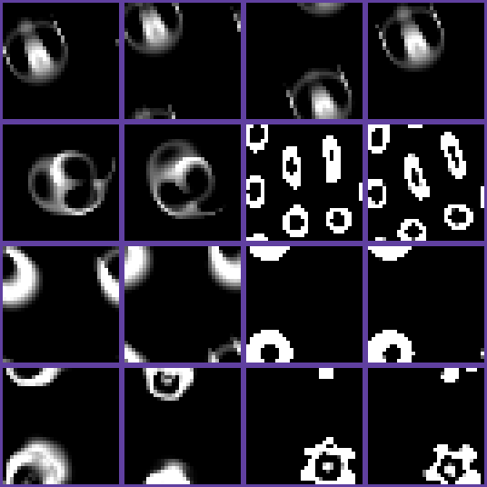
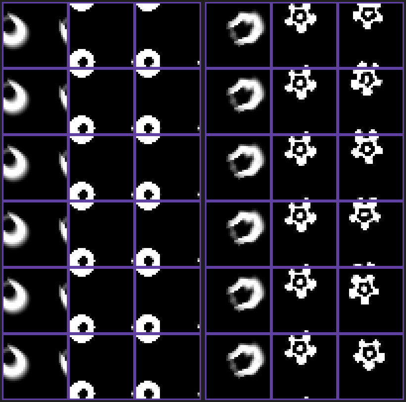
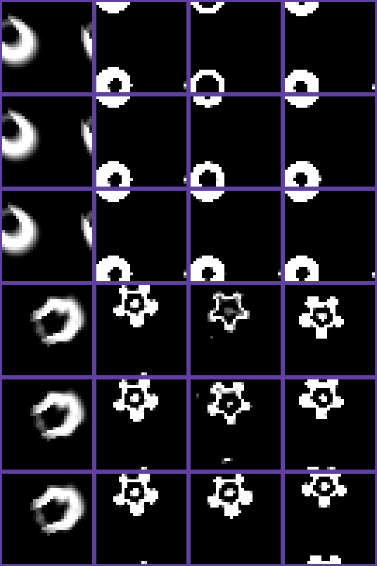
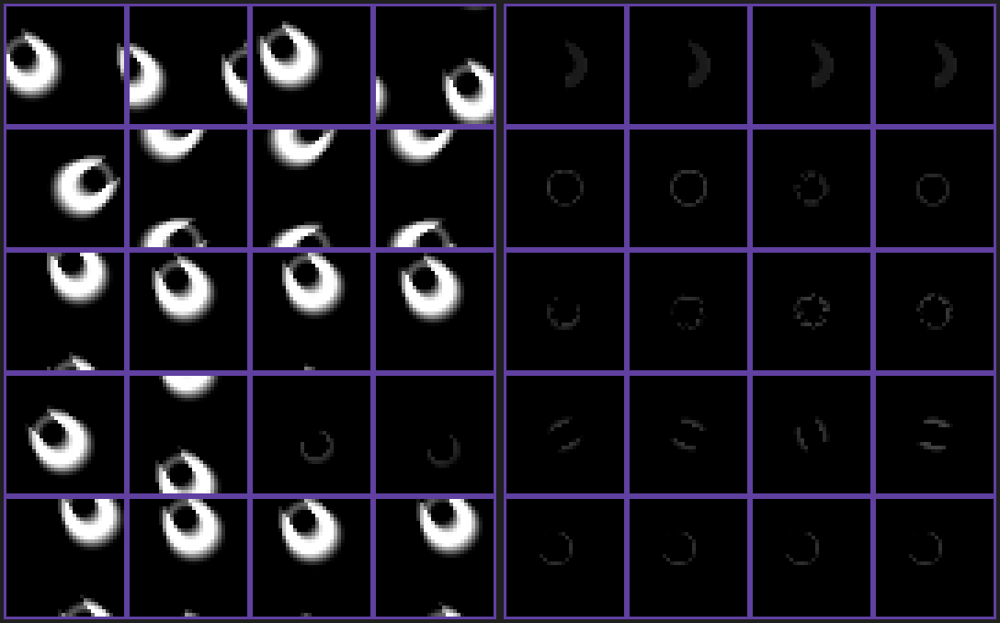
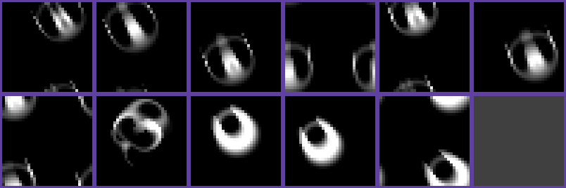

# 表現軸を広げる実験

docs/DESIGN.md の第2部から移した実験の記録。節は取り組んだ順に並べてある。目次と結論の一覧は
[README.md](README.md)。

## 生き残る関数で表情を足せるか

表現軸は、色(色素)・テンポ・身じろぎ(echo)の3つしかない。テンポが作る違いは活発さの強弱だけで、
「待っている」を元気と別物に見せられなかった(docs/DESIGN.md「3状態をテンポに割り当てて直接測った」)。
Glaberish では成長関数が「生まれる関数」G と「生き残る関数」P に分かれ、P は体の内側
(値の大きいセル)にだけ効く。このつまみで、活発さとは質の違う見た目を、崩壊させずに作れて、
しかも元に戻せるかを確かめた(`examples/persistence_expression.rs`、約95秒)。表情に使うには、
戻せることが欠かせない。

**条件**(docs/DESIGN.md「体側の表情の軸を振り分けた」に合わせる。場 32×32、各条件4回):

1. 落ち着かせる時間を乱数でずらし、場に ±0.1% のゆらぎを掛ける
2. エネルギーを 2250 ステップかけて尽きさせる。成長の強さの下限は、元気 1.0 と弱りきった 0.85 の2通り
3. 750 ステップかけて、P(比べるために G も)の中心を σ 単位でずらすか、幅を倍率で変える
4. 3000 ステップ保ち、最後の 900 ステップ(60秒)で見た目の特徴を測る
5. 750 ステップかけて、その生物の成長関数に戻す
6. 3000 ステップ保ち、最後の 900 ステップで特徴を測る

**特徴**は、ドットの画面で見て分かるものに限った。

- 動き差: 速さと脈動。いまの `legibility` と同じ式
- 形差: はっきり見える点(値 > 0.2)の数の相対差
- 表情をかけなかった試行どうしの差(ゆらぎ)を基準にした
- 芯の明るさ(いちばん明るい点)も入れたが、どの条件でも 1.0 に張り付いたので外した
- 体に囲まれた暗いセルの数も数えたが、O2u では尾の輪が体と囲む暗がりを数えていた。形は
  スナップショットで目で確かめた

**結果**:

| 生物 | 崩壊せず・戻れて・差がゆらぎを超えた条件(元気/弱りきった) | 差の中身 | 見た目がはっきり変わった条件 | その後 |
|---|---|---|---|---|
| O2u | P 中心 −0.5σ(0.15/0.26)、P 幅 ×0.85(0.19/0.46)、×0.93(0.11/0.29) | 脈動の強弱だけ(形差 0.02 以下) | なし(−1σ でも姿は同じ) | − |
| OG2g | 元気のときだけ P 中心 ±0.5σ(0.12〜0.16)、幅 ×0.85/×0.93(0.13〜0.20)。弱りきると差は 0.01〜0.03 でゆらぎ並み | 脈動の強弱 | P 中心 −1σ(元気のとき)・幅 ×1.2 以上 | 小さな輪の群れに分かれ、戻しても戻らない |
| S1s | 元気のときだけ P 中心 +0.25σ/+0.5σ、幅 ×1.1(0.08〜0.36、形差 0.04〜0.12)。弱りきると同じ条件で4回とも崩壊 | 少し大きく速くなる | P 中心 −0.25σ から、幅 ×0.93 から | 止まったドーナツ形になり、戻しても戻らない |
| 2S1v | P 幅 ×0.93(0.09/0.17) | 脈動の強弱 | P 中心 −0.25σ から、幅 ×0.85 以下(×1.1 以上は膨張するか同じく止まる) | 止まった歯車形・輪になり、戻しても戻らない |

(括弧内は「そのまま」との動き差。戻した後の差は、どれもゆらぎと同程度の 0.00〜0.10)

(行は上から O2u・OG2g・S1s・2S1v、いずれも元気。列は左から、そのまま・戻れた条件・見た目が
変わった条件・それを元に戻した後。O2u の3・4列目は P 中心 −1σ で、見た目は変わらない)

- **P 中心 +1σ は、全生物で崩壊した**。G を動かすのは P より壊れやすく、O2u では G の4条件のうち
  3〜4条件が、元気でも弱りきっていても崩壊した
- **戻れる範囲の変化は、脈動の強弱だった**。形はほとんど変わらない。脈動の差は相対差では
  0.1〜0.46 あるが、O2u の総量の標準偏差は 0.09〜0.76 で総量 70 の1%前後しかなく、目で分かるかは
  怪しい。いまの `legibility` が絶対量の小ささを見ないことの限界でもある。どちらにしても
  「活発さの強弱」の軸で、テンポと同じ種類の違いしか足せない
- **質の違う見た目(止まったドーナツ形・歯車形・輪の群れ)は作れるが、どれも一方通行だった**。
  関数を元に戻して 3000 ステップ保っても、別の安定な形に移ったまま戻らない(戻した後の姿は、
  表情をかけていたときの姿とほぼ同じ)。表情ではなく、姿が変わる「変態」に近い
- **安全な範囲は、生物ごと・エネルギーごとに違う**。S1s は元気なら P 中心 +0.5σ で戻れるが、
  弱りきると +0.25σ で崩壊する。エネルギーの軸と組み合わせると、崖を読まずに使えない

**結論**: 生き残る関数では、表現軸の少なさは補えない。戻せる範囲で足せるのは活発さの強弱
(テンポと同じ種類)だけで、質の違う見た目は戻れない形の移り変わりとしてしか現れなかった。
「待っている」を別物に見せる役は、これまでどおり色が担う。

一方通行の形の変化は、表情としては使えない。ただ、長い間の扱われ方で姿が変わる、という
「変態」の表現には使える可能性がある(長く放置されるとドーナツ形に落ち着く、など)。その場合は、
崩壊からの復帰(生物を置き直す)で姿が元に戻ることとの整合を考える必要がある。

**限界**: 場は 32×32 だけで、M5Stack の 43×32 は見ていない。試行は条件ごとに4回。戻した後に
保ったのは 3000 ステップで、もっと長く待てば戻る可能性は否定できない。ただし S1s が止まった形は、
放置で 20000 ステップ保たれることが分かっている。変える速さ(750 ステップ)は1通りだけ。P と G を
同時に動かす組み合わせ、戻すときに一度反対側へ振るような戻し方は試していない。

## 別の形から戻る帰り道はあるか

「生き残る関数で表情を足せるか」では、S1s と 2S1v が P 中心 −0.25σ で止まった形(ドーナツ形・
歯車形)に移り、P を戻しても戻らなかった。試したのは「戻す」だけだった。そこで、逆向きのきっかけを
与えて元の姿に戻せるかを確かめた(`examples/form_return.rs`、経由の経路を含めて約65秒)。

ユーザーとは、柔軟な生物を探すより先にこれを試すと決めた。試すのが安いうえ、結果によって、探索の
評価で「別の形へ移っても、戻れるなら表現として認めるか」が決まるため。

**条件**(元気な体、場 32×32、各きっかけ8回):

1. 行き: P 中心を 750 ステップかけて −0.25σ へ動かし、3000 ステップ保ち、750 ステップで戻す
2. 3000 ステップ保ち、移った姿を測る
3. きっかけを 1000 ステップの枠で与え、3000 ステップ保って測る
4. 元の姿と移った姿のどちらに近いかで分ける。距離は動き差 + 形差で、どちらからも 0.3 以上離れたら
   「別の形」とする
5. 戻ったら、もう1周同じことを繰り返す予定だった

きっかけは次の3種類。

- P を一時的に振る(中心 +0.25σ・+0.5σ、幅 ×1.1・×1.2。250 ステップで振り、500 保ち、250 で戻す)
- 体の重心へのクリック相当の注入(半径 4.5・量 0.2 を足す/削る、1回・5回、量を3倍)
- 重心から4セル横への注入(足す・削る・3倍を5回)。止まった形は対称に近いので、動き出すには
  非対称な押しが要るかもしれないと考えた

**結果**: **どのきっかけでも、元の姿には1回も戻らなかった**(2種 × 12 通り × 8回、行きでは全試行が
形を変えた)。

| きっかけ | S1s | 2S1v |
|---|---|---|
| 何もしない | 移ったまま 7・別の形 1 | 移ったまま 7・別の形 1 |
| P 中心 +0.25σ に振る | 崩壊 8 | 移ったまま 6・別の形 1・崩壊 1 |
| P 中心 +0.5σ に振る | 崩壊 8 | 崩壊 8 |
| P 幅 ×1.1 / ×1.2 に振る | 移ったまま 5 / 2・別の形 3 / 6 | 移ったまま 8 / 6・別の形 0 / 2 |
| 重心への注入(4通り) | 移ったまま 7〜8・別の形 0〜1 | 移ったまま 7〜8・別の形 0〜1 |
| 4セル横への注入(3通り) | 移ったまま 3〜6・別の形 2〜5 | 移ったまま 7〜8・別の形 0〜1 |

(左が S1s、右が 2S1v。列は元の姿・移った姿・きっかけの後。行は上から、何もしない・P 幅 ×1.1・
P 幅 ×1.2・4セル横に3倍足す ×5・重心に3倍足す ×1・4セル横から削る ×5。いずれも試行0)

- **「別の形」も、すべて止まった形のままだった**。きっかけの後の速さは、全試行で最大 0.010
  (元の姿は S1s 0.356・2S1v 0.286)。画像でも、S1s はドーナツ形のまま、2S1v は歯車形の内側の穴が
  少し変わっただけだった。止まった体は脈動がほぼ 0 なので、わずかな差でも相対差が大きく出る。
  距離の式の癖で分かれたものと見ている
- **P を +側へ振ると、S1s は壊れた**。元の姿で安全だった +0.25σ(「生き残る関数で表情を足せるか」)も、
  ドーナツ形からは崩壊した。移った形は、元の形とは生きていられる範囲も違う
- 実際のクリックの3倍の量を5回注入しても、止まった形は崩れも動き出しもしなかった。止まった形は
  刺激に対して硬い

**ほかの状態を経由する帰り道**: ユーザーから「直接帰らず、ほかの生物を経由したら戻れないか」と
提案があり、同じツールに経由するきっかけを足した。

- O2u・OG2g・S1s はカーネル(R=13、リング1本、`kn`=1・`gn`=1)が同じで、成長関数の中心 μ と幅 σ
  だけが違う。S1s では、μ と σ を動かすことが、そのままほかの生物を経由する道になる
- 2S1v はカーネルが違う(R=10、リング2本)ので、2S1v のカーネルのまま μ と σ だけを動かす道になる
- 経由の流れ: 生まれる関数と生き残る関数の両方の μ・σ を、750 ステップかけて経由先の値へ動かし、
  1500 ステップ保ち、750 ステップで戻す
- 経由先: O2u・OG2g の値(全部と半分)。ほかに、成長の強さ(エネルギー)を 0.85・0.7 まで下げて戻す道

| 経由 | S1s | 2S1v |
|---|---|---|
| エネルギー 0.85 / 0.7 | 移ったまま 5 / 3・別の形 3 / 5(経由中の速さ最大 0.001) | 移ったまま 8 / 6・別の形 0 / 2(同 0.008) |
| O2u の μσ | 崩壊 8 | 崩壊 8 |
| O2u の μσ へ半分 | 移ったまま 5・別の形 3(同 0.002) | 移ったまま 6・別の形 2(同 0.017) |
| OG2g の μσ | 別の形 8(同 **0.151**) | 移ったまま 6・別の形 2(同 0.051) |
| OG2g の μσ へ半分 | 移ったまま 4・別の形 4(同 0.063) | 移ったまま 6・別の形 2(同 0.015) |

**経由しても、元の姿には1回も戻らなかった**。戻した後の速さは、全試行で最大 0.002(S1s)・
0.039(2S1v)で、止まったまま。

(上3行が S1s、下3行が 2S1v。行は OG2g の μσ 経由・その半分・エネルギー 0.7 経由。列は元の姿・
移った姿・経由中・戻した後。いずれも試行0)

- **S1s は、OG2g を経由すると動き出した**。経由中、ドーナツ形は細い輪になり、試行によっては
  動いた(速さ最大 0.151。元の S1s は 0.356)。しかし S1s の値へ戻すと、また止まったドーナツ形に
  落ち着いた
- 「別の形」に分けられた試行も、戻した後はどれも止まっていた。止まった体どうしは、速さと脈動が
  0 に近い値どうしの相対差になり、わずかな差でも距離が大きく出る(前の結果と同じ式の癖)
- **S1s の値のもとでは、どこを通ってきても止まった形に落ち着いた**。滑る S1s は、animals.json の
  初期パターンから育てたときにだけ現れる、谷の狭い形なのかもしれない。止まった形のほうが、
  広い範囲から流れ込む谷の深い形に見える。確かめるなら、いろいろな初期状態から S1s の値で
  育てて、滑る形と止まった形がどれくらいの割合で現れるかを数える

**結論**: 試した範囲では、止まった形から元の姿への帰り道は無かった。直接のきっかけでも、ほかの
状態やほかの生物の値を経由しても同じだった。S1s と 2S1v の形の移り変わりは一方通行として扱う。
探索の評価は「元の姿へ戻る」だけを合格にする、狭い方にする。

一方で、止まった形は強い刺激でも壊れず形を保った。「死ににくいが、変形しない」硬い体の例で、
表現の幅を求める今回の狙いとは逆の性質だった(「柔軟な生物」の3つの性質の、生存範囲だけが広い)。

**限界**:

- 試したきっかけは、P の一時的な振り、注入、エネルギーの一時的な低下、ほかの生物の μ・σ の経由。
  テンポの一時的な変化、もっと長く保つ経由、経由から戻すときにもっとゆっくり戻す道は試していない
- 経由先は O2u と OG2g の μ・σ だけで、2S1v では既存の生物を経由していない(カーネルが違うため)
- 距離の式は、止まった体どうし(速さ・脈動が 0 に近い)で相対差が大きく出る。形を分けるのには
  向かず、止まったかどうかは速さで、姿は画像で確かめた
- 注入は x 方向にずらしただけ
- 生物を置き直す(崩壊からの復帰と同じ操作)なら元に戻るが、それは体の中の帰り道ではないので
  数えていない
- 元気な体だけで、弱った体は見ていない

## 滑る S1s は谷の狭い形か

前節の仮説「滑る S1s は初期パターンから育てたときにだけ現れる谷の狭い形で、止まったドーナツ形は
広い範囲から流れ込む谷の深い形」を確かめた(`examples/glide_or_stop.rs`、約10秒)。

**条件**: S1s のパラメータのまま、いまの Lenia の規則、成長の強さ 1.0、場 32×32 で、いろいろな
初期状態から 6000 ステップ育てた。3000 ステップ目と 6000 ステップ目の手前 900 ステップの速さで分けた
(0.1 超を滑る、0.02 未満を止まる。滑る S1s は 0.356、止まった形は 0.010 以下だった)。

- S1s のパターン: そのまま・90度回転・180度回転・左右反転・ゆらぎ 5%/20%/50%・左半分を消す・ぼかす(各8回)
- ほかの3種のパターン(各8回)
- 乱数の円盤(半径5/7/9)・楕円形の塊・細い輪(各32回)

S1s は総量の多い体(パターンの総量 139.8)なので、S1s 以外の初期状態は、総量を S1s のパターンに
そろえた版も試した。倍率を掛けて 1 で切り詰めることを5回繰り返し、円盤9・楕円・ほかの生物の
パターンは 138.5〜139.8 にそろった。円盤5・輪は切り詰めで 76〜79 までしか増えなかった。

**結果**(6000 ステップ目):

| 初期状態 | 滑る | 止まる | 崩壊 | 崩壊したステップ(中央値) |
|---|---|---|---|---|
| S1s(そのまま・90度回転・180度回転・反転・ゆらぎ 5%/20%・ぼかす) | 56/56 | 0 | 0 | − |
| S1s ゆらぎ 50% | 3/8 | 0 | 5/8 | 48 |
| S1s 左半分を消す | 0 | 0 | 8/8 | 9 |
| ほかの3種のパターン(そのまま / 総量をそろえる) | 0 | 0 | 24/24 / 24/24 | 8〜44 / 35〜82 |
| 乱数の円盤・楕円・輪(そのまま) | 0 | 1/160(円盤9) | 159/160 | 7〜39 |
| 乱数の円盤・楕円・輪(総量をそろえる) | 0 | 0 | 160/160 | 10〜30 |

3000 ステップ目から 6000 ステップ目までに、滑る⇔止まるが切り替わった試行は無かった。

(左の列は上から、S1s そのまま・90度回転・ゆらぎ 20%・ゆらぎ 50%・ぼかす。右の列は上から、左半分を
消す・乱数の円盤 半径9・円盤9 総量をそろえる・楕円 総量をそろえる・OG2g 総量をそろえる。各行は試行
0〜3。崩壊した試行は、崩壊した瞬間の薄い名残が写っている)

- **仮説は支持されなかった**。止まったドーナツ形は、S1s 以外の初期状態 368 回のうち1回しか現れず、
  広い範囲から流れ込む谷ではなかった
- **S1s の規則は、S1s に近い形以外をすぐに消す**。S1s 以外の初期状態は、総量をそろえても 7〜82
  ステップで崩壊した
- **滑る形の谷は、S1s のパターンの周りでは広い**。回転・反転・ぼかし・ゆらぎ 20% では全部滑り、
  ゆらぎ 50% でも 3/8 が滑った。左半分を消すと崩壊した
- 滑る形とドーナツ形は、どちらも「S1s に近い形」の周りにしか無い。ドーナツ形は、主に滑る体を
  パラメータで変形させたとき(生き残る関数をずらす、放置で弱る)に行き着く形と見られる。広い谷か
  狭い谷かより、パラメータを動かしたときにどちらの谷へ流れるかが、帰り道が無い理由に近い

**限界**: S1s のパラメータのまま(成長の強さ 1.0)だけで、弱った体の規則では試していない。乱数の
初期状態は数種類の形だけ。ドーナツ形そのものを初期状態にしてはいない(ドーナツ形から滑り出すかは、
前節できっかけを与えて試した範囲でだけ分かっている)。崩壊した試行は、そのまま数えただけで、
崩壊しなかったら何になったかは分からない。

## 柔軟な生物を探す

**狙い**: ユーザーと話して、ほしい体を「刺激に強い」ではなく「刺激で変形しても死なず、表現に
幅が出るくらい生きていられる範囲が広い」体とした。これまでの実験を踏まえ、3つの性質に分けた。

| 性質 | 意味 | これまでに見えた不足 |
|---|---|---|
| 生存範囲の広さ | どこまで変形・パラメータの変化に耐えるか | 崩壊の崖は 0.77 で、表情に使えるのは 0.85〜1.0 だけ。崩壊は前触れが短い |
| 戻れること | 変化が終わったら元の姿に戻るか | 生き残る関数で作った形は戻らない(「別の形から戻る帰り道はあるか」) |
| 変形が見て分かる大きさ | 生きていられる範囲の中で、見た目がどれだけ変わるか | 総量の変化は数%、脈動の差は総量の1%前後 |

硬いだけの体(止まったドーナツ形のように、強い刺激でも崩れず変形もしない)を選ばないよう、
評価は「足切り」と「最大化」に分けた。

1. 足切り: 決まった変化の一式で崩壊しない
2. 足切り: 変化が終わってから一定時間のうちに、元の姿へ戻る。形の移り変わりは一方通行だったので、
   別の形へ戻るのは合格にしない
3. 最大化: 1と2を満たす中で、変化をかけている間の見た目の差の最大値

**探す範囲**(`examples/flexible_search.rs`):

- O2u・OG2g・S1s と同じカーネル(R=13、リング1本、多項式)のまま、成長関数の中心 μ(0.10〜0.34、
  0.02 刻み)と幅 σ(0.010〜0.050、0.004 刻み)の格子 143 点
- 各点について、3種のパターンからそれぞれ出発し、μ・σ を 1500 ステップかけて移して生物を連れていき、
  1500 ステップ落ち着かせる。ほかの値の生物を一から探すより、既知の生物から地続きにたどる方が
  見つかりやすいと考えた(「滑る S1s は谷の狭い形か」で、S1s の規則は S1s に近い形以外をすぐ消した)
- 落ち着いた後に、崩壊・膨張せず、塊(値 > 0.1 のつながり)が1つで、はっきり見える点が 300 以下の
  ものを候補にする
- 基準として、出荷している4種も自分のパラメータで同じ試験にかける

**試験の一式**(ペットが実際に体に与える範囲の変化。どれも候補の姿の複製から、ゆらぎ ±0.1% を
掛けて2回ずつ):

| 試験 | かけ方 | 表現の幅を測る区間 |
|---|---|---|
| 弱る | 成長の強さを 750 ステップで 0.85(`MIN_GROWTH_SCALE`)へ、1500 保ち、750 で戻す | 保った最後の 900 ステップ |
| テンポ ×0.6 / ×1.6 | 同じ流れでテンポを変える(がっかりしきったとき / `MAX_TEMPO`) | 同上 |
| クリック ×5 | 実際のクリック(半径 4.5・量 0.2)を重心に1秒ごと5回 | 最初のクリックから 900 ステップ |
| 3倍を横に ×5 | 量 0.6 を重心から4セル横に5回 | 同上 |

どの試験も、変化の後に 3000 ステップ保ち、最後の 900 ステップを「戻した後」として測る。

**見た目の差の式**: 動き差(速さと脈動の相対差の平均)+ 形差(はっきり見える点の数の相対差)。
「別の形から戻る帰り道はあるか」で、止まった体どうし(速さ・脈動が 0 に近い)では相対差が
大きく出る癖が分かった。そこで、相対差の分母に下限を置いた(速さ 0.05、脈動 0.5、点の数 5)。
これより小さい違いは、目で見て分からないとみなす。戻した後の差が 0.3 未満なら「戻った」とする。

**途中で見つけて直した誤り**(約1分の実行を3回やり直した):

1. **候補の条件が、出荷している生物を落としていた**。最初は「値 > 0.1 のつながりが1つ」を条件にして
   いたが、基準の O2u と 2S1v が「塊 2」で候補にならなかった。尾の薄い部分が本体から離れて数え
   られていたためで、同じ理由で O2u に近い値の動く体(速さ 0.56〜0.74)も落ちていた。塊ごとの総量が
   全体の 10% 以上ある「主な塊」が1つなら候補とするよう直した
2. **ペットの範囲を超える試験を合格の条件にしていた**。「3倍を横に ×5」(量 0.6)で、O2u と 2S1v は
   崩壊し、動く候補 11 のうち 9 が崩壊した。ペットのクリックは量 0.2 から慣れで弱まる一方なので、
   この強さは体に届かない。「ペットが実際に与える範囲」という方針から外れていたので、参考として
   出すだけにし、合格の条件と順位には残りの4つの試験を使う

**結果**(143 点 × 出発する生物3種 = 429 点):

- 連れていく間に壊れた 280、落ち着かせる間に壊れた 5、主な塊が1つでない 106、候補 38、合格 29
- 基準(出荷している生物)

| 生物 | 速さ | 弱る | テンポ ×0.6 | テンポ ×1.6 | クリック | 判定 |
|---|---|---|---|---|---|---|
| O2u | 0.623 | 0.20 | 0.28 | 0.21 | 0.06 | 合格(最大 0.28) |
| OG2g | 0.725 | 0.33 | 0.37 | 0.80(戻らず) | 0.06 | 不合格 |
| S1s | 0.356 | 1.10(戻らず) | 0.23 | 0.32 | 0.46 | 不合格 |
| 2S1v | 0.281 | 0.20 | 0.23 | 0.38 | 0.02 | 合格(最大 0.38) |

(数字は、変化をかけている間の見た目の差。3倍の試験では、O2u と 2S1v は崩壊、OG2g は戻らず、
S1s は 0.44 で戻った)

- 合格した動く体は3つ。いずれも既存の生物のすぐ近くの値だった

| 候補 | μ / σ | 速さ | 弱る | テンポ ×0.6 | テンポ ×1.6 | クリック | 最大 |
|---|---|---|---|---|---|---|---|
| O2u から | 0.160 / 0.014 | 0.561 | 0.33 | 0.38 | 0.27 | 0.01 | 0.38 |
| O2u から | 0.140 / 0.014 | 0.635 | 0.27 | 0.37 | 0.19 | 0.05 | 0.37 |
| OG2g から | 0.160 / 0.022 | 0.678 | 0.12 | 0.29 | 0.36 | 0.07 | 0.36 |

(候補のうち速さ 0.1 超の 11 体。上の段は左から O2u から μ 0.12・σ 0.010 / μ 0.12・σ 0.014 /
μ 0.14・σ 0.014(合格)/ μ 0.14・σ 0.018 / μ 0.16・σ 0.014(合格)/ μ 0.16・σ 0.018。下の段は左から
O2u から μ 0.18・σ 0.018、OG2g から μ 0.16・σ 0.022(合格)、S1s から μ 0.30・σ 0.050 / μ 0.28・σ 0.038 /
μ 0.28・σ 0.042)

- 動く候補の姿は、どれも出発した生物とほぼ同じだった。O2u からの体は尾の輪を持つ Orbium の形、
  OG2g からの体はうずまく形、S1s からの体は厚い三日月形。見た目の差が既存の生物と同じくらいだった
  ことと合わせて、この格子で見つかった動く体は、既存の生物の近縁と見るのが自然
- 残りの合格 26 は、S1s から μ 0.28〜0.34 へ連れていった止まった体(速さ 0.007 以下)。画像では、値が
  1 に張り付いた円盤に小さな穴がある形で、止まったドーナツ形の仲間だった。見た目の差はクリックで
  押された変形(0.35 以下)で、弱る・テンポでは 0.1 未満しか変わらない
- 見た目の差が大きい候補は、戻らない試験があって合格しなかった。S1s から μ 0.30・σ 0.050 は最大
  1.25(テンポ ×0.6)、O2u から μ 0.12・σ 0.014 は 0.87(テンポ ×1.6)だが、どちらも戻らなかった

**結論**:

- この格子(カーネル R=13 のまま μ と σ だけを動かす)には、出荷している生物より大きく柔軟な体は
  無かった。合格した動く体の見た目の差は最大 0.36〜0.38 で、基準の O2u(0.28)・2S1v(0.38)と
  同じくらい。差の中身も、主にテンポで速さが変わることで、これまでと同じ活発さの軸だった
- **見た目の差が大きいほど戻れない、というぶつかり合いが、探索の中にもそのまま出た**。「柔軟な
  生物」の3つの性質のうち、戻れることと変形の大きさは、この範囲では両立しにくい
- 合格の大半は止まった硬い体だった。3つの性質だけで評価すると、硬い体が「生存範囲が広く、戻れる」
  側で合格してしまう。止まった体は動きで表現できないので、動いていることを条件に足すか、形の
  変化を測る特徴を足すかを決める必要がある

**限界**:

- 探したのは μ と σ だけで、カーネル(半径・リングの数と重み)は動かしていない
- 格子は粗い(μ 0.02・σ 0.004 刻み)。連れていく途中で 280 点が壊れたので、もっとゆっくり連れていけば
  候補が増える可能性がある
- 各点2回だけ。場は 32×32 だけ
- 見た目の特徴は速さ・脈動・点の数だけで、輪郭の形の変化は測っていない
- 合格の境目(戻った差 0.3)と分母の下限は、これまでの実測から決めた値で、ずらしたときの結果は
  見ていない
