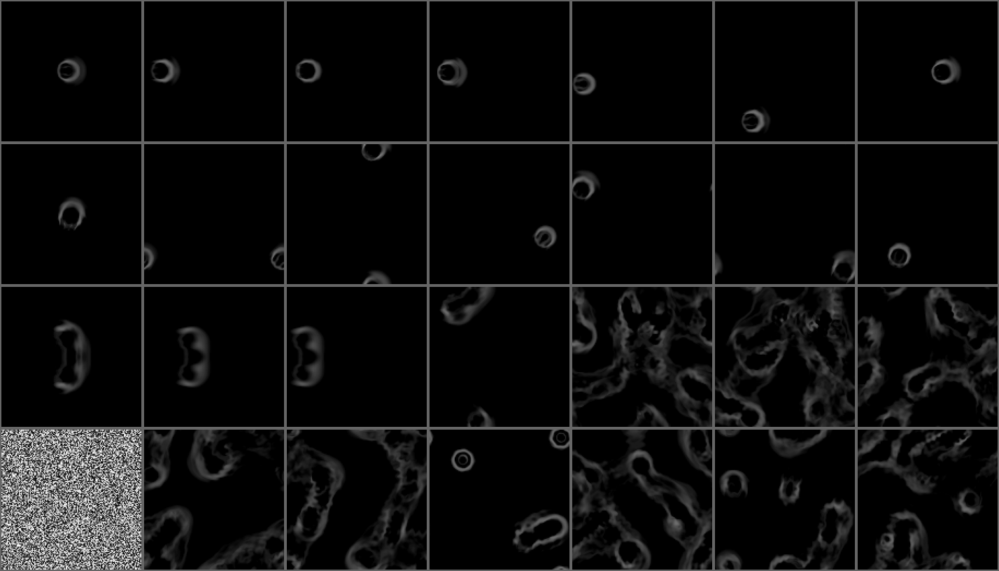
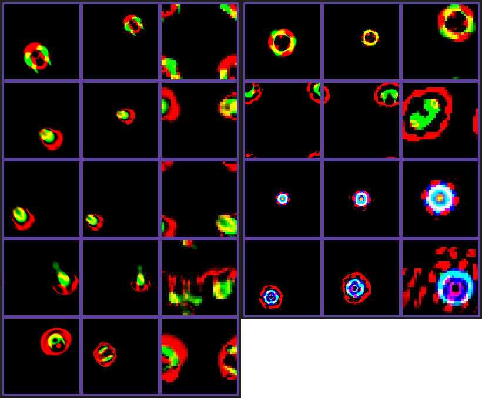
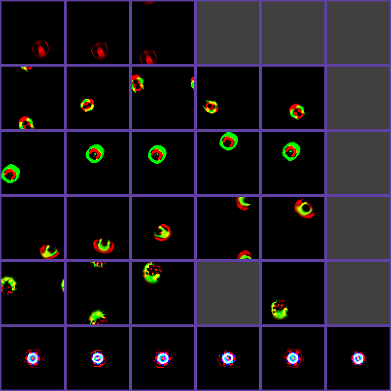
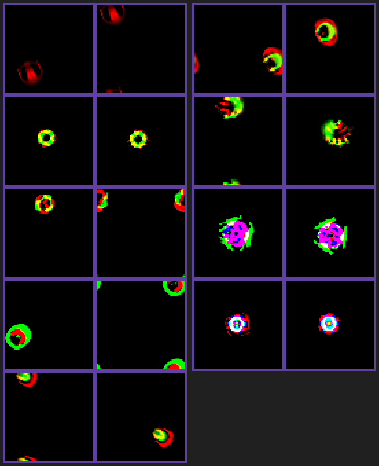

# 体の規則の候補(issue #1)

docs/DESIGN.md の第2部から移した実験の記録。節は取り組んだ順に並べてある。目次と結論の一覧は
[README.md](README.md)。

## 成長の強さの崖は時間の刻みから来ているか

issue #1「体(Lenia)を別のルールに差し替える候補の検討」は、これまで出会った崖
(growth_scale 0.78 で生き延び、0.77 で完全崩壊)が Lenia の離散時間ステップ由来の不安定性
かもしれず、時間を連続に近づけた Asymptotic Lenia なら崖がなだらかになるかもしれない、と
提案した。新しいルールを実装する前に、今の Lenia のまま時間の刻みを小さくして崖を測り直した
(`examples/time_step_cliff.rs`、約4分。ユーザーと合意)。

**方法**:

- 時間の刻みはテンポ(`Lenia::step_at_tempo`)で変え、同じ「体の時間」だけ進めて比べる
  (テンポ ×0.5 なら2倍のステップ数)。テンポは ×2 / ×1 / ×0.5 / ×0.25 / ×0.1
- 条件は既存のテスト `growth_scale_has_a_cliff_rather_than_a_gentle_slope` と同じ(64×64 の場、
  置いた直後から成長を弱める)。体の時間は、崖の近くでゆっくり崩れる分を拾えるよう 1800
- 崖の位置: 成長の強さ 0.50〜1.00 を 0.05 刻みで調べ、一番高い崩壊と一番低い生存の間を
  8回二分する。崖の鋭さ: 崖のすぐ上(+0.005〜+0.05)の総量を、同じテンポの健康な総量と比べる
- 同じ条件で既存のテストを再現できることを先に確かめた(テンポ ×1、600ステップで、0.78 は
  総量 69.85、0.77 は体の時間57で崩壊)

**結果**(崖の位置。※は粗く調べたとき、生き延びる強さより上で崩壊した組があったもの):

| 生物 | ×2 | ×1 | ×0.5 | ×0.25 | ×0.1 |
|---|---|---|---|---|---|
| O2u | 0.695 | 0.774 | 0.844 | 0.887 | 0.920 |
| S1s | 0.861 | 0.927 | 0.809※ | 0.775 | 0.768 |
| OG2g | 0.587※ | 0.774 | 0.588※ | 0.598※ | 0.610※ |
| 2S1v | 0.536※ | 0.50 まで崩壊せず | 同左 | 同左 | 同左 |

- **崖はなだらかにならない**: O2u の崖のすぐ上の総量は、どの刻みでも健康な総量の 0.93〜0.99
  を保ち、崖のすぐ下(−0.01)では体の時間 35〜134 で崩壊した。S1s も 0.82〜0.99 を保つ。
  刻みを細かくしても、衰え方が滑らかになる様子は無い
- **崖の位置は刻みで大きく動き、動く向きは生物で逆**: O2u は刻みを細かくするほど崖が上がる
  (0.774 → 0.920)。今の O2u は、時間の刻みが粗いことに支えられて、弱い成長でも形を保って
  いる部分がある。S1s は細かくするほど下がり、0.77 付近に収まっていく
- **OG2g・2S1v は、総量だけの崩壊の判定では崖を捉えられない**: OG2g は崖のすぐ上で総量が
  健康な約9倍に膨らみ、テンポ ×2 では成長を弱めなくても膨張する(健康な総量が OG2g 889、
  2S1v 1474)。膨張して形を失った状態を「生き延びた」と数えている

**結論**: 「崖は離散時間ステップの副作用で、時間を連続に近づければなだらかになる」は
支持されない。崖の鋭さは刻みによらず、位置は刻みで動くが消えない。O2u では、連続に
近づけるほど崖が 1.0 に近づき、成長を弱めるゆとりが無くなる方向だった。Asymptotic Lenia は
時間の扱い以外にも更新の形が変わるので、これで結論ではない。ただ「時間を連続にすれば崖が
消える」ことを期待して移る根拠は無い。移行を考えるなら、崖の有無ではなく、崖の位置と
余裕、既存の生物がその規則で存在できるか、を比べる必要がある。

**いまのペットへの影響**: 成長の強さの下限 0.85 は、テンポ ×1 の崖 0.77 から余裕を取った
値だった。ところが O2u の崖はテンポ ×0.5 で 0.844 まで上がる。がっかりしきるとテンポは
×0.6 になり(×0.6 の崖は測っていないが、×0.5 と ×1 の間にある)、放置されてエネルギーが
尽きた(成長の強さ 0.85)うえにがっかりしきった O2u は、この実験の条件では崖から 0.01〜0.02
しか離れていない。徐々に弱らせる既存のテスト(がっかりしきったテンポで世話が来ないまま
20000ステップ)は全生物で通っており、置いた直後から急に弱めるこの実験より穏やかな条件では
あるが、余裕は思っていたよりずっと小さい。

> 注記(現在): 徐々に弱らせる条件で測り直すと、テンポ ×0.6 での O2u の崖は 0.80 と 0.77 の間にあり、下限 0.85 から 0.05 以上離れていた。いまのペットも全4種で16回とも崩壊しなかったので、下限は変えていない(「放置されてがっかりした体の余裕」)。

**限界**: 置いた直後から成長を弱める条件だけで、徐々に弱らせたときの崖は測っていない。
崩壊の判定は総量だけで、膨張は見ていない。体の時間 1800 で打ち切った。

## 放置されてがっかりした体の余裕

前節で、置いた直後から急に弱める条件では、O2u の崖はテンポ ×0.5 で 0.844 まで上がり、
放置されてがっかりした状態(成長の強さ 0.85、テンポ ×0.6)は崖から 0.01〜0.02 しか離れて
いないと分かった。実際の使われ方に近い、徐々に弱らせる条件で余裕を測り直した
(`examples/disappointed_margin.rs`、約3分。ユーザーと合意)。

**方法**:

- **測定1(いまのペットそのもの)**: 全4種の `Pet`(自律コントローラを含む)を触らずに放置して
  エネルギーを尽きさせ(2250ステップ)、がっかりを750ステップかけて最大にし(テンポ ×0.6)、
  そのまま20000ステップ進める。落ち着かせる長さを乱数でずらして16回試す
- **測定2(徐々に弱らせたときの崖)**: `Lenia` を直接進め(コントローラなし)、成長の強さを
  2250ステップかけて目標の下限まで、テンポを750ステップかけて目標まで下げ、6000ステップ保つ。
  場に ±0.1% のゆらぎを掛けて何回も試す

**結果**:

| 測定 | 条件 | 崩壊 |
|---|---|---|
| 1 | 全4種、いまのペット(成長の強さ 0.85、テンポ ×0.6) | すべて 0/16。総量の底は O2u 0.95、OG2g 0.81、S1s 0.74、2S1v 0.62 |
| 2 | O2u、下限 0.86〜0.80 × テンポ ×1.0 / ×0.6 / ×0.5 | すべて 0/16 |
| 2 | 全4種、テンポ ×0.6、下限 0.85 / 0.83 / 0.80 | すべて 0/8 |
| 2 | 全4種、テンポ ×0.6、下限 0.77 | O2u だけ 4/8、ほかは 0/8 |

- 徐々に弱らせると、O2u はテンポ ×0.5 でも成長の強さ 0.80 まで崩壊しなかった。置いた直後から
  急に弱める条件の崖(×0.5 で 0.844)より、ずっと低いところまで耐える。ゆっくり弱れば、体の
  形がそれに合わせて落ち着く余地があるためと考えている
- テンポ ×0.6 での O2u の崖は 0.80 と 0.77 の間にある(0.77 で半分が崩壊)。いまの下限 0.85 から
  0.05 以上離れている

**結論**: いまの下限(成長の強さ 0.85、がっかりしきったテンポ ×0.6)は変えなくてよい。前節で
見えた余裕の小ささ(0.01〜0.02)は、置いた直後から急に弱める厳しい条件でのものだった。いまの
ペットでは、エネルギーもがっかりもゆっくりしか変わらない。

**限界**: 崩壊が0回だったことは、起きないことの証明ではない。16回で0回なら、崩壊の起きやすさは
95%の確からしさで2割未満、としか言えない。測定2は6000ステップで打ち切り、コントローラを
含めていない。場は PC と同じ 32×32 で、M5Stack の場(43×32)は測っていない。崩壊の判定は総量
だけ。パラメータが急に変わる場面(プレビューで気分を固定した瞬間など)も測っていないが、
プレビューは新品の個体(エネルギー満タン、成長の強さ 1.0)で始まるので、崖からは遠い。

## Asymptotic Lenia で既存の生物は生きられるか

issue #1 の候補のうち、移行の手間が一番小さいと見込まれた Asymptotic Lenia を、既存の生物で
試した。あわせて、ほかの候補を文献で確かめた(ユーザーと合意)。

**定義**(小島 2023 の整理による): `u ← u + Δt (T(K∗u) − u)`、`T = (G + 1) / 2`。いまの Lenia と
違って 0〜1 への切り詰めが無く、微分方程式として書ける。同じカーネル・成長関数・成長を弱める
つまみ(目標へ増える変化にだけ掛ける)で `Lenia::step_asymptotic` として実装し、
`examples/time_step_cliff.rs -- --asymptotic` で前の2節と同じ測り方をした(約11分)。単体テストで、
目標へ Δt だけ近づくこと、つまみが増える向きの変化にだけ効くことを確かめた。

**結果: 既存の生物は、Asymptotic Lenia では生き物として存在しない**(成長を弱めずに体の時間
1800 進めた後の総量。置いたときを1とする):

| 生物 | ×2 | ×1 | ×0.5 | ×0.25 | ×0.1 |
|---|---|---|---|---|---|
| O2u | 11.1 | 11.8 | 11.5 | 12.0 | 11.5 |
| OG2g | 9.4 | 9.3 | 9.8 | 9.3 | 9.3 |
| S1s | 崩壊 | 崩壊 | 0.82(ほぼ動かない) | 0.82 | 0.82 |
| 2S1v | 10.3 | 10.6 | 10.5 | 10.5 | 10.5 |

- O2u・OG2g・2S1v は、同じパラメータのまま置くと総量が9〜12倍に膨らみ、形を保った生き物では
  なくなった(64×64 の場で総量 850〜1500)
- S1s はテンポ ×1 以上で崩壊し、×0.5 以下では動かない塊になった
- 膨らんだ後の総量が時間の刻みでほとんど変わらない(O2u で 11.1〜12.0)のは、時間の刻みに
  依らないというこの規則の性質とは合っている
- 崖の測り方(総量が5未満なら崩壊)は膨張を生存と数えるので、この規則での崖の値(O2u の
  0.62 など)は意味を持たない

**文献で確かめたほかの候補**:

- 離散化の細かさとグライダーの関係を調べた研究(Davis & Bongard, arXiv 2401.13111)は、Orbium を
  刻みを細かくしても消えない型に、SmoothLife と Gray-Scott の U-skate のグライダーを特定の粗さで
  しか安定しない型に分けている。SmoothLife のグライダーは時間の刻みが1付近・カーネル半径11の
  ときに安定し、U-skate は空間の刻みが Δx = 2.73e-3〜3.62e-3 の狭い範囲でしか安定しない。どちらも
  「崖を減らしたい」という issue の狙いとは逆向きで、32×32 の場に収まるかも怪しいので、実装は
  していない
- Asymptotic Lenia 用のグライダーは、カーネルと成長関数を変えたうえで探索によって見つけられている
  (3つのリングの重み [5/6, 7/12, 1]、μ = 0.21、σ = 0.018、Δt = 0.1。arXiv 2508.04167)。初期パターンは
  勾配降下で作られ、カーネル半径は書かれていない

**結論**: Asymptotic Lenia は、規則を差し替えるだけでは使えない。既存の生物は膨張して生き物で
なくなるので、この規則に合う生物(カーネル・成長関数・初期パターン)を探し直す必要がある。
issue で懸念していた「生物を探し直す手間」が、実際に一番大きな移行コストだった。崖がなだらかに
なるかは、その生物が見つかってからでないと比べられない。`Lenia::step_asymptotic` は、その探索に
使えるよう残してある(ペットは使っていない)。

**限界**: いまの生物のパラメータをそのまま使っただけで、μ や σ を合わせ直すことは試していない。
成長関数は生物ごとの形(多項式・指数)のままにした。文献で見送った候補は、このプロジェクトでは
動かしていない(SmoothLife だけは、次節で見た目を確かめるために軽く動かした)。

## SmoothLife を軽く動かしてみた

文献では「特定の粗さでしか安定しない」グライダーを持つとして実装を見送った SmoothLife だが、
見た目がいまの Lenia と違って面白そうだというユーザーの提案で、一度動かして見た目を確かめた
(`examples/smoothlife_trial.rs`、約4分。ペットには触れていない)。

**規則**(Rafler 2011): 各セルで、内側の円(半径 ri)の平均 m と、外側の輪(ri〜ra、ra = 3 ri)の
平均 n を求める。m に応じて「生まれる区間」と「生き残る区間」を切り替え、n がその区間にあるかを
滑らかに判定する。規則の組は、参考にした Python 実装(duckythescientist/SmoothLife)の2つに
合わせた。

- `BasicRules`: 区間 [0.278, 0.365] / [0.267, 0.445]、離散時間(f ← s)
- `SmoothTimestepRules`: 区間 [0.254, 0.312] / [0.340, 0.518]、目標へ近づける時間の進め方
  (f ← f + dt(s − f)、dt = 0.1)

**最初の試行の失敗**: 円を3〜4個まばらに置いて始めたところ、ほとんどの条件で50〜100ステップの
うちに消えた(残った1条件は、太い帯が迷路のように場を埋めて止まった)。参考にした実装は、辺が
ra の正方形を「場の面積 ÷ (2 ra)²」個と密にばらまいていたので、それに合わせてやり直した。

**結果**(行が条件 E〜I、列がステップ 0・50・100・200・400・800・1600):

| 条件 | 場 | ri / ra | 規則 | 様子 |
|---|---|---|---|---|
| E | 128×128 | 7 / 21 | `BasicRules` | ステップ100までに、中に穴のあいた球のようなグライダーが1匹だけ残り、1600ステップまで形を保って滑り続けた(占有率 0.05、10ステップごとの変化量 0.0975 で一定) |
| F | 128×128 | 7 / 21 | `SmoothTimestepRules` | 穴のある輪、ダンベル形、ビーズを連ねたような紐でつながった塊が次々に現れ、動き続けた。1600ステップでは同心円の塊が残った |
| G | 64×64 | 3.67 / 11 | `SmoothTimestepRules` | 塊がもつれ合った後、400ステップまでに消えた |
| H | 64×64 | 3.67 / 11 | `BasicRules` | 50ステップまでに消えた |
| I | 32×32 | 2 / 6 | `SmoothTimestepRules` | 格子の粗さが目立つ輪や線の網が場を埋め、グライダーは現れなかった |

**見た目**: E のグライダーは中が抜けた球が滑っていく姿で、いまの Lenia の生物(中身の詰まった
体)とははっきり違う。F の、紐でつながった塊やビーズの列も Lenia には無い見た目だった。

**動き**(`--animate` で、E を100〜700ステップ、F を0〜900ステップの間、細かい間隔で書き出して
アニメーションにして確かめた): E のグライダーは形を保ったまま一定の向きに滑り、場の端を越えて
反対側から現れる。F は、最初は塊が形を変えながらもつれ合うが、400ステップを過ぎると、上下の
塊を縦に伸びたビーズの列でつないだ形になり、ほとんど動かなくなる(紐の中の粒がわずかに揺れる
程度)。

**ペットに使う場合の壁**: グライダーが現れたのは 128×128・外側の半径21のときだけで、グライダーの
差し渡しは外側の輪(直径42セル)と同じくらいある。ペットの場(PC 32×32、M5Stack 43×32)に合わせて
半径を縮める(G・H・I)と、消えるか、格子の粗さが目立つ網になった。先行研究の「特定の粗さでしか
安定しない」という指摘とも合う。使うなら場を 128×128 程度に広げる必要があり、1ステップの計算は
約1500タップ × 16384セルで、疎な畳み込みで済むいまの Lenia(32×32)より2桁ほど重い。PC なら
動かせる見込みはあるが、M5Stack では難しい。

**限界**: 1通りの初期配置でしか試しておらず、グライダーが現れる確率は見ていない。成長を弱める
つまみ(エネルギー)に当たるものや崖の位置、摂動への強さは測っていない。畳み込みは素朴な方法で、
FFT などの高速化はしていない。

## Glaberish を取り込む

SmoothLife に既知の生物のカタログが無いことから、生物を探索した先行研究を調べ、Davis & Bongard の
研究(Glaberish、ALife 2022)と、その実装 yuca(MIT)に
行き着いた。yuca を丸ごと取り込むのではなく、必要な考え方と式だけを Rust に取り込む方向に
した(ユーザーと合意)。理由は3つ。

- yuca は Python と PyTorch が前提で、M5Stack の `no_std` でも、PC の常駐の目標(CPU 1.9%・
  メモリ 4.5MB)でも動かせない
- yuca の評価関数は、予測器のニューラルネットを学習させ、その正解率の低さを適応度にしている。
  何を良しとするかを式で追えなくなり、見える量と式で評価してきた方針と衝突する。見つかった
  規則とパターン自体は式とデータなので、取り込んでも透明性は崩れない
- 依存を増やさず、これまでの測る道具(崖、見分けやすさ、グライダーの有無)をそのまま使える

**取り込んだもの**(`crates/vmc-pet-body/src/lenia.rs`、ペットはまだ使っていない):

- **Glaberish の更新式**(`Lenia::step_glaberish`): `A ← clip(A + Δt [(1 − A) G(K∗A) + A P(K∗A)])`。
  成長関数を、空のセルほど効く「生まれる関数」G と、生きているセルほど効く「生き残る関数」P に
  分けたもの。ライフゲームの誕生と生存の条件に当たり、生まれる条件が生き残る条件に含まれない
  規則(Morley など)も書ける。yuca の「今の値」は、既定では中心だけ1の 3×3 カーネル、つまり
  セルの値そのもので、ここでもそうしている
- **成長関数1つぶんの定義**(`GrowthFunction`)と、生物の成長関数を取り出す
  `LeniaParams::growth_function`
- **半径ごとの形からカーネルを作る方法**(`Lenia::with_radial_profile`): yuca の `get_kernel` と
  同じく、格子の各点で形を評価し、最小値を引いてから合計を1にする。`animals.json` の生物の
  カーネル(リングごとの核と重み)では表せない、ガウス混合などのカーネルを試せる

単体テストで、生まれる関数と生き残る関数を同じにすると1ステップでいまの規則と一致すること
(差 1e-6 未満)、空のセルは生まれる関数だけ・満ちたセルは生き残る関数だけで動くこと、半径ごとの
形から作ったカーネルの重みが合計1で形どおりの位置にしか無いことを確かめた。

**確かめ1: 今までの生き物はそのまま使えるか**(`examples/glaberish_trial.rs`、64×64、20000ステップ)。
式の上では、生まれる関数と生き残る関数を同じ G にすると `(1 − A) G + A G = G` で、いまの Lenia と
同じ規則になる。浮動小数点の計算順序が変わるぶんのずれを、いまの規則と並べて動かして見た。

| 生物 | いまの規則 | Glaberish(G = P) | 総量が1%以上ずれたステップ |
|---|---|---|---|
| O2u | 崩壊せず・総量 73.53 | 崩壊せず・総量 73.34 | 1233 |
| OG2g | 崩壊せず・総量 99.19 | 崩壊せず・総量 95.73 | 1166 |
| S1s | 崩壊せず・総量 139.57 | 崩壊せず・総量 139.59 | ずれず |
| 2S1v | 崩壊せず・総量 118.79 | 崩壊せず・総量 129.94 | 618 |

4種とも崩壊せず、総量もいまの規則と近い(2S1v はもともと脈動が ±19 ほどある)。ただし3種は
600〜1200ステップで軌跡が分かれた。計算順序のわずかな差がカオスで広がるためで、**生き物として
そのまま使えるが、いまの規則とまったく同じ動きにはならない**。

**確かめ2: 移植が合っているか**。yuca の s613 の規則(`ca_configs/s613.npy` から読んだ値: カーネル
半径31・ガウス3本の輪、生まれる関数 μ = 0.0621・σ = 0.0088、生き残る関数 μ = 0.2151・σ = 0.0369、
Δt = 0.1)に、yuca が見つけたパターン(`yuca/zoo/*.npy`)を置き、128×128 で3000ステップ動かした。
ランダムな初期状態からも1回動かした。

(行は上から s613_s613_frog000、frog000、s613_fast_wobble_glider000、ランダム。列はステップ
0・100・250・500・1000・2000・3000)

| 置いたもの | 様子 |
|---|---|
| カエル2種(s613_s613_frog000、frog000) | 小さな輪のような体が、3000ステップ形を保ったまま場を横切って動き続けた(総量 64〜89 で脈打つ、塊1つ) |
| 速く揺れるグライダー | 最初はそら豆形のまま進むが、500ステップで2つに割れ、1000ステップからは場を埋める乱流になった(総量 187 → 943) |
| ランダムな初期状態 | 乱流の中から、カエルに似た小さな輪が何度も現れた |

カエル2種が形を保って動き、ランダムな初期状態からもカエルに似た生き物が現れたので、更新式と
カーネルの移植は合っていると見ている(論文の「ランダムな初期状態からカエルが現れる」とも合う)。

**限界**: 速く揺れるグライダーが崩れたのが、移植の差(yuca は既定で倍精度・場の大きさも違う)に
よるのか、もともと長くはもたないのかは切り分けていない。パターンのデータ(yuca の `.npy` を
JSON に書き出したもの)はリポジトリに入れておらず、実験ツールには書き出した JSON のある
ディレクトリを渡す。成長を弱めるつまみを「生まれる側」と「生き残る側」に分けて弱めたときの
見え方や崖は、まだ測っていない。

## 多チャンネル Lenia の計算の重さ

多チャンネル Lenia(Chan 2020, "Lenia and Expanded Universe", arXiv 2005.03742)が、yuca の生物より
負荷の面でましかを測った(`examples/multichannel_cost.rs`、約52秒)。多チャンネル Lenia は、
チャンネル数 c、チャンネルごとの自己カーネル数 ks、チャンネルの組ごとの相互カーネル数 kx に対して
nk = ks·c + kx·c(c−1) 本のカーネルを持つ。

**測り方**: 多チャンネルの生物はまだ無い。そこで1本ぶんの重さを、実際の生物を 300 ステップ動かした
場の複製に `Lenia::step` を1回かけることで模擬した。1本ぶんは、疎な畳み込みと全セルでの成長関数の
評価からなる。

- いまの体と同じ畳み込みのコードを使い、PC で 1000 回測って中央値を取った
- カーネルの半径は生物の R にそろえた。論文では r_k·R(r_k ≤ 1)なので、これが上限になる
- M5Stack の値は、実測(O2u・43×32・1本で約62ms、docs/M5STACK.md)に PC で測った比を掛けた見積もり
- 模擬した1本は、いまの1本と 0.98〜1.00 倍で一致した

**結果**(O2u、43×32。ほかの3種・32×32 でも比はほぼ同じ):

| 構成 | カーネル | PC | いまとの比 | M5Stack 見積もり |
|---|---|---|---|---|
| いまの Lenia | 1本 | 151 µs | 1× | 62 ms/step |
| 2ch・自己1本・相互なし | 2本 | 302 µs | 2.0× | 124 ms/step |
| 2ch・自己1本・相互1本 | 4本 | 599 µs | 4.0× | 247 ms/step |
| 2ch・自己2本・相互1本 | 6本 | 912 µs | 6.1× | 375 ms/step |
| 3ch・自己1本・相互1本 | 9本 | 1349 µs | 9.0× | 556 ms/step |
| 3ch・自己3本・相互1本(論文の典型) | 15本 | 2288 µs | 15.2× | 942 ms/step |
| 比較: s613 のカエル(Glaberish、R = 31、128×128) | 1本 | 711〜955 µs | 4.7〜6.3× | 293〜393 ms/step |

- **重さはカーネル本数にほぼ比例した**。生きているセル数(209〜277)や場の大きさでは、比はほとんど
  変わらない
- **カエルは、多チャンネルの4〜6本と同じくらいの重さ**だった。以前、カエルを「いまの数百倍重い」と
  見積もったのは、場の全セルを走査する前提の誤りだった。疎な畳み込みでは、生きているセルが
  368〜555 に留まるので、半径31でも数倍で済む。ただし 128×128 の場が要る
- **M5Stack では、どの構成も目標の 66 ms/step に収まらない**。いまの時点で余裕がほぼ無く、最小の
  2本でも約8 step/s に落ちる見込み
- **PC では、どれも常駐の負担としては小さい**。15本でも1ステップ約2.3ms で、15 step/s なら
  1コアの約3.5%

**結論**: 負荷の面では、2本程度の小さな多チャンネルならカエルより軽い。論文の典型の15本は、
カエルより重い。どちらにしても、M5Stack で動かすには畳み込みそのものを速くする必要がある
(FFT、カーネルの半径を縮める、ステップを間引くなど)。生物がいないことと崩壊の崖が増えることは、
計算量とは別の壁として残る(docs/DESIGN.md「色素のチャンネルと、がっかりのテンポ」)。

**限界**: M5Stack では実測していない(比の当てはめ。キャッシュや浮動小数点の違いで比が変わる可能性が
ある)。各チャンネルの生きているセル数を、1チャンネルの生物と同じと仮定した。多チャンネルの生物が
もっと広く広がるなら、そのぶん重くなる。相互カーネルが Δ を別に溜める分や、チャンネルごとの
切り詰めは含めていない(畳み込みに比べて小さい)。メモリは、カーネルごとのタップと作業領域で1本
あたり約11KB(43×32、計算上)と見込むが、実機の空きメモリとは照らしていない。FFT による畳み込みは試していない。

## 多チャンネル Lenia の生物を動かす

前節では計算の重さだけを測り、多チャンネルの生物は動かしていなかった。ユーザーから「多チャンネルを
検証して」と頼まれ、一次資料の生物を Rust に移して動かした(`examples/multichannel_trial.rs`)。

**生物のデータ**: Chan 氏のリポジトリの `Python/animals.json`(614 体)は、すべて1カーネルの生物だった。
README の「`python LeniaNDKC.py -c3 -k3` を実行して B を押す」から辿ると、多チャンネルの生物は
`Python/found/{次元}{チャンネル数}{自己カーネル数}{相互カーネル数}.json` にある(1行に1体の JSON、
行末に「,」。B キーはこのファイルの生物を順に読み込む)。ペットの計算量を考え、小さい構成の3つを使った
(リポジトリは MIT License)。

| ファイル | チャンネル | カーネル | 生物 | R |
|---|---|---|---|---|
| `221.json` | 2 | 4(自己1・相互1) | 40 | 15〜38 |
| `222.json` | 2 | 6(自己2・相互1) | 9 | 14〜20 |
| `231.json` | 3 | 9(自己1・相互1) | 23 | 10〜20(ほぼ 20) |

どの生物も、カーネルは多項式の輪(`kn` = 1)、成長関数は多項式(`gn` = 1)、`T` = 10、`h` = 1、`r` = 1
だった。「stable moving」「stable rotating」「stable stationary」「wandering」「with nucleus,
individual, mitosis, death」など、名前の付いた生物もある。3チャンネル・15本の `233.json`(954 体)は
今回は使っていない。

**更新式**(`LeniaNDKC.py` の `calc_kernel`・`kernel_shell`・`calc_once` を読んで写した):

- カーネル k は、距離を最初のカーネルの R で割り、相対半径 r の内側で、リングの重み b の多項式の輪を
  作る。カーネルごとに合計が1になるよう正規化する
- カーネル k ごとに、読むチャンネル c0 の場を畳み込み、成長関数 G_k(中心 m、幅 s)を通し、育てる
  チャンネル c1 へ `dt·h_k·G_k` を足す
- チャンネルごとに、足したカーネルの `h_k` の合計で割ってから足し、0〜1 に切り詰める
- 時間の刻み `dt = 1/T` と成長関数の形は、最初のカーネルの値を使う
- Chan 氏の実装は FFT で畳み込むが、Rust ではいまの体と同じ疎な散布型で畳み込む(場はトーラスなので
  結果は同じになるはず。下の照合で確かめる)
- 起動時の既定の場は 2^(9−2) = 128×128 で、なめらかな切り詰め・値の丸め・ノイズは既定で無効

**条件**(3000 ステップ):

1. 元の R のまま、128×128 の場。移植が合っているかの確認
2. R を 13(いまの体と同じ)に縮めて、64×64 の場
3. R を 13 に縮めて、32×32 の場(PC 版のペットの場)

2 を挟むのは、R を縮めた影響と場が狭い影響を分けて見るため。R の縮め方は、Chan 氏のプログラムの
変換(`scipy.ndimage.zoom`、最近傍)に倣った。総量(全チャンネルの和)が 5 未満なら崩壊、どれかの
チャンネルの値が 0.2 を超えるセルが場の半分を超えたら膨張とした。

**参照実装**: 移植が合っているかを数値で確かめるため、`LeniaNDKC.py` の式を numpy でそのまま写した
参照実装(倍精度・FFT、128×128)も書き、3体でチャンネルごとの総量の推移を出した。

| 生物 | 置いたとき | 1 ステップ | 100 ステップ | 1000 ステップ |
|---|---|---|---|---|
| `221` #0 corona(R 38) | 598.08 / 770.73 | 598.00 / 770.66 | 588.36 / 766.31 | 596.01 / 769.98 |
| `222` #0 object(R 20) | 320.31 / 453.12 | 320.26 / 453.11 | 323.15 / 452.57 | 0.00 / 366.46 |
| `231` #10 wandering(R 20) | 232.52 / 257.24 / 345.41 | 231.95 / 255.35 / 344.87 | 225.21 / 266.13 / 315.14 | 0 / 0 / 0 |

参照実装でも、object はチャンネル0が消え、wandering はすべてのチャンネルが消えた。場の大きさや設定は
Chan 氏のプログラムの既定と同じなので、保存された生物の中には、そのままでは長くもたないものがある
と見ている。

**移植の照合**: Rust の実装(単精度・疎な畳み込み)に同じ3体を置き、同じステップのチャンネルごとの
総量を出した(`multichannel_trial -- <ディレクトリ> --trace <ファイル> <番号>`)。

| 生物 | ステップ | 参照実装(numpy) | Rust |
|---|---|---|---|
| corona | 1 | 598.001314 / 770.664129 | 598.001221 / 770.664246 |
| corona | 100 | 588.355054 / 766.308113 | 588.356079 / 766.307495 |
| corona | 1000 | 596.014109 / 769.983520 | 596.009033 / 769.982056 |
| object | 300 | 324.289837 / 451.956228 | 324.290009 / 451.956360 |
| object | 1000 | 0.000000 / 366.463852 | 0.000000 / 366.463257 |
| wandering | 300 | 232.741655 / 268.653033 / 307.977985 | 232.745712 / 268.657959 / 307.976532 |
| wandering | 1000 | 0 / 0 / 0 | 0 / 0 / 0 |

3体とも5〜6桁まで一致し、object のチャンネル0が消えることと wandering が消えることまで同じだった。
1000 ステップ目の差(corona で 0.005)は、倍精度と単精度の違いが少しずつ広がった分と見ている。RLE の
読み方、カーネル、疎な畳み込み、チャンネルごとの足し方と割り方は、Chan 氏の式どおりに動いている。

**結果**(72 体 × 3 条件、3000 ステップ、約29分。「形を保つ」は、生き延びたうえで総量が置いたときの
0.8〜1.25 倍、どのチャンネルも半分以上残り、主な塊が1つのもの。「動く」は最後の 300 ステップの速さが
0.1 超):

| ファイル | 条件 | 生存 | 形を保つ | 動く | 崩壊 | 膨張 | 置けない |
|---|---|---|---|---|---|---|---|
| `221`(40 体) | 元の R・128×128 | 35 | 26 | 7 | 3 | 2 | 0 |
| | R 13・64×64 | 30 | 22 | 3 | 8 | 2 | 0 |
| | R 13・32×32 | 25 | 18 | 3 | 4 | 6 | 5 |
| `222`(9 体) | 元の R・128×128 | 3 | 2 | 1 | 5 | 1 | 0 |
| | R 13・64×64 | 3 | 3 | 1 | 5 | 1 | 0 |
| | R 13・32×32 | 1 | 1 | 0 | 0 | 2 | 6 |
| `231`(23 体) | 元の R・128×128 | 14 | 10 | 1 | 9 | 0 | 0 |
| | R 13・64×64 | 12 | 7 | 0 | 9 | 2 | 0 |
| | R 13・32×32 | 2 | 2 | 0 | 6 | 8 | 7 |
| 合計(72 体) | 元の R・128×128 | 52 | 38 | 9 | 17 | 3 | 0 |
| | R 13・64×64 | 45 | 32 | 4 | 22 | 5 | 0 |
| | R 13・32×32 | 28 | 21 | 3 | 10 | 16 | 18 |

(左の列は上から `221` の #09 stable moving・#11・#12・#13・#24、右の列は上から `221` の #14 stable
rotating・#35 with nucleus, individual, mitosis, death・`231` の #04・#15。各行は左から、元の R・128×128 /
R 13・64×64 / R 13・32×32 で、同じ大きさに拡大してある。チャンネルを赤・緑・青に割り当てた)

- **元の大きさでも、保存された生物の約3割は3000ステップもたなかった**(72 体中 20 体が崩壊か膨張)。
  ファイルで差が大きく、`221` は 40 体中 35 体が生き延びたが、`222` は 9 体中 3 体だった。参照実装で
  wandering が消えたのと同じ傾向で、探索で見つけた時点では生きていても、長くはもたない生物が含まれている
- 「生存」には、姿が変わったものも含まれる。`221` #36 は総量が 6.6 倍、#37 は 4.4 倍に増え、`231` #22 は
  緑のチャンネルが消えた。形を保ったのは 72 体中 38 体
- **見た目は1チャンネルの体とはっきり違う**。2チャンネルの体は赤と緑の層が重なり、核のような内側の
  構造を持つ。3チャンネルの体は赤・緑・青の同心の輪になる
- **R を 13 に縮めても(64×64)、多くは形を保った**(32 体)。画像でも、元の形のまま小さくなっている。
  速さは R の比(13/35 ≈ 0.37)に近い割合で遅くなった(`221` #11 は 0.298 → 0.111、#12 は 0.250 → 0.093、
  #13 は 0.421 → 0.129)
- **ペットの場(32×32)では、生き延びる生物が大きく減った**。膨張が 16 体(64×64 では 5 体)に増え、
  18 体は縮めてもパターンが場に収まらなかった。縮めた後のカーネルの直径(27 セル)が場の一辺に近く、
  体が端をまたいで自分自身の影響を受けるためと考えている(確かめていない)。画像でも体が場に対して
  大きく、`221` #13 は2つに分かれ(総量 1.7 倍)、`231` #15 は数字では形を保ったが、周りに赤い
  チャンネルの破片が散った。3チャンネルの生物で形を保ったのは 23 体中 2 体だけ
- ペットの場で動いた(速さ 0.1 超)のは `221` の #11・#13・#24 の3体で、#13 は上のとおり形を崩している

**結論**:

- 多チャンネル Lenia の移植は合っている(参照実装と5〜6桁で一致)。一次資料の生物を Rust で動かせる
- 多チャンネルの生物は、1チャンネルの体とは質の違う見た目(色の違う層、内側の構造)を持つ
- ペットに載せるなら、場を 64×64 程度に広げるのが前提になる。32×32 では、形を保つ生物が 72 体中 21 体、
  動いて形を保つのは2体に減った。場を広げても、疎な畳み込みの重さは生きているセルとカーネルの本数で
  決まるので、2チャンネル・4本なら計算はいまの約4倍(前節)
- 表現の軸になるか(チャンネルの配分を変えて、戻せるか)と、ペットの試験一式(弱る・テンポ・クリック)で
  崩壊しないかは、まだ測っていない

**限界**: 各生物1回だけで、ゆらぎを掛けた繰り返しはしていない。3000 ステップで打ち切った。R の縮め方は
最近傍の1通りで、縮めた後の R は 13 だけ。「形を保つ」の基準は総量・チャンネルの残り・塊の数だけで、
輪郭の形は画像でしか見ていない。3チャンネル・15本の `233.json` と、M5Stack の場(43×32)は試していない。

## 多チャンネルの生物をペットの試験にかける

前節で、R を 13 に縮めた 64×64 の場では、多チャンネルの生物の多くが形を保った。そこで、これらを
ペットが実際に体に与える変化にかけ、崩壊せずに戻れるか、どれだけ見た目が変わるかを測った。あわせて、
1つのチャンネルだけ成長を弱めて戻すことで、チャンネルの配分(色の割合)が表情の軸になるかを見た
(`examples/multichannel_trial.rs -- <ディレクトリ> --suite <出力先>`)。

**対象**: 前節の 72 体を R 13・64×64 に置き、3000 ステップ落ち着かせて、形を保った(総量が置いたときの
0.8〜1.25 倍、どのチャンネルも半分以上残る、主な塊が1つ)ものを候補にした。比べるため、1チャンネルの
O2u(vmc-pet の animals.json)も同じ場・同じ手順にかけた。

**試験**(候補の姿に ±0.1% のゆらぎを掛けて各2回。柔軟な生物の探索(expression-axes.md)と同じ流れ):

| 試験 | かけ方 |
|---|---|
| 弱る | 全チャンネルの成長の強さを 750 ステップで 0.85 へ、1500 保ち、750 で戻す。成長の強さは、いまのペットと同じく正の成長にだけ掛ける |
| テンポ ×0.6 / ×1.6 | 同じ流れでテンポ(時間の刻みの倍率)を変える |
| クリック | 実際のクリック(半径 4.5・量 0.2)を、全チャンネルの和の重心へ、全チャンネルに1秒ごと5回注入する |
| 1つのチャンネルだけ弱る | そのチャンネルを育てるカーネルの成長だけを 0.85 に弱める。チャンネルの数だけ行う |

どの試験も、変化の後に 3000 ステップ保ち、最後の 900 ステップを「戻した後」として測る。

**判定**:

- 見た目の差: 速さ・脈動・はっきり見える点の数の相対差(分母の下限は速さ 0.05・脈動 0.5・点 5)。
  柔軟な生物の探索と同じ式
- 色の差: チャンネルごとの総量の割合の差の、チャンネルの中での最大。1チャンネルの体では常に 0
- 戻った: 戻した後の見た目の差が 0.3 未満、かつ色の差が 0.05 未満
- 合格: ペットの4試験(弱る・テンポ ×0.6・×1.6・クリック)のすべてで、2回とも壊れず戻った

`World::step` を、チャンネルごとの成長の強さとテンポを受け取る形に広げた。どちらも 1 のときは足し算の
順序も元と同じにし、前節の照合(corona の総量の推移)が1桁も変わらないことを確かめてから測った。

**結果**(約17分): 72 体のうち、R 13・64×64 で形を保った候補は 32 体(前節と同じ数)。40 体は落ち着かせる間に
壊れたか、形を保たなかった。

**合格したのは多チャンネルの 9 体と、比べた O2u**(数字は変化をかけている間の見た目の差、2回の平均):

| 生物 | チャンネル | 速さ | ゆらぎ | 弱る | テンポ ×0.6 | テンポ ×1.6 | クリック | 1つのチャンネルだけ弱る(見た目の差/色の差) |
|---|---|---|---|---|---|---|---|---|
| O2u(比較) | 1 | 0.623 | 0.00 | 0.20 | 0.26 | 0.23 | 0.07 | − |
| `221` #00 corona | 2 | 0.003 | 0.01 | 0.12 | 0.15 | 0.15 | 0.06 | ch0 0.06/0.01(戻らず)、ch1 0.17/0.00 |
| `221` #05 | 2 | 0.017 | 0.11 | 0.26 | 0.11 | 0.14 | 0.11 | ch0 崩壊、ch1 0.22/0.01 |
| `221` #09 stable moving | 2 | 0.032 | 0.01 | 0.33 | 0.24 | 0.24 | 0.08 | ch0 0.36/0.02、ch1 0.39/0.01 |
| `221` #10 | 2 | 0.017 | 0.00 | 0.34 | 0.08 | 0.22 | 0.02 | ch0 0.10/0.00、ch1 0.20/0.01 |
| `221` #12 | 2 | 0.093 | 0.01 | 0.28 | 0.26 | 0.27 | 0.08 | ch0 0.12/0.00、ch1 0.16/0.01 |
| `221` #22 fast smear | 2 | 0.193 | 0.06 | 0.54 | 0.24 | 0.22 | 0.05 | ch0 0.53/0.00、ch1 0.27/0.02 |
| `222` #01 | 2 | 0.163 | 0.04 | 0.26 | 0.26 | 0.21 | 0.07 | ch0 崩壊、ch1 0.11/0.02 |
| `231` #00 stable stationary | 3 | 0.001 | 0.00 | 0.11 | 0.11 | 0.06 | 0.19 | ch0 崩壊、ch1 0.12/0.01、ch2 0.05/0.01 |
| `231` #04 | 3 | 0.005 | 0.00 | 0.59 | 0.21 | 0.24 | 0.10 | ch0 0.24/0.01、ch1 0.32/0.00、ch2 0.38/0.01 |

(行は上から O2u・`221` #09・#10・#22・`222` #01・`231` #04。列は左から、基準・弱る・テンポ ×0.6・ch0 だけ
弱る・ch1 だけ弱る・ch2 だけ弱る。灰色は崩壊したか、その試験が無いもの。姿は変化をかけて保ち終えたとき)

- **合格しなかった多チャンネルの候補 23 体のうち、18 体は「弱る 0.85」で崩壊した**。放置されてエネルギーが
  尽きる、いまのペットでいちばん長く続く変化に弱い。1チャンネルの4種は、同じ流れ(750 ステップで 0.85 へ
  弱める)で4種とも崩壊しなかった(docs/experiments/expression-axes.md「柔軟な生物を探す」の基準)
- **合格した体の中には、O2u より見た目の差が大きいものがあった**。`231` #04 は弱ると 0.59、`221` #22
  fast smear は 0.54 で、O2u(最大 0.26)や、柔軟な生物の探索で見つかった動く体(最大 0.38)を上回る。
  画像では、弱ると輪が小さくなる(`221` #09)、三日月の形が変わる(#22)といった、大きさと輪郭の変化だった
- **チャンネルの配分(色の割合)は、ほとんど変わらなかった**。1つのチャンネルだけ弱らせても、崩壊せず
  戻った体の色の差は 0.00〜0.03 で、画像でも色の割合は変わって見えない。チャンネルどうしが強く結びついて
  いて、片方を弱らせると両方が一緒に縮む。色の差が大きかったのは `222` #00 object(0.21〜0.42)だけで、
  これは戻らなかった。1つのチャンネルだけ弱らせると崩壊する体も多い(合格した 9 体でも 3 体)
- 合格した体はほとんどゆっくりで(速さ 0.001〜0.19)、O2u(0.623)のように場を横切って動く体は無かった。
  `221` #05 はゆらぎが 0.11 あり、見た目の差のうち 0.11 程度は試行ごとの違いに埋もれる

**結論**:

- 多チャンネルの生物のうち 9 体は、ペットが与える変化(64×64・R 13)で崩壊せず戻れた。その中には、
  1チャンネルの体より大きく見た目が変わる体(弱ると 0.5 を超える)がある
- ただし、多チャンネルの生物の多くは放置されて弱る変化で崩壊し、合格した体もほとんどゆっくりで、
  64×64 の場と約4倍以上の計算が要る
- **チャンネルの配分は表情の軸にならなかった**。色は、体の力学からではなく、いまの色素のように
  別に持つ方が扱いやすい。多チャンネルで得られるのは色の配分ではなく、層の重なった見た目と、
  大きさ・輪郭の変化の大きさ

**PC 版で見る**: 合格した 9 体は `assets/multichannel.json` に同梱し、PC 版の
`--preview-multichannel <id>`(例 `231-04`)で、ペットの仕組みにはつながずに 64×64・R 13 で表示できる
(`--list-multichannel` で一覧)。式は `crates/vmc-pet-body/src/multichannel.rs` に移し、この実験ツールも
同じ実装を使う(移した後も、照合の数値は1桁も変わらなかった)。ユーザーが見たところでは、`222-01` と
`231-04` が面白かった。

**限界**: 各試験2回、64×64・R 13 だけ。弱るの下限は 0.85 の1通りで、ゆっくり弱らせる実際のペットの
流れ(2250 ステップかけてエネルギーが尽きる)ではなく、750 ステップで弱めている。1つのチャンネルだけ
弱らせる強さも 0.85 の1通り。クリックは全チャンネルへ同じ量を注入した。見た目の特徴は速さ・脈動・点の
数と色の割合だけで、輪郭の形は画像でしか見ていない。

## 多チャンネルの生物をペットと同じ流れで放置する

前節の試験は、750 ステップで成長の強さを 0.85 へ弱める1通りで、実際のペットの弱り方(エネルギーが
2250 ステップかけて尽き、そのあとがっかりしてテンポが遅くなる)とは違った。合格した9体(PC 版で面白かった
`222-01` と `231-04` を含む)を、実際のペットと同じ流れで放置して、崩壊しないか、世話されたら元に戻るかを
確かめた(`examples/multichannel_trial.rs -- <ディレクトリ> --neglect <出力先>`)。比べるため O2u も同じ
流れにかけた。

**流れ**(64×64・R 13、ゆらぎ ±0.1% を掛けて各8回):

1. 3000 ステップ落ち着かせ、900 ステップで基準の姿を測る
2. エネルギーが尽きるのに合わせて、成長の強さを 2250 ステップかけて 1.0 → 0.85 に下げる
3. がっかりしていくのに合わせて、テンポを 750 ステップかけて ×0.6 に下げる
4. そのまま 20000 ステップ過ごす(docs/DESIGN.md で、1チャンネルの4種が崩壊しないことを確かめたのと
   同じ長さ)。最後の 900 ステップで弱りきった姿を測る
5. 世話されて元に戻る流れとして、750 ステップで成長の強さとテンポを戻し、3000 ステップ保って測る

判定は前節と同じ(見た目の差と色の差。戻した後の見た目の差が 0.3 未満かつ色の差が 0.05 未満なら戻った)。
いまのペットでは、世話されるとエネルギーは触るたびに 0.15 ずつ回復するので、750 ステップで戻す流れは
実際よりゆっくりとは限らない。

**結果**(約13分):

| 体 | 壊れた | 弱りきったとき(見た目の差/色の差) | 戻した後 | 戻った |
|---|---|---|---|---|
| O2u(比較) | 0/8 | 0.28/0.00 | 0.00/0.00 | 8/8 |
| `221-00` corona | 0/8 | 0.16/0.01 | 0.16/0.00 | 8/8 |
| `221-05` | 8/8 | − | − | 0/8 |
| `221-09` stable moving | 0/8 | 0.37/0.01 | 0.09/0.00 | 8/8 |
| `221-10` | 0/8 | 0.25/0.00 | 0.05/0.00 | 8/8 |
| `221-12` | 0/8 | 0.45/0.01 | 0.05/0.00 | 8/8 |
| `221-22` fast smear | 0/8 | 0.68/0.00 | 0.06/0.00 | 8/8 |
| `222-01` | 1/8(エネルギーが尽きる間) | 0.47/0.01 | 0.09/0.01 | 7/8 |
| `231-00` stable stationary | 0/8 | 0.23/0.01 | 0.09/0.00 | 8/8 |
| `231-04` | 0/8 | 0.56/0.00 | 0.19/0.01 | 8/8 |

(左の列は上から O2u・`221-00`・`221-09`・`221-10`・`221-12`、右の列は上から `221-22`・`222-01`・`231-00`・`231-04`。
各行は左が弱りきったとき、右が戻した後。どちらも試行0)

- **9 体中 7 体は、8回とも崩壊せず、世話されると元に戻った**。`222-01` は8回中1回、エネルギーが尽きていく間に
  崩壊し、生き延びた7回はすべて戻った
- **`221-05` は、前節の試験一式には合格したが、長い放置では8回とも崩壊した**。壊れた区間はエネルギーが尽きる間・
  がっかりしていく間・がっかりしきって過ごす間とまちまちで、短い試験では見えない弱さだった
- **弱りきったときの見た目の差は、多くの体で前節の「弱る」より大きかった**(`221-22` は 0.54 → 0.68、`221-12` は
  0.28 → 0.45、`222-01` は 0.26 → 0.47)。テンポ ×0.6 が重なることと、長く弱ったままでいることの分と見ている。
  O2u は 0.28 で、`221-22` はその約2.4倍、`231-04` は約2倍
- 画像では、`231-04` は弱りきると同心の輪が小さくなり、戻すと元の大きさに戻った。`221-22` は三日月が細くなった
- 色の差はどの体も 0.01 以下で、前節と同じく、チャンネルの配分は変わらなかった

**結論**: 多チャンネルの生物の中には、実際のペットと同じ流れで放置されても崩壊せず、世話されると元に戻り、
弱ったときの見た目の変化がいまの体(O2u)の2倍以上になる体がいる(`231-04`・`221-22` など)。ペットの体の
候補として一番確かなのは、崩壊が1回も無く変化の大きい `231-04` と `221-22`。PC 版で面白かった `222-01` は、
8回中1回崩壊した。一方、短い試験に合格しても長い放置で崩れる体(`221-05`)もあるので、体に選ぶ前には
この流れの試験が要る。

**限界**: 各8回だけで、8回とも崩壊しなかったことからは、崩壊の起きやすさが 95% の確からしさで約3割未満、としか
言えない。世話されて戻る流れは 750 ステップで戻す1通り。場は 64×64・R 13 だけで、クリック・慣れ・自律
コントローラは含めていない。

**PC 版での重さ**: 候補として一番確かな `231-04` を、PC 版の `--preview-multichannel` で動かし、いまのペットと
同じ日に同じ方法で CPU 使用率とメモリを測った(Intel Core i5-10400、12 スレッド。`top` で 30 秒おいた2回目の
サンプル。1コアを 100% とする値)。

| | CPU | 30 秒間の CPU 時間 | RSS |
|---|---|---|---|
| いまのペット(O2u、32×32、1チャンネル) | 1.6% | 0.49 秒 | 4.8MB |
| `231-04` の表示モード(64×64、3チャンネル・9本) | 5.9% | 1.77 秒 | 4.9MB |

CPU は約 3.7 倍、メモリはほぼ同じだった。カーネルの本数(9倍)ほどには増えていない。ただし、表示モードには元気・
慣れ・色素・学習・自律コントローラが入っていない一方、点をいまの4倍の数(64×64)描いており、計算と描画の
内訳は分けていない。PC の常駐としては小さい負担だが、M5Stack では「多チャンネル Lenia の計算の重さ」の見積もり
どおり、目標のフレームレートに収まらない。

**PC 版で体としてつなぐ(最小の範囲)**: M5Stack には載せず、PC 版だけで `--multichannel <id>` として、いまの
ペットの仕組みのうち次の3つだけをつないだ(`multichannel::MultiBody`、`src/multichannel_preview.rs`)。

- 元気: いまのペットと同じ決まり(`vitality.rs` に `LeniaBody` から切り出し、値も計算の順序も変えていない)。
  約 150 秒の放置で尽き、CPU 負荷で速く尽き、成長の強さは下限 0.85 まで下がる。成長の強さは全チャンネルに
  同じ値を掛ける(放置の試験と同じ)
- テンポ: `--preview-mood` で気分を固定したときだけ、`Mood::tempo()` の式で変わる。学習をつないでいないため、
  固定しなければ 1.0 のまま
- クリック: いまのペットと同じ強さの摂動を全チャンネルへ同じ量だけ注入し、満額の世話として数える

つないでいないのは、慣れ・色素・生活リズムの学習・自律コントローラ・記憶。特に慣れがないため、同じ場所を
叩き続けても効き目が落ちず、世話としても毎回満額に数える。いまのペットより回復させやすい点に注意。崩壊した
ときは置き直してエネルギーを満タンに戻す(放置の試験では、`231-04` は放置と回復の流れで 8 回中 0 回崩壊)。

**M5Stack に書き込んだ**: ユーザーの求めで、`VMC_PET_MULTICHANNEL=231-04` を指定してビルドしたときだけ
多チャンネルの体で起動する実験用ファームウェアを作り、CoreS3 に書き込んだ(`m5stack-cores3/src/multichannel.rs`)。
多チャンネルの式は `math` のシムに置き換えて `no_std` でも動くようにし、PC 版と同じコードを使う。つないだのは
元気とタッチだけで、M5Stack には CPU 負荷のシグナルが無く、気分も固定できないので、テンポは 1.0 のまま。記憶は
読みも書きもしない。場は 64×64・R 13 で、画面には重心を中央に置いた 64×48 セルの窓を 5px 間隔で描く。

- ヒープは、いつもの領域(約 7.4 万バイト)に内蔵 RAM から 32 万バイトを足した。起動直後の使用量は合わせて約 21 万バイト
- 体の1ステップは 133〜166 ms(15 ステップごとの平均、240 ステップぶん、240MHz)。目標の 66 ms の約2倍で、
  見積もり(9本で 556 ms/step)の約4分の1だった。見積もりは PC の比を当てはめただけで、実測していなかった
- 描画とタッチのポーリング(40 ms)を合わせると、実際には1秒に約4ステップしか進まない。エネルギーの減り方は
  ステップ単位なので、放置で尽きるまで PC の約 150 秒ではなく、8〜9 分ほどかかる
- 起動から約1分、240 ステップで崩壊は無く、総量は 336〜370 の間にあった

**限界**: 1回・1分の観察で、放置して尽きた後とタッチの効き方は、実機ではまだ確かめていない。
